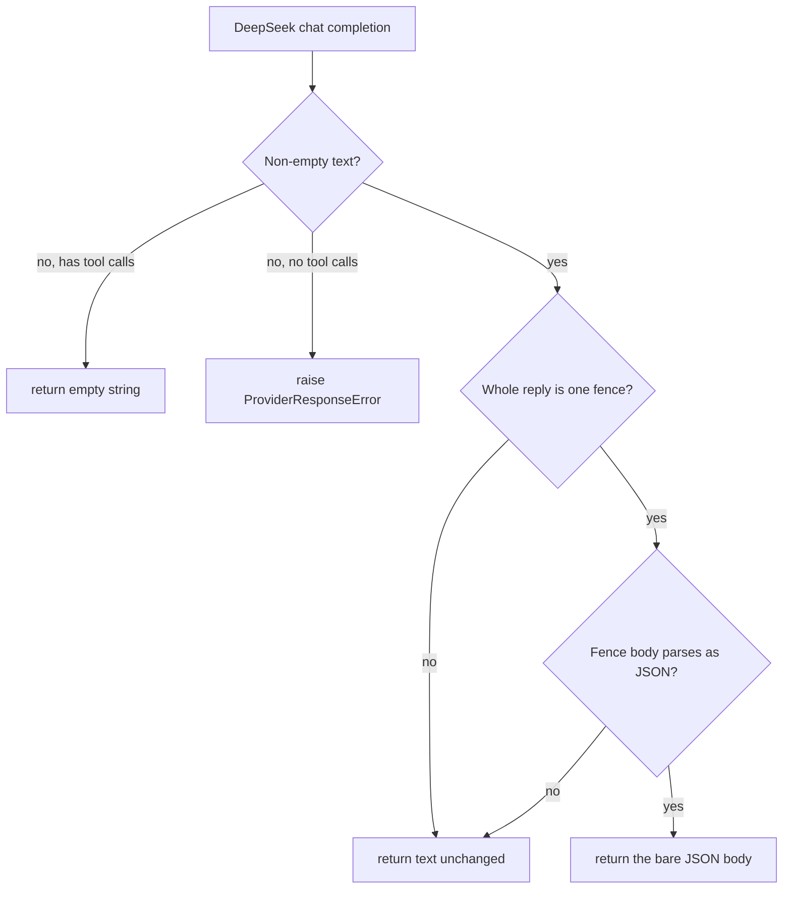

# DeepSeek code-fence preservation

## Summary

`DeepSeekProvider._extract_chat_text` ran every reply through two independent regex substitutions added in PR #169 to unwrap JSON that DeepSeek sometimes wraps in a markdown fence. They ran on all text, so a code answer lost its closing fence, and a reply that opened with a tagged fence (```` ```bash ````) lost its opening backticks and left a stray `bash`. DeepSeek is the default text provider, so every agent that answers with code was corrupted, which also broke `agent.behavior.output.contains_code_block()`. GLM and the other compatible providers return the same bytes untouched.

The fix keeps the #169 unwrap but narrows it: a reply is unwrapped only when it is entirely one fence (```` ```json ```` or a bare ```` ``` ````) whose body parses as JSON. Everything else is returned exactly as DeepSeek sent it.

## Flow chart



## Usage example

```python
from vidbyte import Agent

agent = Agent(name="coder", system_prompt="Answer with code.", provider="deepseek", model_name="deepseek-chat")
reply = agent.run("Print x in Python.")
# DeepSeek reply: "Here is the fix:\n```python\nprint('x')\n```"
assert reply.content.endswith("```")  # the closing fence now survives

schema = {"type": "object", "properties": {"answer": {"type": "string"}}, "required": ["answer"]}
structured = Agent(name="qa", system_prompt="Answer.", provider="deepseek", model_name="deepseek-chat", output_schema=schema)
# DeepSeek reply: '```json\n{"answer": "42"}\n```' still parses into {"answer": "42"}
```

## How it works

A module-level `_WHOLE_FENCE` regex, anchored at both ends of the reply, captures the body of a reply that is a single fence. `_unwrap_whole_json_fence` returns the stripped body only when `json.loads` accepts it; otherwise it returns the original text. A whole-reply ```` ```python ```` block fails the JSON check and is kept as is. The PR #563 behavior is unchanged: a tool-call turn with empty arguments returns `""` and a reply with neither text nor tool calls raises.

**Why narrow rather than remove.** The structured-output path already unfences (`OutputSchemaFormatter._unfenced`), but many other consumers call `json.loads` directly on model text (orchestrator, context critics, eval graders, prosecutor/defender judge), and not all of them strip fences. Keeping a JSON-only whole-reply unwrap preserves what #169 protected for those callers without auditing each one, and it cannot alter any reply that is not pure fenced JSON.

## Files changed

- `vidbyte/providers/compatible.py`: replace the two unconditional substitutions with the anchored, JSON-checked unwrap; move `re` to a module import.
- `tests/test_deepseek_provider.py`: regression tests at provider and agent level.

## Risks

- A reply that is only a fenced JSON example meant as prose (for example "show me a JSON sample") is still unwrapped, exactly as under #169. That is the deliberate trade-off #169 made.
- Bare-fence replies whose body is plain text (```` ``` ```` + prose) are no longer unwrapped. Nothing downstream needs that.

## Verification

- The two reported replies come back byte-identical from DeepSeek, matching GLM, both from `run_text` and through a `BaseAgent`.
- A reply that only ends with a ```` ```json ```` fence is untouched; a whole-reply ```` ```python ```` block is untouched.
- A whole-reply ```` ```json ```` fence still yields bare JSON, and an `output_schema` agent gets `metadata["structured"]`.
- The empty-arguments tool-call test from #563 still passes.
- `python lint/run.py`, `python -m pytest -q -x`, `python scripts/run_ci.py`, and CI.
