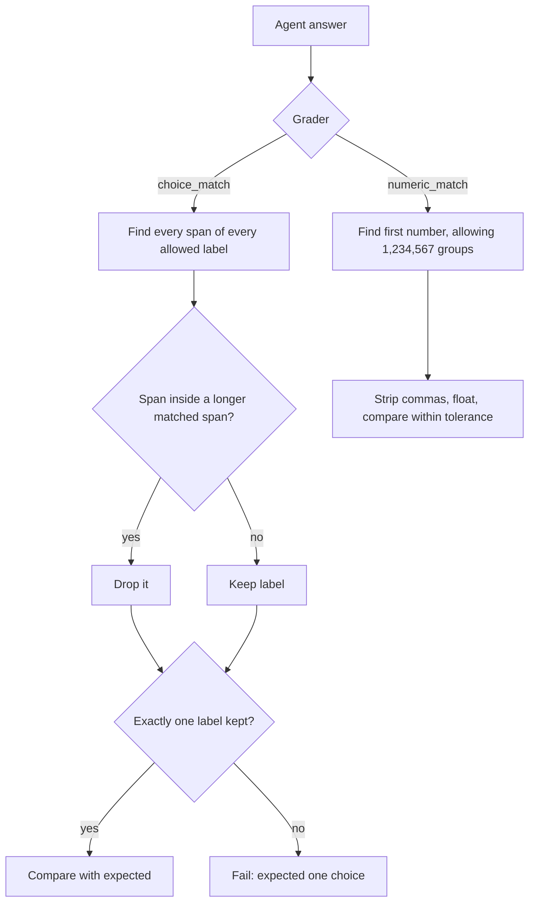

# Eval Grader Label and Number Parsing Fixes

## Summary

Two eval graders misread correct answers. `ChoiceMatchGrader` counted a label nested inside a longer label ("spam" inside "not spam") as a second answer, so an exact correct label failed with "Expected one choice". `NumericMatchGrader` read "1,250" as 1.0. This change keeps only the longer label when one match lies inside another, and parses comma-grouped thousands as one number. `ClassificationTemplate`, `MultipleChoiceTemplate`, and `NumericAnswerTemplate` inherit the fix.

## Flow chart



## Usage example

```python
from vidbyte.evals.graders.choice_match import ChoiceMatchGrader
from vidbyte.evals.graders.numeric_match import NumericMatchGrader
from vidbyte.evals.types import EvalCase

await ChoiceMatchGrader(["spam", "not spam"]).agrade(EvalCase(prompt="t", expected="not spam"), "not spam")  # passed
await ChoiceMatchGrader(["spam", "not spam"]).agrade(EvalCase(prompt="t", expected="spam"), "spam or not spam?")  # fails: two answers
await NumericMatchGrader().agrade(EvalCase(prompt="t", expected=1250), "1,250")  # passed
```

## How it works

- `ChoiceMatchGrader._extract_matches` collects every match span per choice with `re.finditer`, then keeps a choice only if at least one of its spans is not strictly contained in a longer span of another choice. Separate mentions still count separately. Case sensitivity and single-letter matching are unchanged.
- `NumericMatchGrader._parse_number` adds a leading regex alternative `\d{1,3}(?:,\d{3})+(?!\d)(?:\.\d*)?` and strips commas before `float()`. "1,2" and "1,2345" still read as 1; plain, signed, decimal and ".5" inputs parse as before.

## Files

- `vidbyte/evals/graders/choice_match.py`
- `vidbyte/evals/graders/numeric_match.py`
- `tests/test_evals.py`

## Risks

- A comma-separated list of 3-digit numbers ("100,200") now reads as one grouped number. This matches common thousands notation and is accepted.

## Verification

Offline regression tests in `tests/test_evals.py`, `python lint/run.py`, and `python scripts/run_ci.py`.
