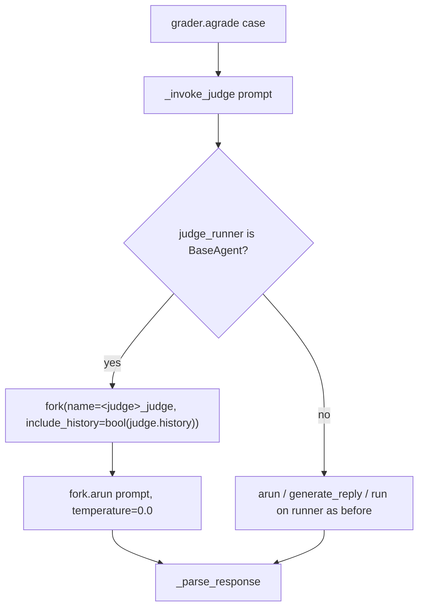

# Eval Judge Fork Isolation

## Summary

`LLMJudgeGrader` and `RubricGrader` called `arun()` directly on the user's judge. When the judge is a `BaseAgent`, every verdict was appended to `judge.history` and rendered into the next judgment's system prompt. One judge grading N cases therefore carried every earlier verdict into each later one: grades depended on case order (nondeterministic under `EvalRunner` concurrency > 1) and judge prompt cost grew quadratically across a suite. `EvalRunner` already isolates the *target* per case with `target.fork(...)`; this change gives the judge the same isolation.

## Flow chart



## Usage example

```python
from vidbyte import Agent
from vidbyte.evals import EvalCase, LLMJudgeGrader

judge = Agent(name="judge", system_prompt="You judge.", provider="deepseek", model_name="deepseek-chat")
grader = LLMJudgeGrader(judge_runner=judge)

for case in cases:
    result = await grader.agrade(case, actual_for(case))  # each judgment starts from the same judge state

assert judge.history == []  # verdicts no longer accumulate on the shared judge
```

## How it works

In both `_invoke_judge` methods, when the judge runner is a `BaseAgent`, the judgment runs on `runner.fork(AgentForkSettings(name=f"{runner.name}_judge", include_history=bool(runner.history)))` instead of the shared instance, mirroring `EvalRunner._invoke_target`. `include_history` is requested only when the judge has preloaded history (for example few-shot examples), so that history is kept, while forks such as `AggregateAgent.fork` that reject non-name overrides still work for history-free judges. Non-agent runners (plain objects with `arun`, `generate_reply`, or `run`) are unchanged. Parsing and the `temperature=0.0` argument are unchanged.

## Files changed

- `vidbyte/evals/graders/llm_judge.py`: fork the agent judge per judgment.
- `vidbyte/evals/graders/rubric.py`: same change.
- `tests/test_evals.py`: regression test with an offline judge runner.

## Risks and open questions

- A judge whose own history was deliberately meant to accumulate across cases no longer does; that was the bug, not a feature.
- An `AggregateAgent` judge with preloaded history would raise from its fork, since it rejects `include_history`; that combination is not used today.

## Verification

`test_agent_judge_does_not_carry_verdicts_across_cases` grades three cases with each grader on one `BaseAgent` judge bound to an offline runner, then asserts `judge.history` stays empty and no judgment's system prompt contains an earlier verdict. It fails on the old code. Then `python lint/run.py`, `python scripts/run_ci.py`, and GitHub CI.
