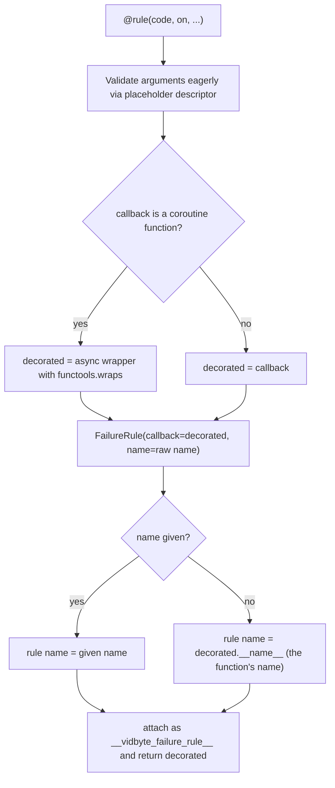

# Failure Rule Decorator Identity

## Summary

The `@rule` decorator in `vidbyte/sessions/failure/rules.py` built its stored `FailureRule` from the wrong objects. Every rule declared without an explicit `name=` was named `<lambda>` (the placeholder used for eager argument validation), so the Session failure ledger could not tell rules apart. For async rules, the stored descriptor pointed at the original coroutine function while the decorator returned a wrapper, so `session.failures.remove_rule(my_async_rule)` silently did nothing. The fix binds the descriptor to the object the decorator returns and passes the caller's raw `name`.

## Flow chart



## Usage example

```python
from vidbyte import FailureCode, FailureDisposition, rule

@rule(code=FailureCode.MODEL_REQUEST_FAILED, on="after_model_response")
async def audit_async(ctx):
    return None

session.failures.add_rule(audit_async)
assert [r.name for r in session.failures._rules] == ["audit_async"]
session.failures.remove_rule(audit_async)
assert session.failures._rules == []
```

## How it works

Inside `decorate`, pick the returned object first (the callback, or the `@wraps` async wrapper for coroutine functions), then build the `FailureRule` with `callback=` that object and `name=` the caller's argument. `FailureRule.__post_init__` already falls back to `callback.__name__`, and `@wraps` keeps the function's name on the wrapper. The router's identity checks (`add_rule` dedup and `remove_rule`) now compare against the same object the user holds. The eager placeholder descriptor stays so bad arguments still fail at decoration-factory time.

## Files changed

- `vidbyte/sessions/failure/rules.py`: `decorate` body only.
- `tests/test_session_failures.py`: one regression test in `FailureRuleTests`.

## Risks

None expected: the router is unchanged, and `FailureRule.invoke` already awaits awaitable results, so the wrapper still runs. Rules with an explicit `name=` behave as before.

## Verification

New test covers sync and async names, explicit name precedence, async dedup on re-add, async execution through `FailureRouter.evaluate`, and `remove_rule` for sync and async rules. Then `python lint/run.py`, `python scripts/run_ci.py`, and the PR's required CI checks.
