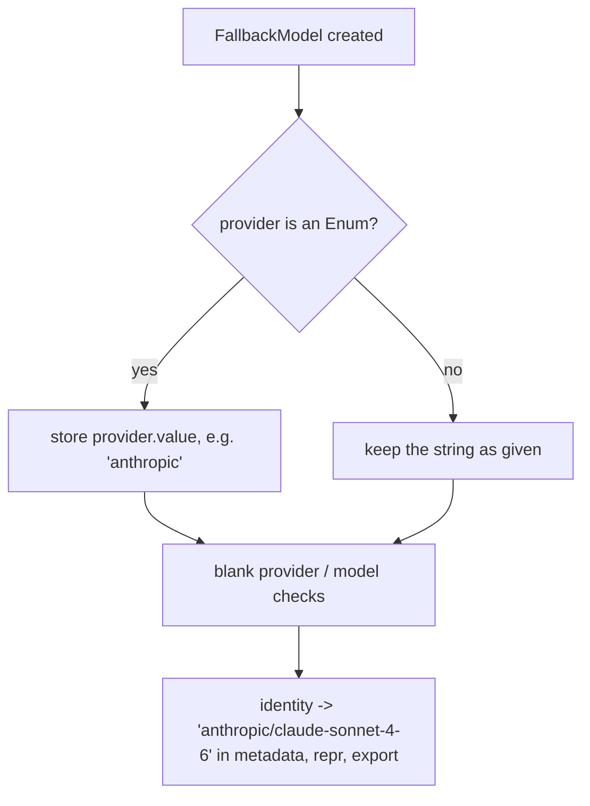

# Fallback entries normalize an enum provider

## Summary

`FallbackModel(provider=ModelProvider.ANTHROPIC, model=...)` kept the enum member as its provider, so
`identity()` rendered `ModelProvider.ANTHROPIC/claude-sonnet-4-6` in run metadata
(`metadata["fallback"]["attempts"][*]["to"]`, `final_model`) and in `repr(agent.fallback)`. The dataclass
now stores the enum's string value at construction, so every consumer sees `anthropic`.

## Flow chart



## Usage example

```python
from vidbyte import Agent
from vidbyte.lib.dataclasses.agents import FallbackModel
from vidbyte.lib.enums import ModelProvider

backup = FallbackModel(provider=ModelProvider.ANTHROPIC, model="claude-sonnet-4-6")
assert backup.provider == "anthropic"
assert backup.identity() == "anthropic/claude-sonnet-4-6"

agent = Agent(name="s", system_prompt="x", provider=ModelProvider.DEEPSEEK,
              model_name="deepseek-v4-flash", fallback=[backup])
# result.metadata["fallback"]["final_model"] == "anthropic/claude-sonnet-4-6" after a fallback
```

## How it works

`FallbackModel.__post_init__` (frozen, slotted) replaces an `Enum` provider with its `.value` via
`object.__setattr__` before the existing blank checks. No caller relies on the enum identity: provider
comparisons (`AgentFallbackSettings._inherited_api_key`, registry lookups) already accept plain strings.
The export workaround from #667 in `BaseAgent._export_runtime_config` becomes redundant and now uses
`identity()` directly.

## Files

- `vidbyte/lib/dataclasses/agents.py`: normalize the provider in `FallbackModel.__post_init__`.
- `vidbyte/agents/base.py`: export backups with `identity()`.
- `tests/test_agent_settings_validation.py`: regression test for the enum provider.

## Risks

Code that compared `entry.provider is ModelProvider.X` would stop matching; none exists in the package.

## Verification

New unit test, `python lint/run.py`, `python scripts/run_ci.py`, and PR CI.
