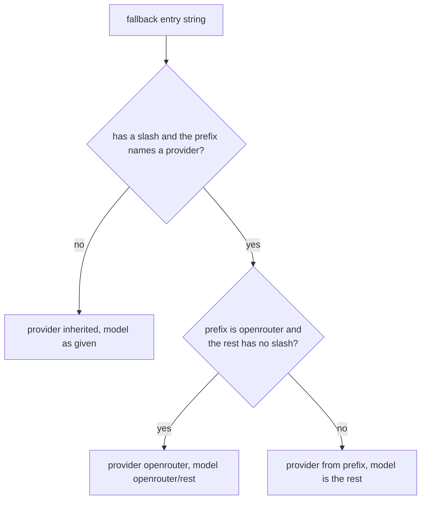

# Fallback entries keep openrouter/auto intact

## Summary

`openrouter-model-ids.md` (#663) made `Runner` keep OpenRouter's own router id `openrouter/auto` on the wire. Fallback entries take a different path: `AgentFallbackSettings._split_provider_prefix` still splits `"openrouter/auto"` into provider `openrouter` and model `auto`, so a run that falls back sends `"model": "auto"` to openrouter.ai, which is not an OpenRouter id. This fix applies the same rule to fallback entries.

## Flow chart



## Usage example

```python
from vidbyte import Agent

agent = Agent(
    name="support",
    system_prompt="Help.",
    provider="deepseek",
    model_name="deepseek-v4-flash",
    fallback=[
        "openrouter/auto",                       # request body: {"model": "openrouter/auto", ...}
        "openrouter/anthropic/claude-sonnet-5",  # request body: {"model": "anthropic/claude-sonnet-5", ...}
    ],
)
```

## How it works

`_split_provider_prefix` still resolves the provider from the prefix. When that provider is `openrouter` and the remainder has no `/`, it returns `openrouter/<rest>` as the model instead of the bare remainder. Every other entry is split exactly as before. #663 added no shared helper, so the two-line rule is mirrored rather than imported.

## Files changed

- `vidbyte/agents/settings/fallback.py`: the rule above, under an `@intent openrouter-keeps-its-own-model-ids` marker.
- `tests/test_agent_settings_validation.py`: regression test.

## Risks and open questions

- An entry like `openrouter/some-future-id` is now sent with its prefix. This matches `Runner`, and OpenRouter's own ids are the only ones without a vendor slug.

## Verification

- A regression test asserts that `openrouter/auto` resolves to provider `openrouter` with model `openrouter/auto`, and `openrouter/anthropic/claude-sonnet-5` still resolves to `anthropic/claude-sonnet-5`.
- A scratch script outside the repo ran the reported repro (DeepSeek returning 503, mocked transport) and confirmed that the openrouter.ai request body now carries `openrouter/auto`.
- `python lint/run.py` and `python scripts/run_ci.py`.
