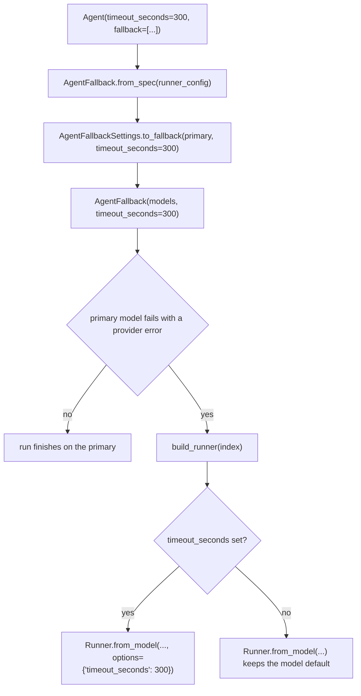

# Fallback Runner Timeout

## Summary

An agent's `timeout_seconds` reaches its primary model runner but is dropped when a
fallback chain builds the runner for a backup model, so every fallback request uses the
library default of 60 seconds. This change carries the agent's timeout into
`AgentFallback` and passes it to each fallback runner, so a backup model gets the same
per-request budget as the model it replaces.

## Flow chart



## Usage example

```python
from vidbyte import Agent

agent = Agent(
    name="researcher",
    system_prompt="Research the question.",
    provider="deepseek",
    model_name="deepseek-v4-pro",
    timeout_seconds=300,
    fallback=["anthropic/claude-sonnet-4-6"],
)
# If DeepSeek fails, the Anthropic request now also waits up to 300 seconds, not 60.
agent.run("Summarize the latest release notes.")
```

## How it works

- `AgentFallback.__init__` takes an optional keyword `timeout_seconds` (default `None`).
- `AgentFallbackSettings.to_fallback` takes the same optional keyword and forwards it.
- `AgentFallback.from_spec` passes `runner_config.timeout_seconds`.
- `AgentFallback.build_runner` passes `options={"timeout_seconds": ...}` only when it is
  set, mirroring `BaseAgent._runner_for_model`, so an unset timeout keeps each model's
  own default.

`FallbackModel` is unchanged; the timeout is an agent-wide setting, not a per-entry one.

## Files

- `vidbyte/agents/fallback.py`
- `vidbyte/agents/settings/fallback.py`
- `tests/test_agent_settings_validation.py` (one regression test)

## Risks

Low. The new keywords default to `None`, which keeps today's behavior for callers such as
the Codex harness that build a chain without a timeout.

## Verification

A regression test builds a chain from an `AgentRunnerConfig` with `timeout_seconds=300`
and asserts the fallback runner's config carries 300. Then `python lint/run.py` and
`python scripts/run_ci.py`.
