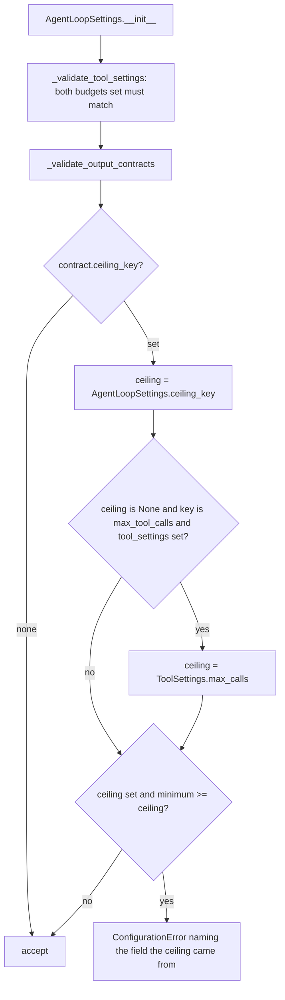

# Tool-call floors respect a budget set only in ToolSettings

## Summary

`AgentLoopSettings` rejects an effort floor whose minimum meets or exceeds its paired ceiling, because such a floor can never be satisfied. `MinToolCalls` and `MinSuccessfulToolCalls` pair with the tool-call budget, which can be set as `AgentLoopSettings.max_tool_calls` or as `ToolSettings.max_calls` (documented as the same budget; the runtime enforces whichever is set). The check only read `AgentLoopSettings.max_tool_calls`, so a budget given only through `ToolSettings(max_calls=N)` let an unreachable floor through: the run then stopped with `stop_reason=max_tool_calls` without ever meeting the floor. This change makes the check fall back to `ToolSettings.max_calls`.

## Flow chart



## Usage example

```python
from vidbyte.agents.contracts import MinToolCalls
from vidbyte.agents.settings import AgentLoopSettings, ToolSettings
from vidbyte.lib.errors import ConfigurationError

AgentLoopSettings(tool_settings=ToolSettings(max_calls=3), output_contracts=[MinToolCalls(2)])  # accepted

try:
    AgentLoopSettings(tool_settings=ToolSettings(max_calls=3), output_contracts=[MinToolCalls(5)])
except ConfigurationError as error:
    print(error)
    # MinToolCalls(minimum=5) conflicts with ToolSettings.max_calls=3: the floor is unreachable (require minimum < ceiling).
```

## How it works

In `AgentLoopSettings._validate_contract_ceiling`, when the contract's `ceiling_key` is `max_tool_calls`, `self.max_tool_calls` is `None`, and `tool_settings` is set, the ceiling becomes `tool_settings.max_calls` and the error message names `ToolSettings.max_calls`. When both budgets are set, `_validate_tool_settings` (which runs first in `_validate`) already requires them to match, so reading `max_tool_calls` first is equivalent to using the effective budget. Other ceilings (`max_tokens`, `max_iterations`, `timeout_seconds`) are unchanged.

Other construction paths (YAML loader, `AgentSettings._loop`, run-state restore, fork settings, the fork tool) all pass `tool_settings` into the constructor, so they go through `_validate` and need no change.

## Files changed

- `vidbyte/agents/settings/loop.py`: fall back to `ToolSettings.max_calls` for the tool-call ceiling.
- `tests/features/sdk_loop_settings/test_contract.py`: regression tests.
- `tests/features/sdk_loop_settings/FEATURE.md`: record the regression.

## Risks

Configurations that previously constructed with an unreachable tool-call floor and a `ToolSettings.max_calls` budget now fail at construction. Those runs could never satisfy the floor, so failing early is the intended behavior.

## Verification

Regression tests: `ToolSettings(max_calls=3)` with `MinToolCalls(5)`, `MinSuccessfulToolCalls(5)`, or `MinToolCalls(3)` raises `ConfigurationError`; with `MinToolCalls(2)` it is accepted. Then `python lint/run.py` and `python scripts/run_ci.py`.
