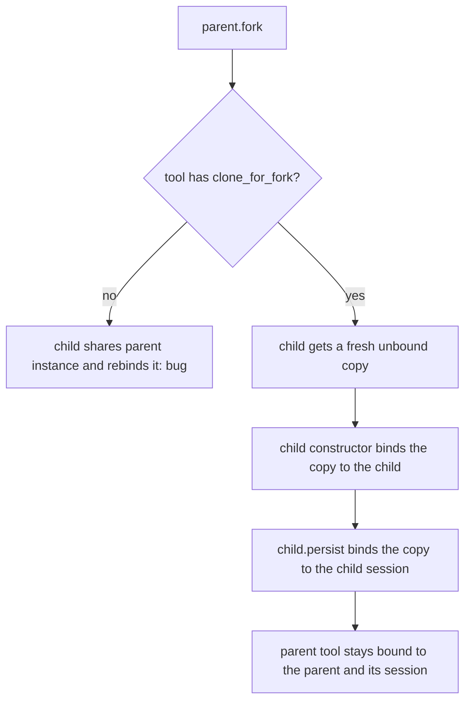

# Fork Clones Bound Builtins

## Summary

`BaseAgent.fork()` hands the child the parent's tool instance whenever a tool has no
`clone_for_fork()`. `RunPromptsSequentiallyTool` and every session builtin
(`_SessionBuiltinTool` subclasses) bind to their owning agent or session, so the child's
constructor (and later `child.persist()`) re-binds the parent's instance to the fork. The
parent's queued prompts then land on the fork, and the parent's checkpoints land on the
fork's session. This change gives both tools an unbound `clone_for_fork()`, matching
`PauseAgentTool`.

## Flow chart



## Usage example

```python
store = FileSessionStore(root=tmp)
parent = Agent(name="ops", system_prompt="Ops.", tools=[CheckpointTool(store), RunPromptsSequentiallyTool()])
parent.persist(store=store)
branch = parent.fork()
branch.persist(store=store)
await parent.arun("checkpoint, then queue the release notes")  # both act on the parent
```

## How it works

- `RunPromptsSequentiallyTool.clone_for_fork()` returns a fresh `RunPromptsSequentiallyTool()`.
- `_SessionBuiltinTool.clone_for_fork()` returns `type(self)(self._store, scope=self._scope.copy())`
  with no bound session. The scope is copied, not shared, because `bind_session` grows the
  scope's allowlist; a shared scope would let the fork's session widen the parent's access.
- `SessionScope.copy()` returns an independent scope with the same allowlist and all-runs flag.
  No subclass overrides `__init__`, so `type(self)(store, scope=...)` builds each of them.

## Files

- `vidbyte/tools/builtins/run_prompts_sequentially.py`
- `vidbyte/tools/builtins/sessions/_base.py`
- `vidbyte/sessions/scope.py`
- `tests/test_agent_fork_isolation.py` (regression tests)

## Risks

A forked session tool no longer shares the parent's scope object, so access granted to the
parent after the fork no longer leaks into the fork (and vice versa). That is the intent.

## Verification

Two regression tests in `tests/test_agent_fork_isolation.py`, the `a97`/`a98` repro scripts,
`python lint/run.py`, and `python scripts/run_ci.py`.
