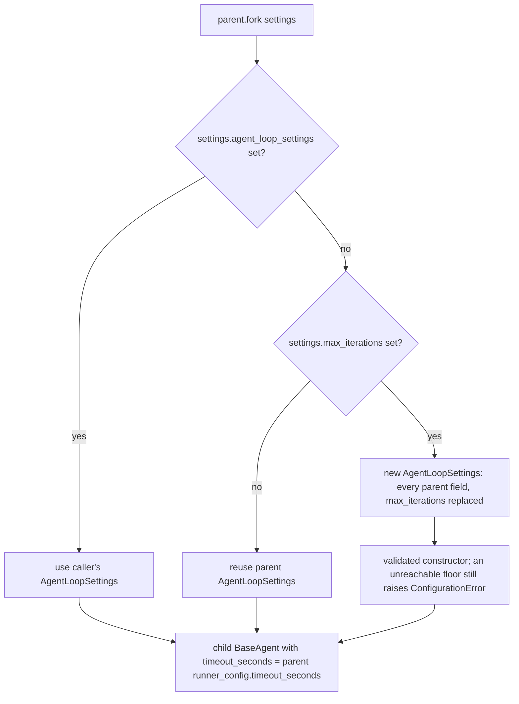

# Fork inherits parent loop guardrails and model timeout

## Summary

`AgentForkSettings` documents that every unset field inherits from the parent agent, but `AgentForker` dropped parent configuration in two places:

1. `fork(AgentForkSettings(max_iterations=N))` rebuilt `AgentLoopSettings` from a partial field list, so the child lost `tool_error_policy`, `tool_settings`, `output_contracts`, `max_contract_rejections`, and `max_queued_prompts`. A tool denied on the parent (`ToolSettings(denied_tools=...)`) executed in the child.
2. Every fork, including plain `fork()`, dropped `runner_config.timeout_seconds`, so the child's model calls had no timeout.

The fix passes those values through so a fork keeps the parent's guardrails.

## Flow chart



## Usage example

```python
from vidbyte.agents import AgentForkSettings, AgentLoopSettings, MinToolCalls, ToolSettings

loop = AgentLoopSettings(max_iterations=10, tool_settings=ToolSettings(denied_tools={"delete_file"}), output_contracts=[MinToolCalls(1)])
parent = BaseAgent(system_prompt="Work.", agent_loop_settings=loop, timeout_seconds=12.5)

child = parent.fork(AgentForkSettings(max_iterations=3))
assert child.agent_loop_settings.tool_settings is loop.tool_settings  # delete_file stays denied
assert child.agent_loop_settings.output_contracts == loop.output_contracts
assert child.runner_config.timeout_seconds == 12.5
```

## How it works

- `AgentForker._loop_settings` adds the missing constructor arguments (`max_queued_prompts`, `tool_error_policy`, `tool_settings`, `output_contracts`, `max_contract_rejections`) from the parent's settings. It still goes through the validated constructor, so a contract floor that the new `max_iterations` cannot reach raises `ConfigurationError`, which is the correct behavior.
- `AgentForker.fork` passes `timeout_seconds=agent.runner_config.timeout_seconds` to the child `BaseAgent`. `AgentForkSettings` has no override for this field, so the child always inherits it.

## Files changed

- `vidbyte/agents/fork.py`: the fix.
- `tests/test_agent_fork_isolation.py`: one regression test.

## Risks

- A child built with a `max_iterations` override now also enforces the parent's output contracts. That is the documented behavior. A caller who wants different contracts passes an explicit `agent_loop_settings`.

## Verification

- The new test fails on `main` and passes with the fix.
- `python scripts/run_ci.py --stage source` passes locally, and PR CI is green.
