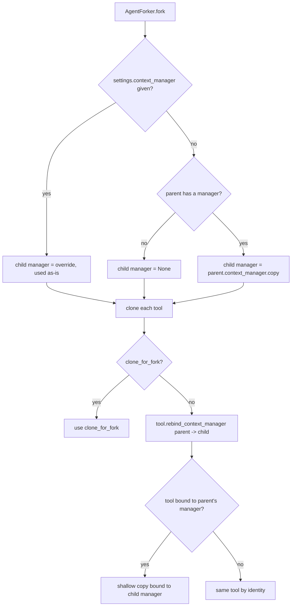

# Fork Isolates the Context Manager

## Summary

`BaseAgent.fork()` promises an isolated child branch, but the child received the
parent's `ContextManager` object by reference, and every builtin tool that writes
to a manager (context-primitive create/edit/remove/move/recite/upsert tools,
reasoning trace tools, CoT event, reflexion, trajectory checkpoint) passed to the
child by identity, still bound to the parent's manager. A child run that removed
or created primitives silently rewrote the parent's context window, including
concurrent `fork_conversation` / batch forks. The fix gives an inheriting child an
independent copy of the parent's manager and rebinds the child's manager-bound
tools to whatever manager the child ends up with.

## Flow chart



## Usage example

```python
from vidbyte.agents import Agent
from vidbyte.context import ContextManager
from vidbyte.tools.builtins.context_primitives import context_window_tools

manager = ContextManager()
parent = Agent(tools=list(context_window_tools(manager)), context_manager=manager)
# ... parent run creates primitive "notes" ...
child = parent.fork()
assert child.context_manager is not parent.context_manager
assert [pid for pid, _ in child.context_manager.registry_items()] == ["notes"]
# child run calls context_remove(notes) and context_create_text(scratch)
assert [pid for pid, _ in parent.context_manager.registry_items()] == ["notes"]
```

## How it works

- `ContextManager.copy()` (context layer) returns a new manager built with
  `dataclasses.replace(self)` (fresh `context_items` tuple and `metadata` dict)
  plus fresh copies of `_registry`, `_placements`, and `_id_counters`. Registry
  items are shared, which is safe: every primitive is a `frozen=True` dataclass
  and every manager write (`upsert`, `set_frozen`, `recite`, `context_edit`)
  replaces the registry entry with a new object via `dataclasses.replace`.
- `BaseTool.rebind_context_manager(old, new)` (tools layer, no agents import)
  returns `self` unless the tool's `_manager` is `old`, in which case it returns
  a shallow copy whose `_manager` is `new`. All manager-bound builtins use the
  `_manager` attribute, so one default hook covers them without per-class code.
- `AgentForker.fork` resolves the child manager first, then `_clone_tool` calls
  `clone_for_fork()` when present, otherwise `rebind_context_manager(parent,
  child)`. `_ToolWrapper` views keep working through the existing `_rewrap`
  path because an unchanged inner tool is returned by identity.

## Files

- `vidbyte/context/manager.py`: add `ContextManager.copy()`.
- `vidbyte/tools/base.py`: add `BaseTool.rebind_context_manager()`.
- `vidbyte/agents/fork.py`: copy the inherited manager; rebind tools.
- `tests/test_agent_fork_isolation.py`: regression test.

## Risks

- An explicit `settings.context_manager` still shares that object with whoever
  passed it, by design; the parent-bound tools now write to it instead of the
  parent, matching what the child renders.
- Custom (non-builtin) tools that hold a manager under a different attribute
  are passed by identity as before.

## Verification

A regression test runs a parent and a forked child with an offline scripted
runner that calls `context_remove` and `context_create_text`, asserting the
child starts with the parent's primitives and the parent registry is unchanged.
Then `python lint/run.py` and `python scripts/run_ci.py`.
