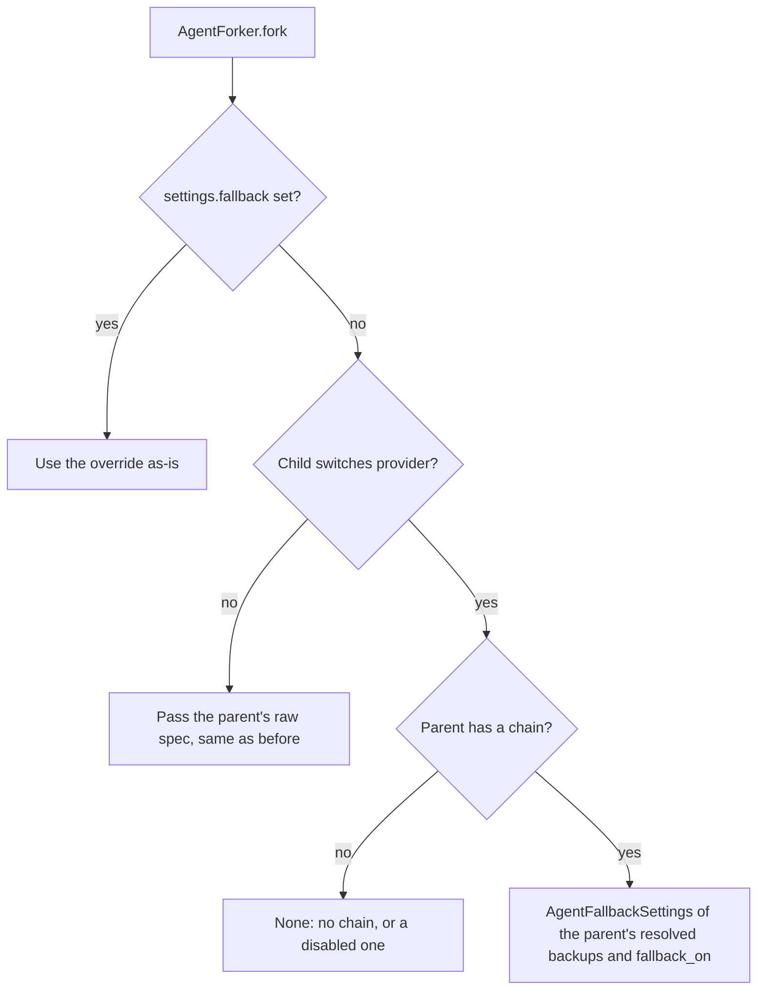

# Fork Keeps Fallback Providers

## Summary

`AgentForker` handed a child the parent's raw fallback spec, and the child re-resolved it against its own primary. A bare backup name means "this model on the agent's provider", so a fork that switched provider silently moved the parent's backups onto the wrong vendor (for example `anthropic/deepseek-v4-flash`). A provider-switching child now inherits the parent's already-resolved backups, so each keeps its own provider and only that provider's key.

## Flow chart



## Usage example

```python
from vidbyte.agents import AgentForkSettings, BaseAgent

parent = BaseAgent(name="t", system_prompt="x", provider="deepseek", model_name="deepseek-v4-pro", api_key="dk", fallback=["deepseek-v4-flash"])
child = parent.fork(AgentForkSettings(provider="anthropic", model_name="claude-sonnet-4-6"))
# child.fallback: anthropic/claude-sonnet-4-6 -> deepseek/deepseek-v4-flash (the backup keeps the DeepSeek key)
```

## How it works

A new `AgentForker._fallback` helper picks the child's spec. An explicit `settings.fallback` wins. A fork that keeps the parent's provider passes the raw spec exactly as before. A provider-switching fork wraps `agent.fallback.models[1:]` (resolved `FallbackModel` entries, which `_resolve_entry` passes through unchanged) in `AgentFallbackSettings` with the parent's `fallback_on`, or passes `None` when the parent has no chain, which keeps a disabled chain disabled. The child still builds the chain through `AgentFallback.from_spec`, so it gets the child's runner timeout.

## Files

- `vidbyte/agents/fork.py`: the `_fallback` helper, tagged `@intent fork-keeps-resolved-fallback-providers`.
- `tests/test_agent_fork_isolation.py`: one regression test for the chain identities, keys, `fallback_on` and timeout.

## Risks

A resolved backup carries its own vendor's key. Resolution already drops the key for any entry on another provider, so the child's primary never gets the parent's key and `fork-key-never-crosses-providers` still holds. On a provider-switching fork, backups keep the parent's temperature rather than a `temperature` override, because they are the parent's backups.

## Verification

Run the new test, `python lint/run.py`, and `python scripts/run_ci.py`.
