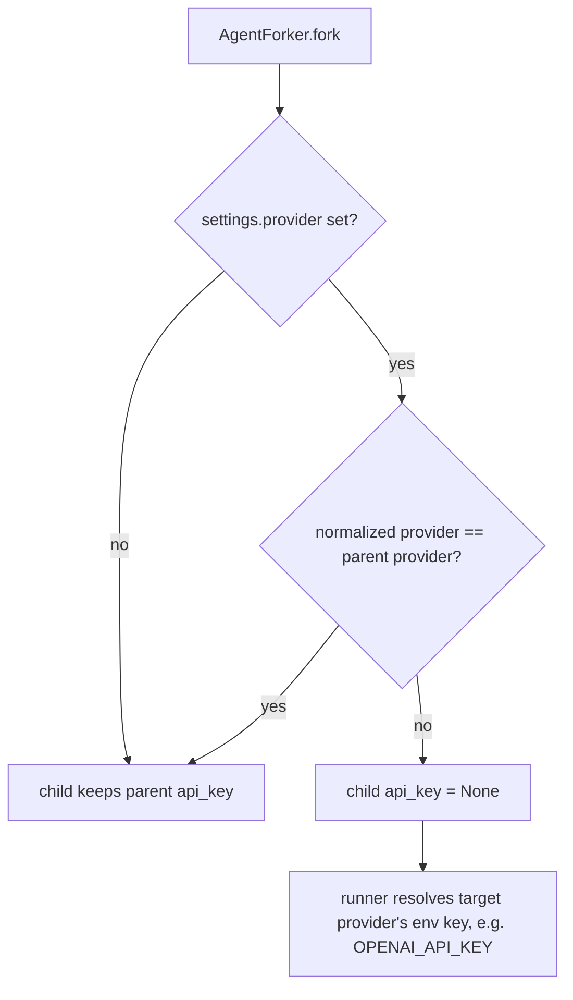

# Fork key never crosses providers

## Summary

`AgentForker.fork` copied the parent's `api_key` into every child, even when
`AgentForkSettings.provider` moved the child to a different vendor. Forking a
DeepSeek agent with an explicit key into an OpenAI child sent
`Authorization: Bearer <deepseek key>` to api.openai.com: one vendor's secret
leaked to another, and the call failed auth. The model-facing
`fork_conversation` tool lets the model pick `provider`, so a model could
trigger the leak. Fallback chains already follow the rule "the agent's key only
goes to the agent's own provider" (PR #592, `fallback-key-never-crosses-providers`);
fork now follows it too.

## Flow chart



## Usage example

```python
from vidbyte import Agent
from vidbyte.agents import AgentForkSettings

parent = Agent(name="router", system_prompt="Route.", provider="deepseek",
               model_name="deepseek-v4-flash", api_key="sk-deepseek-SECRET")

# Different provider: the DeepSeek key is not inherited; OpenAI reads OPENAI_API_KEY.
child = parent.fork(AgentForkSettings(provider="openai", model_name="gpt-5.4-mini"))
assert child.runner_config.api_key is None

# Same provider (or a model-only override): the parent's key is kept.
sibling = parent.fork(AgentForkSettings(model_name="deepseek-v4-pro"))
assert sibling.runner_config.api_key == "sk-deepseek-SECRET"
```

## How it works

`AgentForker.fork` gets one small helper, `_api_key(agent, settings)`, carrying
`@intent fork-key-never-crosses-providers`. It normalizes the child's provider
(enum `.value` or string, stripped and lowercased) and compares it with the
parent's `runner_config.provider` (already a string). Equal: return the
parent's key. Different: return `None`, so `Runner.from_model` resolves the
target provider's own credential from its env var when the runner is built.

The `fork_conversation` schema text for `provider` promised that credentials
are "still inherited"; it is reworded to say a different provider uses its own
configured key, and credentials are still never model-controlled.

`Session.fork`, `Session.resume`, and `Session.fork_from` take no provider
override and rebuild agents via `BaseAgent.restore`, which does not carry an
api key, so they are unchanged. Handoff and continual-trace agents copy the
source agent's provider with its key, so they cannot cross providers.

## Files

- `vidbyte/agents/fork.py`: the `_api_key` helper and its call.
- `vidbyte/tools/builtins/fork/fork.py`: provider schema description text.
- `tests/test_agent_fork_isolation.py`: cross-provider and same-provider fork tests.
- `tests/test_fork_tool.py`: `fork_conversation` with a provider override does not pass the parent key.

## Risks

A caller who forked into another provider and relied on the parent's key being
valid there (for example an OpenAI-compatible gateway key reused under another
provider name) now needs that provider's env var or an explicit agent. That
reuse is exactly the leak this closes, and it matches fallback behavior.

## Verification

New regression tests, `python lint/run.py`, `python scripts/run_ci.py`, and the
required GitHub checks.
