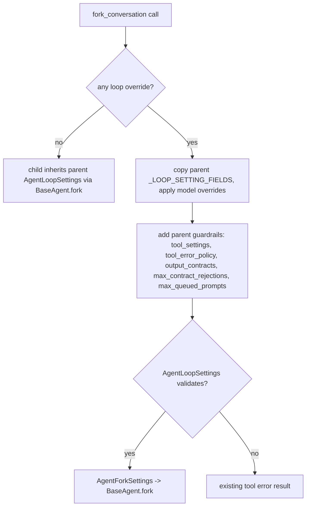

# Fork Tool Preserves Parent Guardrails

## Summary

`ForkConversationTool._resolve_loop_settings` rebuilt the child's `AgentLoopSettings` from only the
model-overridable `_LOOP_SETTING_FIELDS` whenever the model passed any loop override (`max_iterations`,
`loop_settings`, or context-window budget keys). The parent's `tool_settings` (including
`denied_tools`), `tool_error_policy`, `output_contracts`, `max_contract_rejections`, and
`max_queued_prompts` were silently dropped, so a model could escape a denied tool just by asking for a
smaller iteration budget. The fix carries those guardrail fields through unchanged.

## Flow chart



## Usage example

```python
parent_settings = AgentLoopSettings(max_iterations=6, tool_settings=ToolSettings(denied_tools={"drop_table"}))
agent = Agent(..., tools=[drop_table, ForkConversationTool()], agent_loop_settings=parent_settings)
# Model calls fork_conversation(prompt="cleanup", max_iterations=3).
# The child now runs with max_iterations=3 and the same ToolSettings, so drop_table is still denied.
```

## How it works

`_resolve_loop_settings` still builds the overridable fields exactly as before, then passes
`**self._inherited_guardrails()` into the same validated `AgentLoopSettings` constructor. The guardrail
fields are not in `_LOOP_SETTING_FIELDS`, so the model still cannot override them. If an inherited
constraint conflicts with a model override (for example `tool_settings.max_calls` vs a new
`max_tool_calls`), constructor validation raises and the tool returns its normal error result.

## Files

- `vidbyte/tools/builtins/fork/fork.py`: pass inherited guardrails into the child `AgentLoopSettings`.
- `tests/test_fork_tool.py`: regression test for `max_iterations` and `loop_settings` overrides.

## Risks

A model override that conflicts with an inherited guardrail now errors instead of silently discarding
the guardrail. That is the intended behavior.

## Verification

New regression test fails on `main` and passes with the fix; full `scripts/run_ci.py` gate and the
hosted `ci.yml` / `static-policy.yml` workflows.
