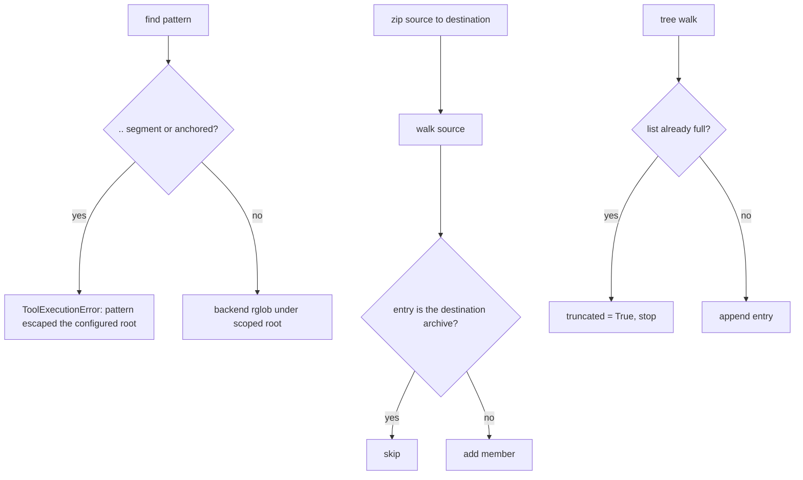

# Filesystem tools: find stays in root, zip skips itself, tree truncation is exact

## Summary

Three small logic fixes in the built-in filesystem tools. `find` passed the model's glob
pattern straight to `Path.rglob`, which treats `..` literally, so `../*` listed files outside
the configured root. `zip` opened its output file before walking the source, so zipping a
folder into a file inside that folder archived the half-written archive into itself. `tree`
reported `truncated=True` whenever it returned exactly `max_entries` entries, even when
nothing was left out.

## Flow chart



## Usage example

```python
from vidbyte.lib.dataclasses import FileSystemToolConfig
from vidbyte.tools.filesystem import FindTool, TreeTool, ZipTool
from vidbyte.tools.types import ToolCall

config = FileSystemToolConfig(root="workspace", allow_write=True)
await FindTool(config).execute(ToolCall("find", {"pattern": "../*"}))          # error result
await ZipTool(config).execute(ToolCall("zip", {"source": ".", "destination": "backup.zip"}))
# backup.zip no longer contains backup.zip
await TreeTool(config).execute(ToolCall("tree", {"max_entries": 3}))           # truncated only if a 4th entry exists
```

## How it works

- `FileSystemPermissions.require_pattern_inside_root(pattern)` rejects a pattern with a `..`
  segment (split on `/` and `\`) or an anchor (absolute or drive-rooted); `FindTool` calls it
  before the backend globs.
- `LocalFileSystemBackend.zip_path` skips the walked entry whose resolved path equals the
  resolved destination.
- `TreeTool` checks whether the list is already full before appending, and sets
  `truncated = True` only when an eligible entry would have been dropped.

## Files changed

- `vidbyte/lib/tools/filesystem/permissions.py`
- `vidbyte/tools/filesystem/find.py`
- `vidbyte/lib/tools/filesystem/backends/local.py`
- `vidbyte/tools/filesystem/tree.py`
- `tests/test_filesystem_tools.py`

## Risks

Patterns such as `sub/../sub/*` that would stay inside the root are now refused too; that is
deliberate and matches how the other tools refuse ambiguous escaping paths.

## Verification

Regression tests for each bug in `tests/test_filesystem_tools.py`, then `python lint/run.py`
and `python scripts/run_ci.py`.
