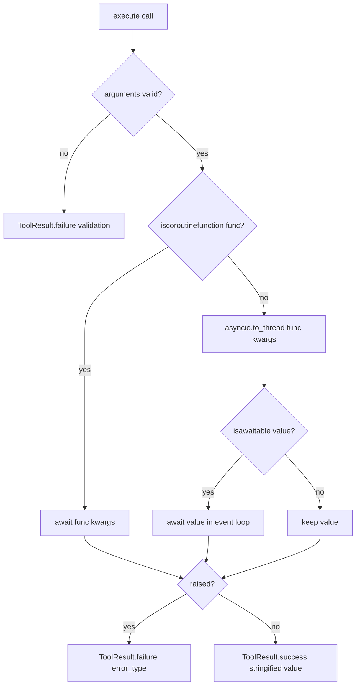

# FunctionTool: await coroutines returned by sync-wrapped async tools

## Summary

`FunctionTool.execute` picks the async path only when `inspect.iscoroutinefunction(self.func)` is true. An `async def` tool wrapped by an ordinary sync decorator (a `functools.wraps` logging, metrics, or retry wrapper) fails that check, so it runs in a worker thread and returns an un-awaited coroutine. The model then receives `"<coroutine object restart at 0x...>"`, the tool's side effect never happens, and Python warns that the coroutine was never awaited. The fix awaits any awaitable value the sync path returns.

## Flow chart



## Usage example

```python
import functools
from vidbyte import tool

def logged(fn):
    @functools.wraps(fn)
    def wrapper(*args, **kwargs):
        return fn(*args, **kwargs)
    return wrapper

@tool
@logged
async def restart(service: str) -> str:
    """Restart a service."""
    return f"restarted {service}"

# The model calls restart(service="db"); the tool result is now "restarted db".
```

## How it works

Inside the existing `try` block, after `value = await asyncio.to_thread(self.func, **kwargs)`, add `if inspect.isawaitable(value): value = await value`. The coroutine is created in the worker thread but is not bound to it, so awaiting it on the event loop is safe. Because the await sits inside the existing `try`, an exception raised by the coroutine still becomes `ToolResult.failure` with its `error_type`. Genuine `async def` tools and plain sync tools run exactly as before.

The `"is_async"` metadata is left unchanged: it describes how the callable is declared, and changing it would need extra state for no behavioral gain.

## Files changed

- `vidbyte/tools/function_tool.py`: three lines in `FunctionTool.execute`.
- `tests/test_custom_function_tools.py`: two tests for a sync-decorated async tool (awaited value; exception becomes a failure).

## Risks

- A sync tool that intentionally returns an awaitable as data would now have it awaited. That was never usable output (it stringified to an object repr), so this is acceptable.
- The wrapper's own sync code still runs in a worker thread; only the returned coroutine runs on the loop.

## Verification

- `python -m pytest -q tests/test_custom_function_tools.py`
- `python lint/run.py`
- `python scripts/run_ci.py`
