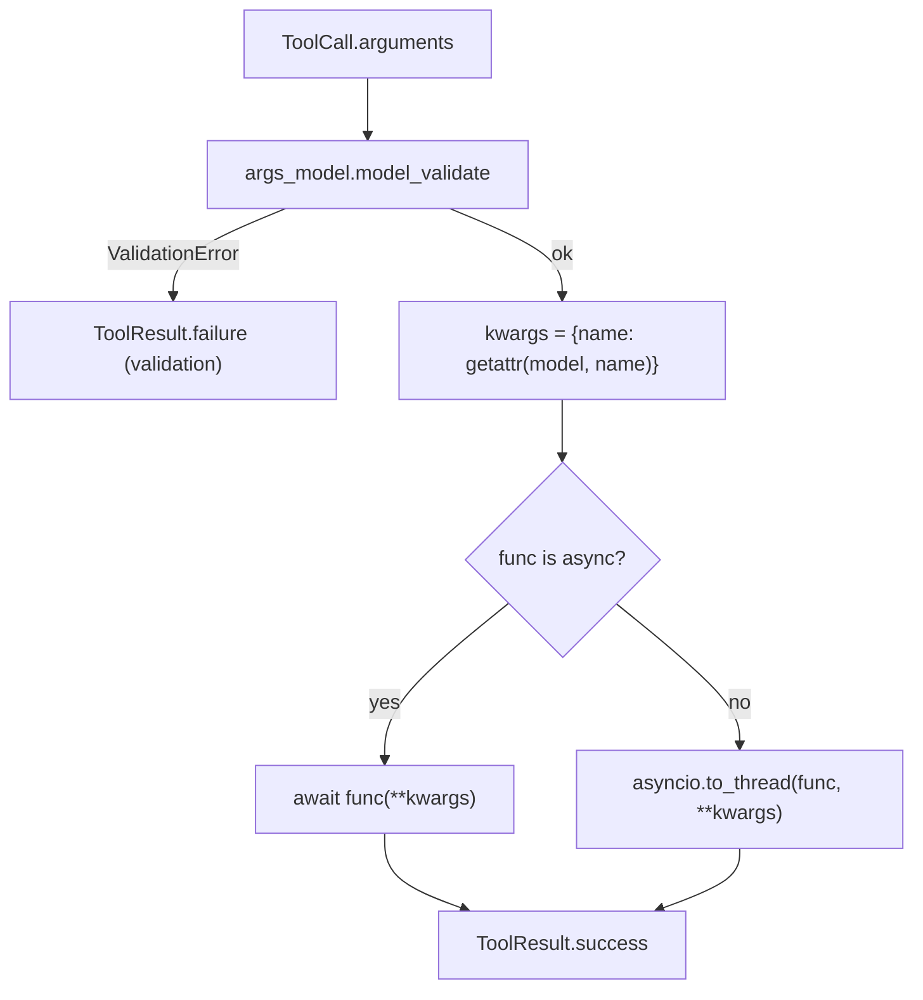

# FunctionTool Typed Keyword Arguments

## Summary

`FunctionTool.execute` validates a tool call into an args model built from the function's own type hints, then calls the function with `model.model_dump(mode="python")`. `model_dump` recursively converts nested Pydantic models and dataclasses back into plain dicts, so a `@tool` function annotated `passenger: Passenger` receives a `dict`, and code such as `passenger.name` fails with `AttributeError`. Enums and coerced scalars already arrive typed, so typed values are the intended contract. The fix passes the validated attribute values through unchanged.

## Flow chart



## Usage example

```python
from pydantic import BaseModel
from vidbyte import tool


class Passenger(BaseModel):
    name: str
    age: int


@tool
def book(city: str, passenger: Passenger | None = None) -> str:
    """Book a trip."""
    return f"{city} for {passenger.name}" if passenger else city

# A model call {"city": "Rome", "passenger": {"name": "Al", "age": 30}}
# now invokes book() with a Passenger instance, not a dict.
```

## How it works

In `vidbyte/tools/function_tool.py`, replace `kwargs = model.model_dump(mode="python")` with `kwargs = {name: getattr(model, name) for name in type(model).model_fields}`. The keys are identical (field names equal parameter names, no aliases); only nested values keep their validated types. Nothing else changes.

## Files changed

- `vidbyte/tools/function_tool.py`: one-line kwargs change in `execute`.
- `tests/test_custom_function_tools.py`: regression test covering a Pydantic-model parameter, a dataclass parameter (`ToolParameter`), an enum parameter, and an int coerced from a string.

## Risks

A tool that relied on receiving dicts for model-typed parameters now receives model instances. That contradicts its own annotation, so this is treated as a bug fix, not a contract change.

## Verification

The new test fails on `main` and passes with the fix; `python scripts/run_ci.py` runs the full gate locally; CI `Source / Python 3.11`, `Source / Python 3.12`, and `Package` run on the branch.
