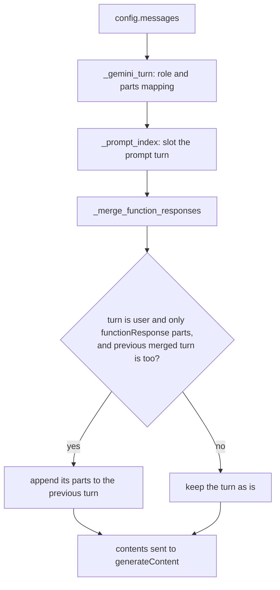

# Gemini Parallel Function Responses

## Summary

When a Gemini model makes several `functionCall`s in one turn, the runtime formats each tool
result as its own `{"role": "user", "parts": [{"functionResponse": ...}]}` turn, and
`GeminiProvider` sent them unchanged. Gemini rejects that with 400 INVALID_ARGUMENT ("the number
of function response parts is equal to the number of function call parts of the function call
turn"), so any Gemini agent whose model calls two or more tools in parallel failed the run with
`ProviderRequestError`. The fix merges consecutive response-only user turns into one user content
inside `GeminiProvider._create_contents`, keeping call order.

## Flow chart



## Usage example

```python
agent = Agent(name="r", system_prompt="s", tools=[search], provider="gemini",
              model_name="gemini-3.5-flash", api_key="...")
# The model answers with search(a), search(b), search(c) in one turn. The next request now carries
#   model [functionCall x3]
#   user  [functionResponse x3]
# instead of three separate user turns, so Gemini accepts it.
await agent.arun("go")
```

## How it works

`_create_contents` gains one final step, `_merge_function_responses`, which walks the assembled
contents and folds a user turn made only of `functionResponse` parts into the previous turn when
that one is also response-only. Text turns, model turns, the `_prompt_index` placement and the
`_gemini_turn` role mapping are unchanged, and a single call still produces one response turn.
Two different call turns always have a model turn between their responses, so responses to
separate call turns are never merged together.

## Files

- `vidbyte/providers/gemini.py`: add `_merge_function_responses` and `_is_function_response_turn`.
- `tests/test_gemini_tool_wire_format.py`: contents-level tests and an end-to-end agent test with a
  strict Gemini fake across two `arun` calls.

## Risks

- A history where response-only user turns follow each other for some other reason is also merged;
  Gemini would reject that shape anyway, so merging is the only valid form.
- The runtime and other providers are untouched.

## Verification

`python -m pytest -q tests/test_gemini_tool_wire_format.py`, `python lint/run.py`,
`python -m pytest -q -x`, and the CI workflows.
