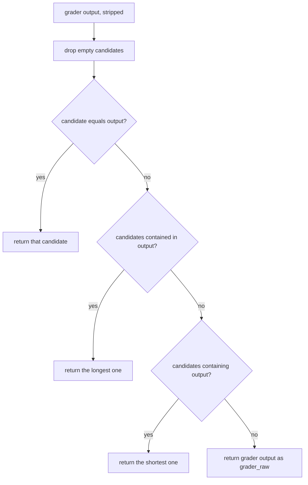

# Grader faithful winner selection

## Summary

`MultiProviderAgenticGraderRuntimeAlgorithm._select_winner` returned the first candidate (dict order) whose text was contained in the grader output, or vice versa. When one candidate's text is a substring of another's (for example `"42"` and `"The answer is 42, because 6 x 7 = 42."`), the grader's choice could be overridden, and an empty candidate matched any grader output. This change makes selection deterministic and faithful to the grader.

## Flow chart



## Usage example

```python
candidates = {"deepseek": "42", "anthropic": "The answer is 42, because 6 x 7 = 42."}
# Grader repeats anthropic's answer verbatim.
output, provider = runtime_algorithm._select_winner(candidates, grader_response, handle)
assert provider == "anthropic"  # previously "deepseek"
```

## How it works

Within `_select_winner`, rank candidates in three tiers: exact match on stripped text; then non-empty candidates contained in the grader output, longest first; then non-empty candidates containing the grader output, shortest first. Ties keep dict order. With no match, return the grader output with provider `grader_raw`, as before.

## Files

- `vidbyte/agents/algorithms/multi_provider_agentic_grader.py`: `_select_winner` ranking.
- `tests/test_multi_provider_agentic_grader.py`: regression test `test_select_winner_prefers_faithful_match`.

## Risks

Only the choice among multiple matching candidates changes; single-match and no-match behavior is unchanged.

## Verification

New unit test fails on the old code and passes on the new; `python scripts/run_ci.py` and `python lint/run.py` pass.
