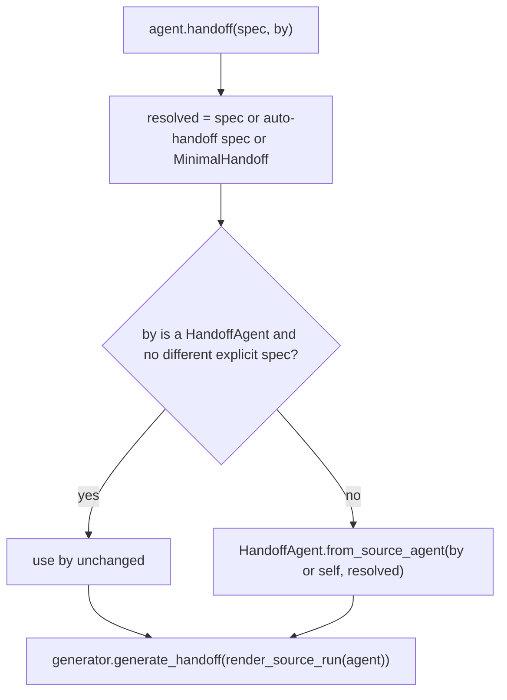

# Handoff `by=` Generator Fix

## Summary

`BaseAgent.handoff(spec=None, *, by=None)` had two bugs when `by` was given. A plain `BaseAgent` passed as `by` crashed with a raw `AttributeError` (only `HandoffAgent` has `generate_handoff`), and an explicit `spec` was silently ignored whenever `by` was a `HandoffAgent`, so the caller got the generator's own default spec back. The fix keeps the documented behavior (design doc `handoff-agent.md` FR 11) and makes `by` work for any agent while honoring an explicitly requested spec.

## Flow chart



## Usage example

```python
from vidbyte import Agent, EngineeringHandoff, HandoffAgent

cheap = Agent(name="cheap", provider="deepseek", model_name="deepseek-chat")
doc = await agent.handoff(EngineeringHandoff(), by=cheap)          # EngineeringHandoff via cheap's model

summarizer = HandoffAgent(provider="deepseek", model_name="deepseek-chat")
doc = await agent.handoff(EngineeringHandoff(), by=summarizer)     # EngineeringHandoff, not MinimalHandoff
doc = await agent.handoff(by=summarizer)                           # summarizer used as-is (MinimalHandoff)
```

## How it works

- `by is None`: unchanged; a generator is built on this agent's runner for the resolved spec.
- `by` is a `HandoffAgent` and no explicit spec, or the explicit spec is `by.spec`: `by` is used as-is.
- Any other `by` (a plain agent, or a `HandoffAgent` with a different explicit spec): `HandoffAgent.from_source_agent(by, resolved)` builds a generator that reuses `by`'s provider, model, key, temperature, and runner cache and fills the requested spec.

## Files

- `vidbyte/agents/base.py`: generator selection in `BaseAgent.handoff`.
- `tests/test_handoff_agent.py`: three regression tests.

`MultiAgent.handoff` overrides the method without calling it, so it is unaffected.

## Risks

A `HandoffAgent` subclass passed as `by` together with a conflicting explicit spec is rebuilt as a plain `HandoffAgent`, so subclass overrides and non-model settings on `by` do not carry over. Honoring the requested spec was chosen over raising, matching the plain-agent path.

## Verification

Offline fake-runner tests for the three cases, then `python lint/run.py` and `python scripts/run_ci.py`.
