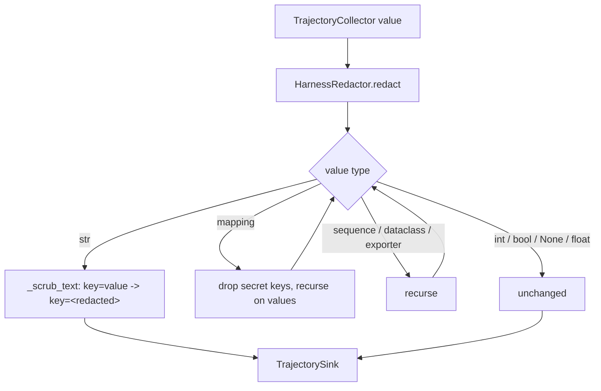

# Harness Free-Text Redaction

## Summary

`HarnessRedactor` is the single redaction pass every harness `task`/`output`/`history`
value goes through before it reaches a `TrajectorySink`. It dropped credential-like
mapping keys but returned every string unchanged, so a credential typed into a request
or echoed by a model (`api_key=sk-...`, `password: hunter2`) was written to the
trajectory verbatim. The credential-assignment regex already existed but was only used
by `safe_error_message`. This change applies that same scrub to every string value.

## Flow chart



## Usage example

```python
from vidbyte.harnesses.serialization import HarnessRedactor

HarnessRedactor().redact({"output": "Connect with api_key=sk-live-9f8e and password: hunter2"})
# {"output": "Connect with api_key=<redacted> and password=<redacted>"}
```

## How it works

A private `_scrub_text` helper holds the existing `_ERROR_ASSIGNMENT` substitution.
`_safe` calls it for every `str` value; `safe_error_message` calls it too and keeps its
own length truncation. Key dropping, recursion, and object projection are unchanged.

## Files

- `vidbyte/harnesses/serialization.py`: add `_scrub_text`, scrub strings in `_safe`.
- `tests/test_harness_redaction.py`: regression test for nested task/output/history text.

## Risks

- A `str` enum member is now emitted as a plain `str`; JSON output is identical.
- Ordinary text matching `token=`/`secret:` followed by a value is redacted. That is the
  intended trade-off already accepted for error messages.
- Regex detection is not complete; tenants can still supply a stricter redactor.

## Verification

`python -m pytest tests/test_harness_redaction.py` (fails before the fix), then the full
`python scripts/run_ci.py --stage source` gate and the dispatched CI workflows.
