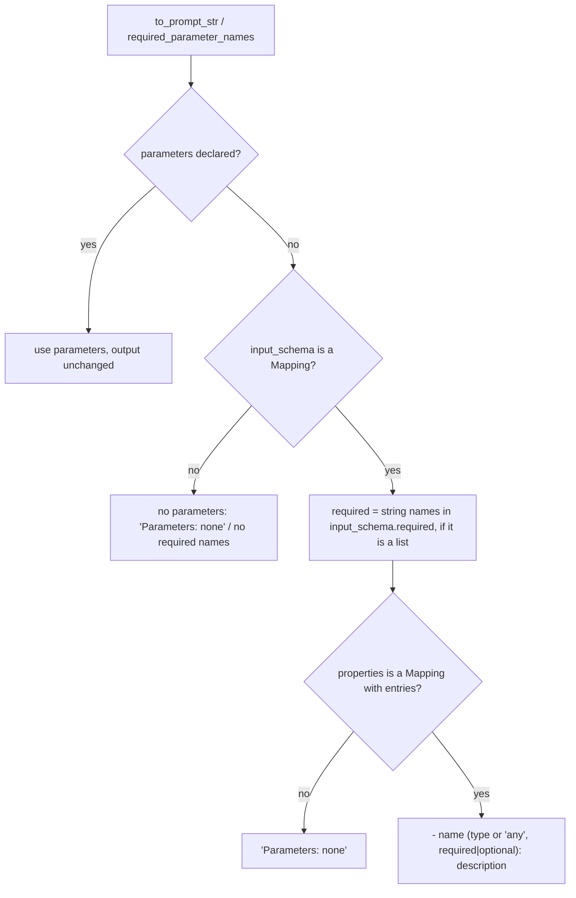

# Input-schema tools: prompt docs and required-argument checks

## Summary

A `ToolSpec` can declare its arguments as typed `parameters` or as a raw JSON Schema `input_schema`. The provider formatter sends `input_schema` when it is a mapping, but `ToolSpec.to_prompt_str()` and `ToolSpec.required_parameter_names()` only read `parameters`. Every tool that declares only `input_schema` (the `run_prompts_sequentially`, `fork_conversation`, `pause`, sessions, context-primitive and handoff builtins, MCP-bridged tools, and any user `BaseTool` written that way) is therefore described in the system prompt as `Parameters: none`, contradicting the native tool schema in the same request, and `BaseTool.validate_call` never rejects a call that omits a field listed in `input_schema["required"]`, so `execute()` runs on arguments that are not valid. This change makes both methods fall back to `input_schema` when no typed parameters are declared.

## Flow chart



## Usage example

```python
from vidbyte.tools import BaseTool, ToolCall, ToolResult, ToolSpec

class LookupOrder(BaseTool):
    def spec(self) -> ToolSpec:
        return ToolSpec(
            name="lookup_order",
            description="Look up an order.",
            input_schema={
                "type": "object",
                "properties": {"order_id": {"type": "string", "description": "Order id."}},
                "required": ["order_id"],
            },
        )

    async def execute(self, call: ToolCall) -> ToolResult:
        return ToolResult.success(self.name, call.arguments["order_id"])

LookupOrder().spec().to_prompt_str()
# ... Parameters:
# - order_id (string, required): Order id.      (was "Parameters: none")
LookupOrder().validate_call(ToolCall("lookup_order", {}))
# 'Missing required parameters: order_id'       (was None)
```

## How it works

- Trigger: fall back to `input_schema` only when `parameters` is empty **and** `input_schema` is a mapping. When `parameters` is empty this is exactly the formatter's precedence (input_schema wins when it is a mapping), so the prompt and validation match what the provider is told. When a spec declares both (only `FunctionTool` does, deriving `parameters` from the same pydantic schema), both describe the same arguments, so keeping `parameters` first leaves every existing parameters-based rendering byte-identical instead of re-rendering `FunctionTool` docs from the raw schema.
- `required_parameter_names()` returns the string entries of `input_schema["required"]` in that case, or `()` if `required` is not a list/tuple.
- `to_prompt_str()` builds its parameter lines from one private helper, which renders typed `parameters` exactly as today or, in the fallback case, each top-level property as `- name (type, required|optional): description`. The type is the property's string `"type"` or `any`; the description is the property's string `"description"` or empty. Non-mapping `properties` or property values never raise. `Parameters: none` stays when there are no lines.
- The fallback is tagged `# @intent input-schema-tool-contract` in the code and in the regression test.

## Files changed

- `vidbyte/lib/dataclasses/tools.py`: the two `ToolSpec` methods plus one private helper.
- `tests/test_tool_core.py`: one regression test class for prompt rendering, required names, `validate_call` through the executor, and malformed schemas.

## Risks and open questions

- Input-schema tools that previously reached `execute()` with a missing required argument now get the executor's `Missing required parameters: ...` error instead of their own message. The builtins already reject those calls in `execute()`, so only the wording changes.
- As with typed parameters, `validate_call` treats an explicit `null` as missing. No builtin declares a nullable required field.
- Activity annotations are still not listed in `to_prompt_str()`; unchanged and out of scope.

## Verification

- Regression test: an input_schema-only spec lists its properties with required/optional markers, returns its required names, and an executor call with `{}` returns the validation error without running `execute()`; malformed schemas render `Parameters: none` without raising; a parameters-based spec renders byte-identically.
- `python lint/run.py` and `python scripts/run_ci.py` pass locally; the PR's required CI checks are green.
