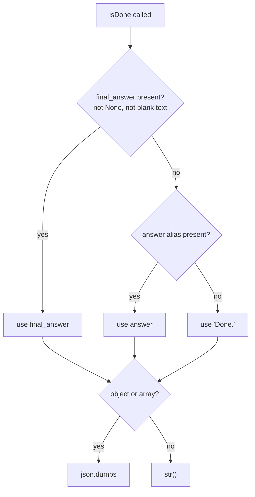

# isDone keeps falsy typed final answers

## Summary

The internal `isDone` tool chose its answer with `final_answer or answer or "Done."`. Python treats `0`, `0.0`, and `False` as false, so a model that finished with `isDone(final_answer=0)` had its real answer replaced by the `"Done."` placeholder. The tool already accepts typed JSON answers (objects and arrays), so typed scalars must survive too. The fix picks the first answer that is actually present, where only `None` and blank text count as absent.

## Flow chart



## Usage example

```python
from vidbyte.tools import ToolCall
from vidbyte.tools._internal import IsDoneTool

tool = IsDoneTool()
(await tool.execute(ToolCall("isDone", {"final_answer": 0}))).output        # "0"
(await tool.execute(ToolCall("isDone", {"final_answer": False}))).output    # "False"
(await tool.execute(ToolCall("isDone", {"final_answer": "", "answer": "x"}))).output  # "x"
(await tool.execute(ToolCall("isDone", {}))).output                          # "Done."
```

## How it works

`IsDoneTool.execute()` reads `final_answer` and the older `answer` alias in order and takes the first one that a new private helper, `_is_given`, accepts: anything except `None` or a blank/whitespace-only string. If neither is given it uses `"Done."`. Rendering is unchanged: objects and arrays become JSON text, everything else goes through `str()`.

## Files changed

- `vidbyte/tools/_internal.py`: answer selection in `IsDoneTool.execute()` plus the `_is_given` helper, with an `@intent falsy-final-answer-is-still-an-answer` comment.
- `tests/test_agent_tool_loop.py`: regression tests next to the existing isDone object-answer tests.

## Risks

- A whitespace-only `final_answer` now falls back to the alias or `"Done."` instead of being returned as blank text; this matches the intent of the old empty-string fallback.
- An empty object or array (`{}` / `[]`) is now returned as JSON text rather than `"Done."`, consistent with treating typed answers as real.

## Verification

- New tests: `0`, `0.0`, `False` render as answers; missing, `None`, `""`, and blank fall back to `"Done."`; a blank `final_answer` uses the `answer` alias; an agent run ending in `isDone(final_answer=0)` replies `"0"`.
- `python lint/run.py` and `python scripts/run_ci.py`, then remote CI.
- Reproduction probe `a304_isdone_falsy_answer.py` prints `BAD total 0`.
