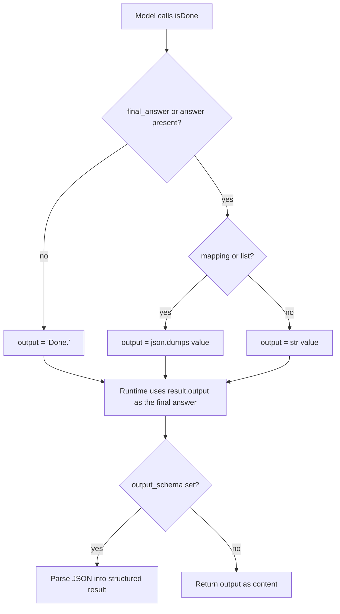

# isDone Keeps Object Final Answers as JSON

## Summary

`IsDoneTool.execute` turned its `final_answer` argument into text with `str()`. Many models (DeepSeek, OpenAI non-strict) send a structured final answer as a JSON object or array rather than a JSON-encoded string, so `str()` produced a Python repr such as `{'severity': 'high'}`. With an `output_schema` the runtime then rejected the model's valid JSON as "not valid JSON" and spent an extra iteration (or failed under tight budgets); without a schema the developer received the repr as the agent's content. The fix serializes mapping and list answers with `json.dumps(..., ensure_ascii=False)` and leaves strings and the existing `answer` alias and `"Done."` default unchanged.

## Flow chart



## Usage example

```python
from pydantic import BaseModel
from vidbyte import Agent

class Ticket(BaseModel):
    severity: str
    owner: str

agent = Agent(name="triage", system_prompt="Triage.", output_schema=Ticket)
# The model finishes with isDone({"final_answer": {"severity": "high", "owner": "dba"}}).
reply = agent.run("DB is down")
assert reply.structured == Ticket(severity="high", owner="dba")  # accepted on the first isDone
```

## How it works

`AgentRuntime` takes the isDone `ToolResult.output` as the final answer, so the one change in `IsDoneTool.execute` covers the linear runtime and every runtime built on it (including `JevRuntime`). Strings pass through untouched, so JSON-encoded string answers behave exactly as before. Falsy answers (`0`, `False`, `{}`) still fall back to `"Done."`; changing that is out of scope.

## Files

- `vidbyte/tools/_internal.py`: serialize mapping/list final answers as JSON.
- `tests/test_agent_tool_loop.py`: regression tests for an object answer with and without an output schema.

## Risks

A developer who relied on the Python repr of a dict answer will now get JSON text. That repr was never a usable format, so this is treated as a bug fix.

## Verification

Offline fake-runner tests: an object `final_answer` with an output schema parses on the first model call with stop reason `is_done`; without a schema the content is valid JSON. Then `python lint/run.py` and `python scripts/run_ci.py`.
