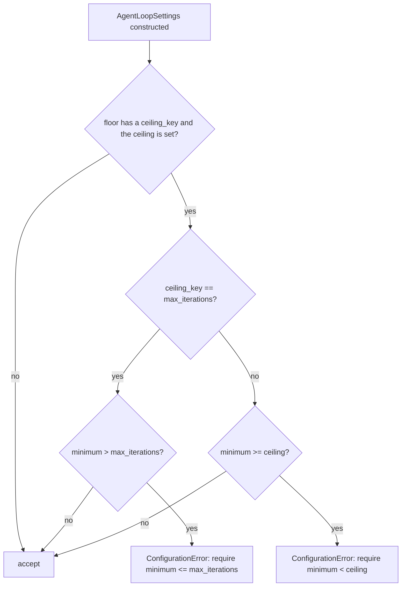

# Iteration floor may equal max_iterations

## Summary

`AgentLoopSettings` rejects `MinIterations(n)` whenever `n >= max_iterations`, calling the
floor "unreachable". That is an off-by-one. The iteration budget is checked at the start of
an iteration, but the floor is checked when the model offers a final answer during an
iteration, after the iteration count has already grown. So with `max_iterations=3` the agent
can offer its answer in iteration 3, when the count is 3, and `MinIterations(3)` is met. The
fix rejects only `minimum > max_iterations` for this pairing. The other paired ceilings
(`max_tokens`, `max_tool_calls`, `timeout_seconds`) keep the strict `minimum < ceiling` rule,
because each of them stops the run before a final answer at that ceiling can be accepted.

## Flow chart



## Usage example

```python
from vidbyte.agents.contracts import MinIterations
from vidbyte.agents.settings import AgentLoopSettings

# Accepted now: the model may finish in its third and last iteration, which meets the floor.
settings = AgentLoopSettings(max_iterations=3, output_contracts=(MinIterations(3),))

# Still rejected: a fourth iteration can never start under a budget of three.
AgentLoopSettings(max_iterations=3, output_contracts=(MinIterations(4),))
# ConfigurationError: ... the floor is unreachable (require minimum <= max_iterations)
```

## Runtime ordering (verified in `vidbyte/agents/runtime.py`)

Inside the `while True` loop of the linear runtime (`JevRuntime` inherits the same loop):

1. `_budget_stop(iteration_count=state.iteration_count, ...)` runs before the model call and
   stops with `MAX_ITERATIONS` when `iteration_count >= max_iterations`. Here
   `iteration_count` is the number of iterations already finished.
2. The model is called.
3. `state.iteration_count += 1` runs right after a model response arrives.
4. When the response has no tool calls (or calls `isDone`), the contract counters are built
   from the new `state.iteration_count` and the floors are evaluated.

So iteration `max_iterations` starts (count `max_iterations - 1` passes step 1), the count
becomes `max_iterations` in step 3, and `MinIterations(max_iterations)` is satisfied in step 4.
By contrast, `max_tokens` is re-checked right before the floor in step 4, and the
`max_tool_calls` budget stops the next iteration in step 1 once reached, so equality there is
truly unreachable.

## How it works

`_validate_contract_ceiling` in `vidbyte/agents/settings/loop.py` treats the
`max_iterations` ceiling as inclusive: for that key it raises only on `minimum > ceiling`,
with the message "(require minimum <= max_iterations)". Every other key keeps `>=` and the
existing message. The rule is keyed on the ceiling rather than added as a flag on the
contract class because the off-by-one comes from where the runtime enforces that ceiling,
which `AgentLoopSettings` owns, and it keeps the change inside the one function that already
reads `ceiling_key`.

Other paths: the YAML loader folds `agent.max_tool_rounds` into a copy of the loop
(`@intent yaml-max-tool-rounds-in-loop`) without re-validating floors, and `AgentFork`
builds a fresh `AgentLoopSettings`, so both follow this single rule. No other code compares
a floor against `max_iterations`.

## Files changed

- `vidbyte/agents/settings/loop.py`: inclusive rule for `max_iterations`, message, `@intent`.
- `tests/features/sdk_loop_settings/test_contract.py`: equality accepted, `n + 1` rejected.
- `tests/test_agent_tool_loop.py`: offline run with `max_iterations=3`, `MinIterations(3)`,
  a model that tries to finish every turn, ending with `final_response` after 3 calls.
- `skills/agentic-loop-settings/SKILL.md`, `tests/features/sdk_loop_settings/FEATURE.md`,
  `llms.txt`: state the iteration exception.

## Risks

Low. The change only accepts a configuration that used to raise; no runtime path changes.
A model that answers with tool calls in its last iteration still stops with
`max_iterations`, which is the expected outcome of a tight budget.

## Verification

`python lint/run.py` and `python scripts/run_ci.py`, then the required CI checks on the PR.
