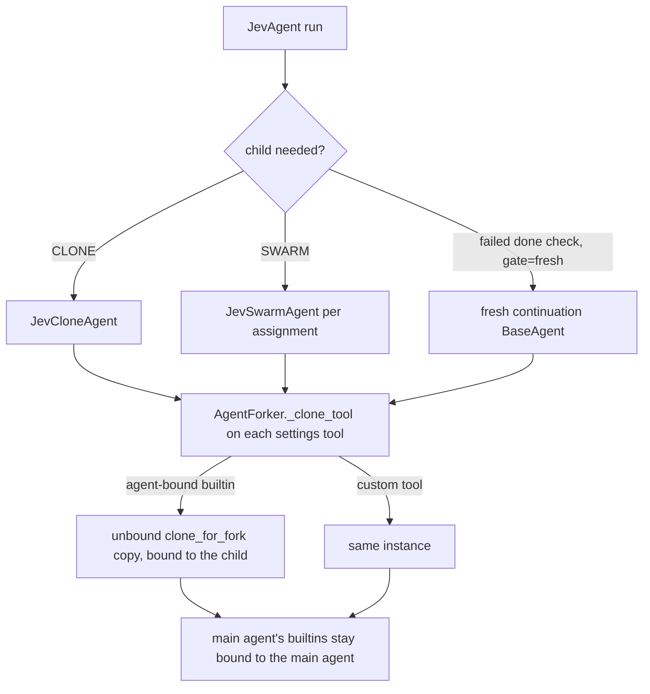

# JevAgent children clone agent-bound tools

## Summary

`BaseAgent.__init__` binds agent-bound builtins (`pause_agent`, `run_prompts_sequentially`, `fork_conversation`, `create_handoff`, `attach_mcp_server`, `AgentTool`, session tools) to the agent being built. `JevCloneAgent`, `JevSwarmAgent`, and the FRESH continuation agent are built mid-run from `settings.tools`, the main agent's own tool instances, so each child steals those bindings. After a CLONE, SWARM, or fresh continuation, the main agent's `pause_agent` pauses a finished helper. The fix gives every JevAgent child the same `clone_for_fork()` copies that `AgentForker` already gives a fork.

## Flow chart



## Usage example

```python
pause = PauseAgentTool()
settings = JevAgentSettings(name="lead", system_prompt="Work.", provider="openai", model_name="gpt-4.1", tools=(pause,))
agent = JevAgent(settings)
JevCloneAgent(settings, 1)
assert pause._agent is agent  # previously rebound to "lead-clone-1"
```

## How it works

Each of the three construction sites passes `tuple(AgentForker._clone_tool(tool, None, None) for tool in settings.tools)` instead of `settings.tools`. `_clone_tool` is the existing fork logic: it looks through `customize()`/`with_activity()` views, calls `clone_for_fork()` where a tool defines it, and otherwise returns the tool itself. Passing no context managers keeps context-manager-bound tools unchanged, matching today's behavior for these children. `vidbyte/agents/jev` importing `vidbyte/agents/fork.py` keeps the dependency direction legal.

## Files

- `vidbyte/agents/jev/compute/clone.py`, `vidbyte/agents/jev/compute/swarm.py`, `vidbyte/agents/jev/agent.py`: clone tools for the child.
- `tests/test_jev_compute_clone.py`, `tests/test_jev_compute_swarm.py`, `tests/test_jev_fresh_continuation.py`: regression tests.

## Risks

The fresh-continuation factory clones once when `JevAgent` is built, so successive fresh agents share one clone set; each runs to completion before the next is built, and the main agent's tools are never shared.

## Verification

Regression tests assert the main agent's `PauseAgentTool` and `RunPromptsSequentiallyTool` stay bound to the main agent after each child is built. `python lint/run.py` and `python scripts/run_ci.py` pass locally, and CI is green.
