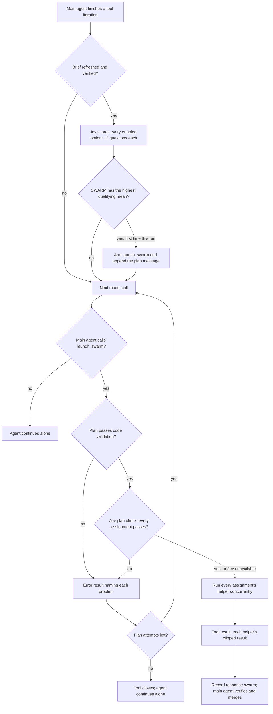

# Jev dynamic compute: SWARM

## Summary

`SWARM` is a fifth dynamic-compute option. When Jev recognizes that the remaining work is many large, separate, independent units, the checkpoint gives the main agent a `launch_swarm` tool and asks it to plan a team. The main agent writes one assignment per unit, up to ten. Code validates the plan, Jev checks every assignment, and up to ten helper agents then run concurrently. Their results come back as the tool result, and the main agent verifies and merges them.

It differs from the existing options by what it bets on. `SUBAGENT` recognizes one bounded unit, `FORK_AGENT` compares alternative approaches, and `CLONE` repeats one approach. `SWARM` bets on breadth: many distinct units that one agent would otherwise grind through serially, often over a horizon far longer than one run.

## Flow chart



## Usage example

```python
from vidbyte.agents.jev import JevAgent, JevAgentSettings, JevComputeSettings, JevRuntimeSettings
from vidbyte.lib.enums import JevDynamicComputeOption

agent = JevAgent(
    JevAgentSettings(
        name="auditor",
        system_prompt="You audit services for security problems.",
        provider="openai",
        model_name="gpt-4.1",
        tools=(read_file, search_code, write_file),
    ),
    JevRuntimeSettings(
        compute=JevComputeSettings(
            dynamic_compute=(JevDynamicComputeOption.SUBAGENT, JevDynamicComputeOption.SWARM),
            swarm_agents=10,
        ),
    ),
)
reply = await agent.arun("Audit each of the 14 services under services/ for SSRF and write one findings file per service.")
swarm = agent.response.swarm
if swarm is not None:
    for output in swarm.outputs:
        print(output.name, "completed" if output.completed else "failed")
```

## When a swarm wins: the evidence behind the questions

The questions come from published evidence about when parallel agents beat one agent, and when they make results worse.

| Scenario or finding | Source | What it implies |
|---|---|---|
| Breadth-first research over many entities; complex research uses 10+ subagents with divided responsibilities; vague subtasks caused duplicated work | Anthropic multi-agent research system | Many units, enumerated units, disjoint scopes, context overflow |
| Wide information seeking across many entities is repetitive rather than hard, and single agents score near zero | WideSearch benchmark; Kimi K2.5 swarm (3x–4.5x fewer critical steps on wide search) | Many units, combined result, long horizon |
| Parallelizable work improved 80.9%; sequential planning degraded 39–70%; independent agents amplified errors 17.2x versus 4.4x with an orchestrator | Google, "Towards a Science of Scaling Agent Systems" | Independent units, per-unit verification, combined result |
| 16 agents built a compiler over about two weeks by splitting many failing tests; one giant task made every agent hit the same bug and overwrite each other | Anthropic, building a C compiler with parallel Claudes | Separate blockers, per-unit verification, long horizon |
| Hundreds of agents ran for weeks once workers owned separate tasks; shared locks cut 20 agents to the throughput of 2–3 | Cursor, scaling long-running autonomous coding | Isolated writes, disjoint scopes, long horizon |
| Subagents that cannot see each other make conflicting implicit decisions | Cognition, "Don't build multi-agents" | Settled conventions |
| Per-file pipelines migrated 3.5k test files in six weeks; LLM migrations at Google covered thousands of files | Airbnb; Google code migration paper | Many substantial units, per-unit verification |
| Input that exceeds one context is processed by map then reduce | LLM×MapReduce; Chroma context rot | Context overflow, combined result |

The twelve SWARM questions, each one observable signal:

| Key | Signal |
|---|---|
| `swarm.many_units` | Many distinct unfinished units, clearly more than two or three. |
| `swarm.substantial_units` | Each unit is multi-step work, not a lookup. |
| `swarm.enumerated_units` | The units are already named or listed in the run. |
| `swarm.disjoint_scopes` | Every item belongs to exactly one unit. |
| `swarm.independent_units` | No unit needs another unit's result. |
| `swarm.settled_conventions` | Shared formats, interfaces, and methods are already fixed. |
| `swarm.separate_blockers` | Difficulties are per unit, not one shared blocker. |
| `swarm.unit_verification` | Each unit's result can be checked on its own. |
| `swarm.isolated_writes` | Units read only or write to their own targets. |
| `swarm.long_horizon` | Remaining serial effort is many times the effort already spent. |
| `swarm.context_overflow` | Unit-specific material exceeds one careful context. |
| `swarm.combined_result` | The deliverable is assembled from unit results, not chosen among them. |

`SWARM` is last in enum order, so `SUBAGENT` wins a tie. The first five questions separate the two: one bounded unit answers them false.

## How it works

1. **Option and questions.** `JevDynamicComputeOption.SWARM`, twelve `SWARM_*` keys, and twelve `JevComputeQuestion` instances in `vidbyte/lib/jev/compute/situations.py`. Recognition, scoring, and the threshold are unchanged.
2. **Setting.** `JevComputeSettings.swarm_agents: int = 10`, validated from 2 through 10. `SWARM` is opt-in like `CLONE`.
3. **Arming.** When a decision selects `SWARM` for the first time in a run, `JevComputeController` builds one `JevSwarmTool` and appends the plan message. `JevComputeController.tools(catalog)` returns the catalog with that tool added, and `JevRuntime` assigns it after each checkpoint.
4. **Base runtime.** `AgentRuntime` resolves tool schemas once per run. After `_after_tool_iteration`, it now re-resolves them only when the hook replaced `self.tools`. Every other runtime keeps the same catalog object, so nothing else changes.
5. **The tool.** `launch_swarm` is an internal tool, so it has no per-tool timeout and its result is never compacted. Its arguments are shared `conventions` plus one assignment per unit with `name`, `objective`, `inputs`, `deliverable`, `boundaries`, and `verification`. Every field description lives in the `jev_swarm` prompt family.
6. **Plan validation.** `JevSwarmPlanReader` turns the arguments into a validated `JevSwarmPlan`, with ids `A1` through `A10`. It requires at least two assignments, at most the configured count, unique names, and bounded non-blank text.
7. **Plan check.** `JevSwarmPlanCheck` asks Jev four questions per assignment in one request: self-contained, disjoint, in scope, and checkable deliverable. An answer below `0.5` P(true) rejects the plan with that question's gap text. A Jev outage or missing answer fails open. Each rejection uses one of three attempts, and the tool closes when they run out.
8. **Helpers.** `JevSwarmAgent` copies the main agent's settings with empty history. Each helper receives its assignment as the prompt and the original request plus the verified brief as typed context items. All helpers run concurrently. A helper that raises the SDK error or returns nothing is marked failed, and the others still count.
9. **Results.** The tool result lists every assignment's result, clipped to a fixed bound. `JevAgent.response.swarm` records the plan, outputs, and plan attempts. The tool closes after a launch, so the swarm runs at most once per run.

## Files

- `vidbyte/lib/enums/jev.py`, `vidbyte/lib/enums/__init__.py`, `vidbyte/lib/enums/prompts.py`: option, question keys, plan question keys, prompt keys.
- `vidbyte/lib/constants/jev.py`: agent bounds, plan limits, threshold, tool name, clip bound.
- `vidbyte/lib/dataclasses/jev.py`: `JevSwarmPlanQuestion`, `JevSwarmAssignment`, `JevSwarmPlan`, `JevSwarmOutput`, `JevSwarmResult`, `JevAgentResponse.swarm`.
- `vidbyte/lib/jev/compute/situations.py`, `compute.py`, new `plan.py`: twelve option questions, registry entry, four plan questions and their registry.
- `vidbyte/agents/runtime.py`: re-resolve schemas when the hook replaced the catalog.
- `vidbyte/agents/jev/settings.py`, `runtime.py`, `response.py`.
- `vidbyte/agents/jev/compute/controller.py`, `states.py`, and new `swarm.py`, `swarm_plan.py`, `swarm_tool.py`.
- `vidbyte/prompts/prompts/jev_swarm/` (new) and `vidbyte/prompts/README.md`.
- Tests: `tests/test_jev_compute_situations.py`, new `tests/test_jev_compute_swarm.py`.
- Docs: Jev README, compute README, `REPO_MAP.md`, `skills/jev-agent/SKILL.md`, `skills/asking-jev-dynamic-compute-questions/SKILL.md`.

## Risks and open questions

- **Cost.** One launch can run ten full agent loops. The opt-in default, the once-per-run cap, and plan validation bound it.
- **Shared side effects.** Helpers use the main agent's tools and permissions. The isolated-writes question and the disjoint plan check lower the risk, but nothing sandboxes a helper.
- **Base runtime.** The schema re-resolve runs only when a hook replaces the catalog, which no other runtime does.
- **Plan-check threshold.** `0.5` is an initial value. A false rejection costs one retry; a false acceptance launches a weaker assignment.
- **Helper model.** Helpers use the main agent's model, matching `CLONE`. A cheaper helper model is left for later.

## Verification

- Question tests: twelve SWARM questions with the existing shape checks, 60 total, and four plan questions with per-assignment names.
- Settings tests: opt-in default, `swarm_agents` default and bounds.
- Plan reader tests: valid plan, too few or too many assignments, duplicate names, missing fields.
- Run tests with scripted runners: the tool appears in model calls only after a SWARM selection; a valid plan runs every helper and returns their results; a rejected plan returns gap text and a corrected plan launches; exhausted attempts close the tool; a failed helper is reported; a Jev outage fails open; a non-SWARM selection adds no tool.
- `PYTHONPATH=<worktree> python scripts/run_ci.py --stage source`, then `python scripts/run_ci.py --stage package`.
