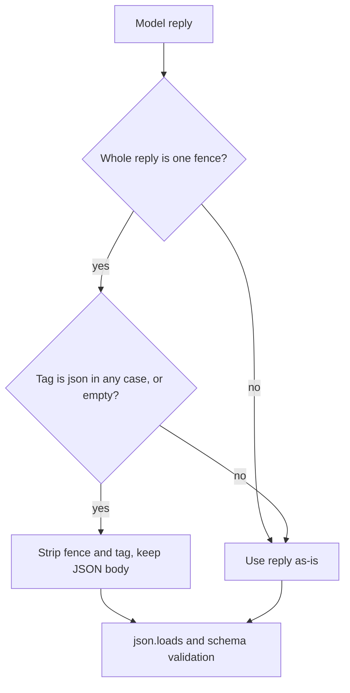

# Case-Insensitive JSON Fence Stripping

## Summary

Two regexes strip a markdown fence that providers wrap around JSON output, but their optional
language tag `(?:json)?` is case-sensitive. A reply fenced as ```` ```JSON ```` or ```` ```Json ````
keeps the tag in the captured body, so `json.loads` fails. For a `BaseAgent` with `output_schema`
this costs a repair turn per occurrence and can exhaust `max_contract_rejections`, raising
`OutputSchemaViolationError` on a valid answer. The fix adds `re.IGNORECASE` to both patterns,
matching what `vidbyte/agents/multi/orchestrator.py` already does.

## Flow chart



## Usage example

```python
from pydantic import BaseModel
from vidbyte.providers.output_schema import OutputSchemaFormatter

class Total(BaseModel):
    total: int

parsed, error = OutputSchemaFormatter().validate('```JSON\n{"total": 4}\n```', Total)
assert error is None and parsed.total == 4
```

## How it works and files changed

- `vidbyte/providers/output_schema.py`: `_FENCED_JSON` gains `re.IGNORECASE` (used by `validate()`).
- `vidbyte/providers/compatible.py`: `_WHOLE_FENCE` gains `re.IGNORECASE` (used by `_unwrap_whole_json_fence`).
- Nothing else in either pattern depends on letter case, so no other behavior changes.

## Risks

None material. Non-JSON fences (for example ```` ```python ````) are still left untouched because
the compatible provider only unwraps bodies that parse as JSON.

## Verification

Regression tests for ```` ```JSON ```` and ```` ```Json ```` in
`tests/test_output_schema_formatter.py` and `tests/test_deepseek_provider.py`, then
`python lint/run.py` and `python scripts/run_ci.py`.
