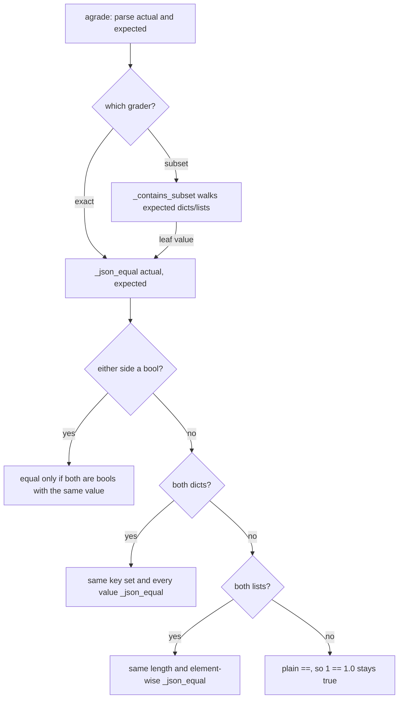

# JSON graders: booleans are not numbers

## Summary

`JSONExactMatchGrader` and `JSONSubsetGrader` compare parsed JSON with Python `==`. In Python `True == 1` and `False == 0`, so a JSON boolean matched the numbers 1 and 0, at the top level and nested inside objects and arrays. An eval written to catch an extraction agent that emits `{"approved": 1}` instead of `{"approved": true}` passed. JSON's data model keeps booleans and numbers apart (the sibling `json_schema.py` grader already rejects `bool` for `integer`/`number`), but it has one number type, so `1` and `1.0` must stay equal. This change adds one JSON-aware equality that both graders use.

## Flow chart



## Usage example

```python
import json
from vidbyte.evals import EvalCase, JSONExactMatchGrader, JSONSubsetGrader

case = EvalCase(prompt="x", expected=json.dumps({"approved": True, "count": 1}))

await JSONExactMatchGrader().agrade(case, '{"approved": 1, "count": 1}')     # passed=False (was True)
await JSONSubsetGrader().agrade(case, '{"approved": 1, "count": 1, "x": 2}')  # passed=False (was True)
await JSONExactMatchGrader().agrade(case, '{"approved": true, "count": 1.0}') # passed=True  (1 == 1.0 kept)
```

## How it works

- Add a private `JSONExactMatchGrader._json_equal(actual, expected)`. If either side is a `bool`, the values are equal only when both are `bool` and equal. Dicts are equal when they have the same key set and every value is `_json_equal`. Lists are equal when they have the same length and every element pair is `_json_equal`. Anything else falls back to `==`.
- `JSONExactMatchGrader.agrade` calls `_json_equal` in place of `==`.
- `JSONSubsetGrader._contains_subset` keeps its dict and list containment logic (including the index-based list semantics) and only swaps its leaf `actual == expected` for `self._json_equal(actual, expected)`.
- The invariant is tagged `# @intent json-bool-is-not-number` in the helper and in the regression test.

## Files changed

- `vidbyte/evals/graders/json_match.py`: the helper plus two call-site swaps.
- `tests/test_evals.py`: one regression test covering both graders.

## Risks and open questions

- Evals that relied on `true` matching `1` will now fail. That is the intended fix; JSON treats them as different values.
- Non-JSON Python inputs (already-structured values such as tuples) keep falling back to `==`, as before.

## Verification

- New test: bool vs 1/0 fails for both graders at the top level and nested in dicts and lists; `1` vs `1.0` still passes; identical booleans still pass.
- `python lint/run.py` and `python scripts/run_ci.py` pass locally; the PR's required CI checks are green.
