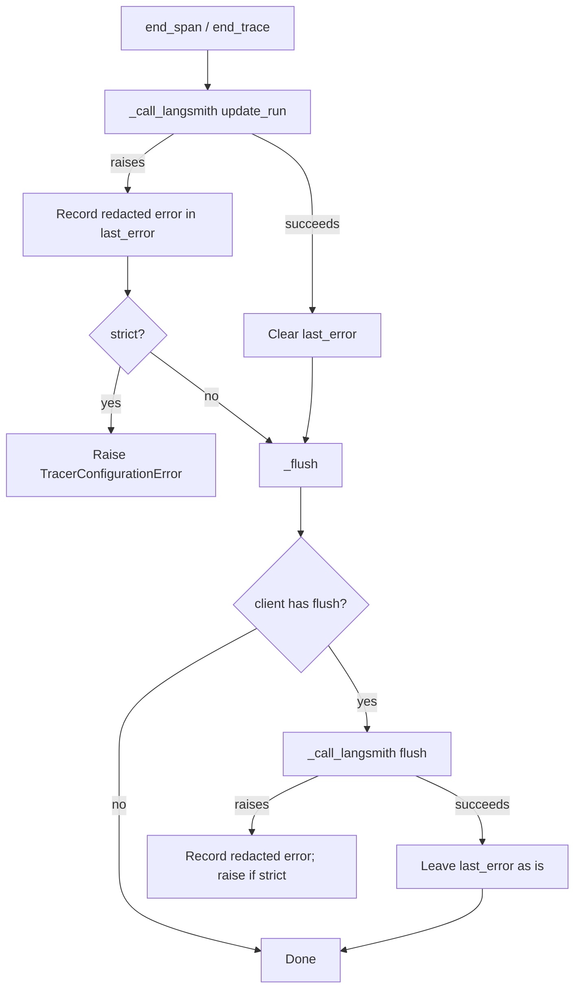

# LangSmith Flush Keeps Last Error

## Summary

In non-strict mode `LangSmithTracer` keeps the agent run alive when LangSmith rejects a call, and keeps a redacted copy of the failure in `tracer.last_error` so the caller can see that tracing broke. `end_span` and `end_trace` call `update_run` and then `_flush()`, and both go through `_call_langsmith`, which sets `_last_error = None` after any successful call. The real `langsmith.Client.flush()` only drains its queue and does not raise, so every rejected `update_run` was erased one line later and `last_error` was `None` after a run where every run update failed. The fix stops a successful flush from clearing the error (`@intent flush-keeps-delivery-error`).

## Flow chart



## Usage example

```python
from vidbyte import Agent
from vidbyte.providers.tracing.langsmith import LangSmithTracer

tracer = LangSmithTracer(api_key="lsv2_pt_...", project="support-bot")
agent = Agent(system_prompt="Be helpful.", tracer=tracer)
reply = agent.run("hello")  # the run succeeds even if LangSmith rejects run updates

if tracer.last_error is not None:
    # e.g. "422 Unprocessable Entity ... lsv2_[REDACTED]"
    print("LangSmith delivery failed:", tracer.last_error)
```

## How it works

`_call_langsmith` clears `_last_error` after a successful call only when the action is not `"flush"`. A later successful `create_run` or `update_run` still clears an earlier error, so `last_error` describes the most recent run-level delivery. A flush that raises is still recorded (and still raises in strict mode). Redaction and strict-mode raising are unchanged.

## Files changed

- `vidbyte/providers/tracing/langsmith.py`: guard the clear in `_call_langsmith` and add the `@intent` comment.
- `tests/test_tracing.py`: regression tests with a flush-capable client double: non-strict `end_trace` and `end_span` keep a redacted `last_error`; strict mode still raises on update failure; a failing flush is still recorded.

## Risks

A flush error now persists until the next successful `create_run`/`update_run` instead of being cleared by a later successful flush. That is consistent with "most recent run delivery error" and only affects diagnostics.

## Verification

`python -m pytest tests/test_tracing.py`, then `python lint/run.py` and `python scripts/run_ci.py`, then the GitHub CI checks.
