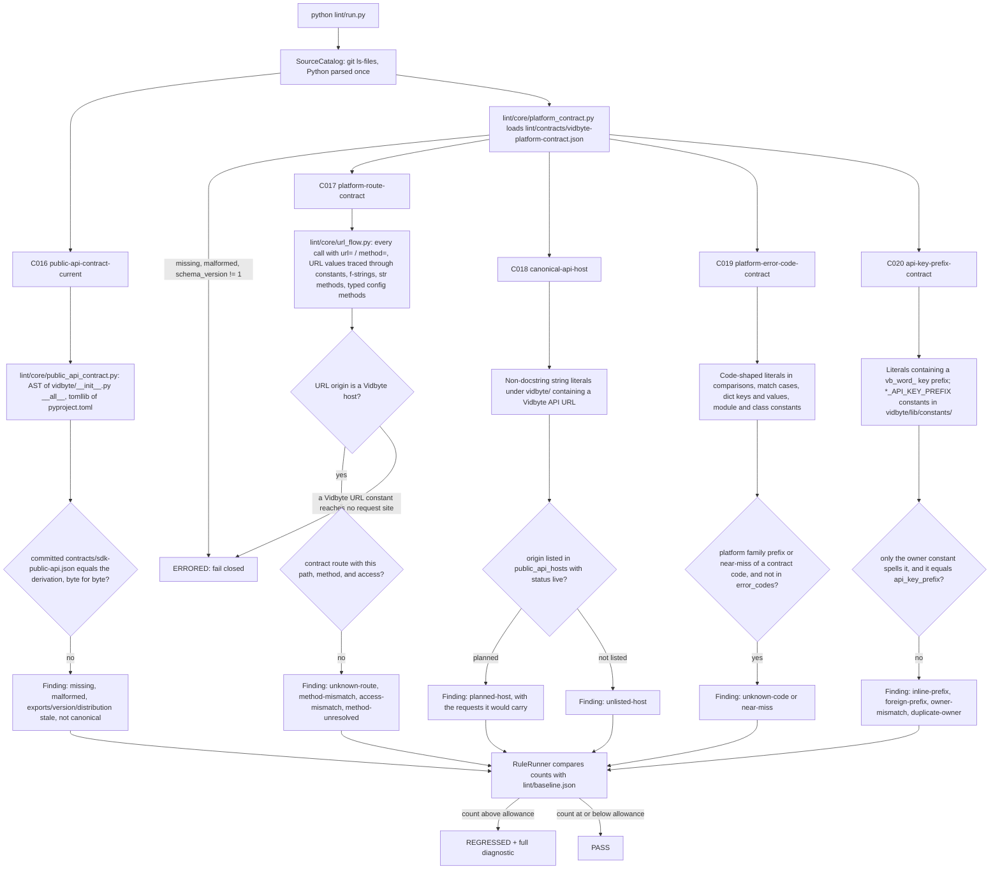

# Design Doc: SDK Lint — Cross-Repo Contract Rules (C016–C020)

**Status:** Draft
**Created:** 2026-10-09
**Branch:** `feat/lint-sdk-cross-repo-contracts`

## Summary

This PR is the SDK's side of the cross-repo contracts. It ships one owned contract, one vendored contract, and five static rules. None of the rules imports `vidbyte` or contacts the network.

- **Owned contract.** `contracts/sdk-public-api.json` records the SDK's public import surface, which is the sorted names of `vidbyte.__all__`, together with the distribution name and version from `pyproject.toml`. `scripts/generate-sdk-public-api.py` derives it from source with `ast` and `tomllib`. The CLI's C5 vendors this file.
- **Vendored contract.** `lint/contracts/vidbyte-platform-contract.json` is a byte-for-byte copy of the platform contract generated by cerredz/Vidbyte (V1, #648). It holds 103 routes, 13 x402 capabilities, 79 error codes, the API-key prefix, and the public API hosts.
- **C016 `public-api-contract-current`** (X03, owner side). The committed `contracts/sdk-public-api.json` matches what the generator derives now, in data and in bytes.
- **C017 `platform-route-contract`** (X05). Every HTTP request the SDK sends to a Vidbyte host goes to a contract route, with a matching method and a compatible access class.
- **C018 `canonical-api-host`** (X06). Every Vidbyte API URL hardcoded in SDK production code uses a host that the contract lists with status `live`.
- **C019 `platform-error-code-contract`** (X07). Every platform error-code literal that SDK code branches on or maps exists in the contract's `error_codes`.
- **C020 `api-key-prefix-contract`** (X10). The SDK spells the Vidbyte API-key prefix only in one `vidbyte/lib/constants/` constant, and that constant equals the contract's `api_key_prefix`.

The four consumer rules fail closed (ERRORED) when the vendored contract is missing, malformed, or has the wrong `schema_version`. Existing debt is frozen at its measured count: C016 = 0, C017 = 0, C018 = 1, C019 = 0, C020 = 4. This PR changes no product code. The C018 finding is a live bug: managed JEV calls are pinned to `api.vidbyte.pro`, which does not resolve. It is listed under "Product findings for follow-up" in the PR body.

## Flow chart



## Usage example

```bash
python lint/run.py --rule C018                  # focused text report
python lint/run.py --rule C017 --format json
python scripts/generate-sdk-public-api.py --check   # exit 1 when contracts/sdk-public-api.json is stale
python scripts/generate-sdk-public-api.py           # regenerate after committing a vidbyte/__init__.py or version change
python lint/run.py                              # whole suite, as scripts/run_ci.py runs it
```

Sample finding (the baselined C018 finding, abbreviated):

```text
SDK-LINT C018 canonical-api-host [BLOCKING]

WHERE
  vidbyte/lib/constants/jev.py:20
  VIDBYTE_JEV_GATEWAY_ENDPOINT: str = "https://api.vidbyte.pro/api/v1/models/typesafe"

WHAT HAPPENED
  vidbyte/lib/constants/jev.py:20 `VIDBYTE_JEV_GATEWAY_ENDPOINT` hardcodes the Vidbyte API host
  https://api.vidbyte.pro, which lint/contracts/vidbyte-platform-contract.json lists with status
  `planned`, not `live`. Requests built from it: POST /api/v1/models/typesafe/systemone
  (vidbyte/providers/typesafe.py:177), POST /api/v1/models/runs/{run_id}/close (:181),
  GET /api/v1/models/typesafe/models (:188).

HOW TO FIX
  1. Change the origin of VIDBYTE_JEV_GATEWAY_ENDPOINT to the live host the contract lists,
     https://vidbyte-backend.onrender.com, and keep the path /api/v1/models/typesafe.
  2. If the host must be configurable, ...
```

## Rule IDs

The implementation plan pre-assigns C016–C020 to this PR. S1 owns C006–C008, S2 owns C009–C012, and S3 owns C013–C015, S063, and S064. Before work started, all five IDs were confirmed unused on `origin/main` (`f8b048ab`), on the S1, S2, and S3 branches, and on every other remote branch: no rule module, registry entry, baseline key, or README row uses them.

| Shipped ID | Name | Catalog entry | Side |
|---|---|---|---|
| C016 | `public-api-contract-current` | X03 | owner: generator + freshness |
| C017 | `platform-route-contract` | X05 | consumer |
| C018 | `canonical-api-host` | X06 | consumer |
| C019 | `platform-error-code-contract` | X07 | consumer |
| C020 | `api-key-prefix-contract` | X10 | consumer |

## Contract files

### Owned: `contracts/sdk-public-api.json`

- **Schema.** The schema is fixed by the implementation plan, and its keys are in this order: `{"schema_version": 1, "source": {"repository": "cerredz/Vidbyte-SDK", "commit": "<sha>", "generator": "scripts/generate-sdk-public-api.py"}, "distribution": "vidbyte-sdk", "version": "<pyproject [project].version>", "exports": [<sorted unique names of vidbyte.__all__>]}`.
- **Canonical bytes.** The rendering follows V1: top-level keys in schema order, `source` on one line, one export per line, LF endings, and a trailing newline. `contracts/.gitattributes` pins `*.json` to LF, as V1's does, so a Windows checkout cannot change the vendored bytes.
- **Derivation without importing.** `vidbyte/__init__.py` is parsed with `ast`, and `__all__` is resolved honestly:
  - from list and tuple literals of strings;
  - through `+` concatenation, `*name` unpacking, and `list()`, `tuple()`, and `sorted()`;
  - through module-level names bound earlier in the file, and `__all__` imported from another `vidbyte` module (`from vidbyte.x import __all__ as y`, or `x.__all__`);
  - through `__all__ +=`, `__all__.extend(...)`, and `__all__.append(...)` in statement order.

  Anything else fails closed and names the line: a conditional or nested assignment, `del`, another mutator, a comprehension, a call, or a non-string element. `pyproject.toml` is read with `tomllib`, and a `dynamic` version fails closed. Today `__all__` is one 593-name list literal with no duplicates.
- **Provenance.** `source.commit` is the commit at which the generator read its inputs. The generator writes only when `vidbyte/__init__.py`, `pyproject.toml`, and any module it followed match `HEAD`. It keeps the recorded commit when the derived data is unchanged. This mirrors `scripts/generate-platform-contract.py` in V1. The committed file was generated at this PR's base, `f8b048ab`, before the first commit on the branch. Those inputs are byte-identical on the branch, so the hash survives a squash merge.
- **Exports are `__all__`, nothing more.** Four root imports (`FunctionTool`, `ToolMixin`, `ContinualTraceAgentDescriptor`, `HandoffAgentDescriptor`) are bound in `vidbyte/__init__.py` but missing from `__all__`. These are known S015 debt, and the contract does not list them. The CLI imports `FunctionTool` from `vidbyte.tools`, so C5's surface rule will see it as non-public. That is listed as a product finding.

### Vendored: `lint/contracts/vidbyte-platform-contract.json`

- **Source.** It was copied byte for byte from cerredz/Vidbyte. Its blob is `0be92ffe2fa7a79ff3780be36b95962a0b56fac3` in all three of these places:
  - the V1 branch `feat/lint-platform-contract-export`, at head `449fa6ff788a5c49fb1e292c05f37059e971dec0` (the contract was committed in `cafc18ff`);
  - that PR's squash merge to vidbyte `main`, `bbeef425a3af7e554d55a3016d73f0fa85976c76` (#648 merged while this PR was being built);
  - this repository.

  Its own `source.commit` is `3b501a638cbea33b89ce4a6d9ae9527df7699b24`.
- **Line endings.** `lint/contracts/.gitattributes` pins LF.
- **Refreshing.** `lint/contracts/README.md` records the provenance and the refresh steps. The vendored copy is never edited by hand.
- **One reader.** `lint/core/platform_contract.py` is the shared reader for C017–C020. It validates the whole document against the fixed schema: exact key sets, `schema_version == 1`, the source fields, the route, capability, and host records, sorted unique error codes, and a whitespace-free prefix. Any problem raises `PlatformContractUnavailable`, which the runner reports as ERRORED. Its message names the file, the field, and the fix.

### Placement

- AGENTS.md's Placement Rules govern code inside the `vidbyte` package: dataclasses, enums, and new JEV code. They say nothing about repository-root data folders or about `lint/`. So neither `contracts/` nor `lint/contracts/` conflicts with them, and both locations are the ones the plan names.
- `lint/` never imports `vidbyte`, so its frozen records stay in `lint/`, as `lint/core/diagnostic.py` and C010's `PricebookSpec` already do.
- REPO_MAP.md lists neither `lint/` nor the new `contracts/` folder. It is a lossy map, and this rules-only PR leaves it unchanged. Adding both entries is noted as a follow-up.

## How each rule works

### C016 public-api-contract-current

- **Standard.**
  - The implementation plan's cross-repo contract section: "Each owner PR ships the generator script plus a lint rule proving its committed export is current. That check must be static and must not import the product package."
  - X03: the CLI imports 22 SDK names through deep paths that SDK placement rules A009/A010 move code between. So consumers may import only the names this file lists, and a stale list either blocks a legitimate import or allows one that no longer exists.
- **Detection.** C016 derives the data exactly as the generator does, then compares it with the committed file.
- **Kinds.**
  - `contract-missing`: the file is absent or untracked.
  - `contract-malformed`: not UTF-8, invalid JSON, or a schema violation. This covers the key order, `schema_version`, the repository or generator value, a commit that is not 40 lowercase hex characters, and exports that are unsorted, duplicated, or not identifiers.
  - `exports-stale`: names added to or removed from `__all__`, each listed with its `__all__` line.
  - `version-stale` and `distribution-stale`.
  - `not-canonical`: the data is right but the bytes differ, such as after a hand edit or a CRLF checkout. This kind is reported only when the data is current.
  - `source-unresolvable`: `__all__` or the version cannot be resolved statically.
  - `generator-missing`: `scripts/generate-sdk-public-api.py` is not tracked.
- **Repair.** Commit the source change, run `python scripts/generate-sdk-public-api.py`, then commit the regenerated file in the same PR. A removed or renamed export also needs the CLI's vendored copy refreshed.

### C017 platform-route-contract

- **Standard.** X05: every route the SDK calls must match a contract route's method, path, and access. The SDK sends three:
  - `POST /api/v1/models/typesafe/systemone` (`models.typesafe.systemone`);
  - `GET /api/v1/models/typesafe/models` (`models.typesafe.list`);
  - `POST /api/v1/models/runs/{run_id}/close` (`models.runs.close`).

  The catalog listed only the first two. The run-close route is built in `DecisionModelConfig.resolved_run_close_url` from `JEV_MANAGED_RUN_CLOSE_PATH`. All three are `API_KEY` routes, and all three resolve today.
- **Request sites.** A request site is any call with a `url` argument, given by keyword or by position when the callee's signature is known. Its `method` comes from the same call.
- **URL tracing.** `lint/core/url_flow.py` traces each URL expression to its possible string values. It follows:
  - literals and f-strings, and `+` concatenation;
  - `or` and conditional expressions;
  - module constants, including constants imported from other `vidbyte` modules;
  - class constants;
  - `str.format` (which keeps `{name}` placeholders), `removesuffix`, `removeprefix`, and `strip`/`rstrip`/`lstrip`;
  - `os.environ.get` and `os.getenv` defaults;
  - local assignments;
  - the return values of called functions and methods.

  A method call is followed only when the receiver's class is known: `self`/`cls`, a class name, a parameter annotated with a class, or a local assigned from a constructor or from an annotated call. Arguments are bound to parameters, and unknown values become holes. Following only typed receivers is what keeps `TextModelConfig.resolved_endpoint()` in the Anthropic adapter from borrowing `DecisionModelConfig`'s Vidbyte endpoint.
- **Vidbyte requests.** A traced URL whose literal prefix has a Vidbyte origin is a platform call. A Vidbyte origin is a host listed in the contract, or a host under `vidbyte.pro` or `vidbyte.ai`, or a `*.onrender.com` host whose name contains `vidbyte`. Its path is compared with each contract route path, with every `{param}` normalized.
- **Access.** A request carries the caller's Vidbyte API key when its headers come from a function that returns an `Authorization` header, or from a dict with that key. The SDK holds no other Vidbyte credential, because it has no browser session. Such a request needs an `API_KEY` or `PUBLIC` route. A request with no `Authorization` header needs a `PUBLIC` route. When the headers cannot be traced, access is unknowable, so it is not checked.
- **Kinds.**
  - `unknown-route`: no contract route has this path. The finding names the closest routes.
  - `method-mismatch`: the path exists, but not for this method.
  - `access-mismatch`: the route's access class cannot accept this request's credential.
  - `method-unresolved`: a Vidbyte request whose method is not statically known.
- **Fail closed.** If a whole-value Vidbyte URL literal reaches no request site, C017 cannot prove which routes the SDK calls, so it raises (ERRORED) instead of reporting zero.

### C018 canonical-api-host

- **Standard.**
  - X06 and the plan: "Consumer host rules flag literals that aren't listed, and literals whose status is not `live`."
  - The contract lists `https://vidbyte-backend.onrender.com` as `live` and `https://api.vidbyte.pro` as `planned`.
- **Re-verification on `main`.** On 2026-10-09, `nslookup api.vidbyte.pro` returned NXDOMAIN from the local resolver, 8.8.8.8, and 1.1.1.1. `vidbyte-backend.onrender.com` resolves: `/health` returns 200, and `/api/v1/models/typesafe/models` returns 401 without a key, so the route exists. `DecisionModelConfig.resolved_endpoint()` (`model_configs.py:409-414`) returns `VIDBYTE_JEV_GATEWAY_ENDPOINT` (`constants/jev.py:20`) whenever the mode is `VIDBYTE_MANAGED`. That is JevAgent's default decision mode (`DecisionModelConfig.vidbyte_managed()`). So every managed JEV decision, model list, and run close goes to a host that does not exist.
- **Scope.** C018 scans every non-docstring string literal under `vidbyte/`, f-string parts included, for a Vidbyte API URL. It uses C017's definition of a Vidbyte host, and the URL must also name an API surface: a contract origin, an `api.` host, an onrender host, or a `/api/` path. A website link such as `https://vidbyte.ai` is not an API host, so it is out of scope. Today there is one such literal.
- **Kinds.**
  - `planned-host`: the origin is listed, but its status is not `live`.
  - `unlisted-host`: the origin is not listed, which includes `http://`.

  The diagnostic lists the requests C017's tracer builds from the literal. When those include the contract's `models.*` routes, it states that managed JEV calls cannot reach the platform. It also lists the tests that pin the host.
- **Repair.** Use the live host from the contract. If a configurable base URL is wanted instead, its default must be the live host, and any override must be validated against the contract's live hosts. That keeps `@intent managed-key-stays-on-vidbyte-host` (`model_configs.py:410-412`): the `vb_live_` bearer key must never follow a caller-chosen URL.

### C019 platform-error-code-contract

- **Standard.** X07: SDK code that branches on a platform error code must match the export.
- **Re-verification on `main`: the SDK has no such site today.**
  - All 79 contract codes were searched across `vidbyte/`, `tests/`, `scripts/`, and `skills/`.
  - The only flat matches are two SDK-internal tokens that happen to equal generic platform codes. One is `"not_found"`, a patch tool result token in `ToolResult.metadata` (`tools/builtins/editing/patch.py:65`). The other is `"validation_failed"`, the workflow validator's default `reject_code` (`workflows/validation.py:70`).
  - The SDK's own failure vocabulary is dotted (`model.not_found`, `lib/enums/failure.py`), so it never takes the platform's flat shape.
  - The managed gateway failures are mapped by HTTP status only. `_TypeSafeFailures.managed_failure_reason` (`providers/typesafe.py:229-249`) carries `@intent managed-status-messages-are-credential-safe`, and the managed path never reads the response body.
  - The catalog's premise, "the model-gateway idempotency codes the SDK depends on", does not hold: `model_gateway_idempotency_*` appears nowhere in the SDK.

  C019 is therefore a tripwire with 0 sites. It exists so that the first SDK code that handles a gateway code, which the idempotency follow-up below would add, is checked against the contract.
- **What counts as a platform code.**
  - **Position.** The literal sits where code branches on or maps a value:
    - an operand of `==`, `!=`, `in`, or `not in`, including the elements of a tuple, list, set, or frozenset;
    - a `match` case value;
    - a dict-literal key or value;
    - a module-level or class-level constant, including enum members.
  - **Shape.** The whole literal is flat snake_case with at least three tokens.
  - **Attribution.** The literal is attributed to the platform when either of these holds:
    - it starts with a platform family, meaning a two-or-more-token prefix shared by at least two contract codes. These are derived from the contract at run time, and today they are `api_billing_`, `api_billing_reservation_`, `model_gateway_`, `model_gateway_idempotency_`, `personal_workspace_`, and `runtime_admission_`;
    - it is a near miss of a contract code, with a `difflib` ratio of at least 0.9.
- **Kinds.**
  - `unknown-code`: a family literal that is not in `error_codes`.
  - `near-miss`: probably a typo of the closest contract code.
- **How SDK-internal codes are told apart.**
  - Exact contract codes never produce a finding.
  - Generic two-token codes (`not_found`, `validation_failed`, `internal_error`, ...) are excluded from attribution, because SDK tokens collide with them, as shown above.
  - A family prefix or a near miss is the evidence that a literal names the platform's vocabulary.

### C020 api-key-prefix-contract

- **Standard.**
  - X10: one contract value for `vb_live_`.
  - V1's B066 enforces the backend's single declaration, `backend/lib/enums/api_keys.py:7` `API_KEY_LIVE_PREFIX`.
  - AGENTS.md: constants live in `vidbyte/lib/constants/<domain>.py`.
- **Re-verification on `main`.** The SDK spells the prefix inline four times, and it has no constant for it:
  - the managed-key format check, `model_configs.py:401` `re.fullmatch(r"vb_live_[A-Za-z0-9_-]{32,}", key)`;
  - its error message at `:402`;
  - two redaction regexes, at `providers/typesafe.py:255` and `:271`.

  The tests build keys with `"vb_live_"` too, but tests are out of scope.
- **Owner.** The owner is a module-level `str` constant in `vidbyte/lib/constants/` whose name ends in `API_KEY_PREFIX`. The recommended form is `VIDBYTE_API_KEY_PREFIX` in `constants/jev.py`, beside `VIDBYTE_JEV_GATEWAY_ENDPOINT`.
- **Kinds.**
  - `inline-prefix`: a non-docstring literal outside the owner contains the contract prefix, or the owner's value.
  - `foreign-prefix`: a literal spells a different `vb_<word>_` prefix.
  - `owner-mismatch`: the owner's value is not the contract's `api_key_prefix`.
  - `duplicate-owner`: a second owner constant exists.
- **Why it matters.** The format check and the two redaction regexes must track the platform's key format. If the prefix drifts, managed mode rejects every valid key. The redaction would also stop matching, so error text could carry a live key, which is the case `@intent malformed-managed-output-redacts-live-keys` exists to prevent.

## Files changed

- New contract files:
  - `contracts/sdk-public-api.json`, `contracts/.gitattributes`, and `contracts/README.md`;
  - `lint/contracts/vidbyte-platform-contract.json` (vendored), `lint/contracts/.gitattributes`, and `lint/contracts/README.md`.
- New generator: `scripts/generate-sdk-public-api.py`.
- New shared lint-core helpers. The SDK's rules never import one another, so code needed by more than one rule lives here:
  - `lint/core/public_api_contract.py` is used by C016 and the generator;
  - `lint/core/platform_contract.py` is used by C017–C020;
  - `lint/core/url_flow.py` is used by C017 and C018.
- New rules:
  - `lint/rules/c016_public_api_contract_current.py`;
  - `lint/rules/c017_platform_route_contract.py`;
  - `lint/rules/c018_canonical_api_host.py`;
  - `lint/rules/c019_platform_error_code_contract.py`;
  - `lint/rules/c020_api_key_prefix_contract.py`.
- `lint/core/registry.py`: five appended `RULE_MODULES` entries.
- `lint/baseline.json`: five keys, each seeded with `--update-baseline --rule <ID>`.
- `lint/README.md`:
  - five C-series rows;
  - a `contracts/` nested-folder line;
  - the count-free Responsibilities line that S1–S3 also use.
- `lint/rules/README.md`: five File Index lines.
- `lint/core/README.md`: three File Index lines.
- `docs/design/lint-sdk-cross-repo-contracts.md`: this document.

The SDK lint design (`docs/design/sdk-agent-facing-lint-suite.md:48`, "No new feature-test files") declines committed rule tests. Fixtures and mutants therefore ran from a scratch directory, and their results are recorded in the PR body.

## Risks and open questions

- **The vendored copy can go stale.** Consumer rules compare SDK code with the copy, not with the live backend. No scheduled refresh exists yet; the README's refresh steps are manual. A copy that is stale but well-formed passes.
- **C017 traces typed receivers only.** A URL built through an untyped receiver, `getattr`, or another module's helper that the tracer cannot follow is not seen. The fail-closed check covers the case where a Vidbyte URL constant drops out entirely. It does not cover one request site out of several silently becoming untraceable while the others still use the constant. Every current site is traced.
- **C019 has no sites today.** It cannot see a generic two-token code (for example `"authentication_required"`) or a stale code that left the contract without a family or near-miss link. It will catch the gateway codes the SDK is most likely to start handling.
- **C018 treats website links as out of scope.** A docs link on an `api.` host or a `/api/` path would be reported. No such literal exists.
- **Squash merges and `source.commit`.** The generator records `HEAD`. A later PR that changes `__all__` records a branch commit that a squash merge removes from `main`. V1 has the same property, and keeping the commit when the data is unchanged limits churn.
- **Report truncation.** Every rule here has fewer than 20 findings, so a regression always shows its full diagnostic.

## Verification plan

- Run `python lint/run.py --rule <ID> --format json` for each rule and classify every finding by hand. The expected counts are 0, 0, 1, 0, and 4, all true positives.
- Prove each zero-finding rule (C016, C017, C019) with a hand-written violation in a real file, confirm REGRESSED, then revert.
- Run a scratch fixture self-test per rule. Correct code must give 0 findings, each kind must give exactly the expected findings, and every diagnostic must render all six fields with numbered steps, at least two will-not-work entries including the baseline, and no empty-list prose.
- Test the fail-closed path of each consumer rule in fixtures: a missing contract, invalid JSON, and `schema_version` 2.
- Run at least 3 scratch mutants per rule (silence the judge, drop each sub-check, break name or path resolution). Each must make the self-test fail.
- Simulate an agent regression for each rule in a real file, confirm REGRESSED and a readable message, then revert.
- Check that the vendored blob hash equals vidbyte's, and that `scripts/generate-sdk-public-api.py --check` exits 0.
- Run `ruff check --config lint/ruff.toml` and `mypy --strict` on the new modules.
- Run the full gate: `python -m pip install -e ".[dev]"` into the lane venv, then `python scripts/run_ci.py`.
- Trial-merge S1, S2, and S3 into a throwaway worktree with this branch and confirm `python lint/run.py` passes.
