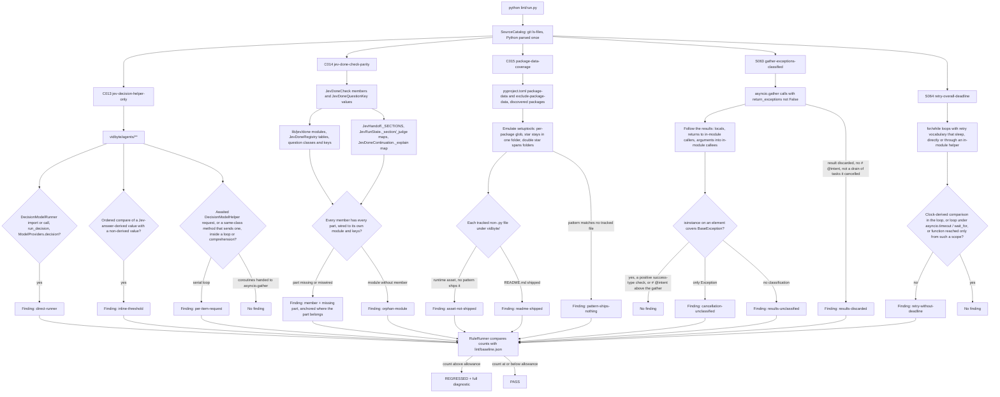

# Design Doc: SDK Lint — Jev, Packaging, and Async Contract Rules (C013–C015, S063–S064)

**Status:** Draft
**Created:** 2026-10-09
**Branch:** `feat/lint-sdk-jev-packaging-async`

## Summary

This PR adds five static rules to the SDK lint suite. None of them depends on Ruff or imports `vidbyte`. Each guards a contract whose breakage is silent at the call site and shows up later as wrong behavior, a broken installed wheel, or a stuck run.

- **C013 `jev-decision-helper-only`** (catalog C014). Agents-layer code asks Jev through `DecisionModelHelper`: no direct `DecisionModelRunner` or provider decision call, no inline comparison of a Jev answer probability or score against a threshold, and no Jev request awaited once per item inside a loop.
- **C014 `jev-done-check-parity`** (catalog C017). Every `JevDoneCheck` member has all the parts the done-check pipeline dispatches on: its question module and question keys, its `JevDoneRegistry` question, threshold, and description, its `JevHandoff._SECTIONS` entry, and its handler in `JevRunState._section`, `JevRunState._judge`, and `JevDoneContinuation._explain`. A done-question module with no member is also reported.
- **C015 `package-data-coverage`** (catalog C022). Every tracked non-Python runtime asset under `vidbyte/` is shipped by a `[tool.setuptools.package-data]` pattern, no folder README is shipped, and every pattern ships something.
- **S063 `gather-exceptions-classified`** (catalog S082, VR-001). The results of `asyncio.gather(..., return_exceptions=True)` are classified with `isinstance(result, BaseException)` wherever they are used, so a cancelled child's `CancelledError` is never treated as a value. A result that is discarded instead must carry an `# @intent` comment, unless the function is draining tasks it cancelled itself.
- **S064 `retry-overall-deadline`** (catalog S083, VR-018). A retry loop that sleeps between attempts stops at a cumulative deadline, either by comparing a clock reading inside the loop or by running under an enclosing `asyncio.timeout` / `asyncio.wait_for`.

The rules only read source. Existing debt is frozen at its measured count: C013 = 9, C014 = 0, C015 = 3, S063 = 4, S064 = 4. Any new violation makes `python lint/run.py` fail with a complete agent-facing diagnostic. This PR changes no product code. The real gaps the rules surface are listed under "Product findings for follow-up" in the PR body.

## Flow chart



## Usage example

```bash
python lint/run.py --rule C013            # focused text report
python lint/run.py --rule S063 --format json
python lint/run.py                        # whole suite, as scripts/run_ci.py runs it
```

Sample finding (one of the baselined C013 findings, abbreviated):

```text
SDK-LINT C013 jev-decision-helper-only [BLOCKING]

WHERE
  vidbyte/agents/jev/gate/clarification.py:87
  failed = tuple(key for key in ranked if yes[key] < JEV_NOUL_YES_THRESHOLD)

WHAT HAPPENED
  vidbyte/agents/jev/gate/clarification.py:87 in JevClarificationAgent.gaps decides a Jev answer
  inline: it compares the answer-derived value `yes[key]` with `JEV_NOUL_YES_THRESHOLD`
  (`yes[key] < JEV_NOUL_YES_THRESHOLD`). `yes` is derived from `result.yes()` (line 85), which
  carries Jev answer probabilities or a score_noul score.

HOW TO FIX
  1. For one noul answer, replace the comparison with
     `DecisionModelHelper.noul_passes(answers, name, JEV_NOUL_YES_THRESHOLD)` and act on its three
     results: True, False, or None when the answer is missing or not noul.
  2. For several noul answers that decide together, call `DecisionModelHelper.score_noul(...)` ...
  3. When the rule is not a mean P(true) over noul answers ..., add one static method to
     DecisionModelHelper in vidbyte/lib/jev/decision.py ... and call it here.
  ...
```

## Rule IDs

The implementation plan pre-assigns C013–C015, S063, and S064 to this PR. S1 owns C006–C008 and S2 owns C009–C012. Before work started, all five IDs were confirmed unused on `origin/main`, on S1 (`feat/lint-sdk-settings-validation`) and S2 (`feat/lint-sdk-pricing-usage-contracts`), and on every other remote `lint` branch: no rule module, registry entry, baseline key, or README row uses them.

| Shipped ID | Name | Catalog entry | Standard |
|---|---|---|---|
| C013 | `jev-decision-helper-only` | C014 | SS-116, SS-117 |
| C014 | `jev-done-check-parity` | C017 | SS-115 |
| C015 | `package-data-coverage` | C022 | SS-172 |
| S063 | `gather-exceptions-classified` | S082 | SS-156, VR-001 |
| S064 | `retry-overall-deadline` | S083 | VR-018 |

## How each rule works

### C013 jev-decision-helper-only

- **Standard.**
  - PR #477 comment 4130386075 (on `vidbyte/agents/jev/continuation/done.py`): "Any logic for thresholds, returning true or false for questions, translating jev model requests to an answer, etc, should be handled by this new file [`DecisionModelHelper`] and should be the universarl/canonicaly way" (quoted verbatim). PR #459 comment 4110233707 asked for the same move earlier.
  - Field guide `jev-capability-layout.md`: "route shared request execution and answer scoring through `vidbyte/lib/jev/decision.py`'s `DecisionModelHelper`" (:5), "Turn noul answers into pass or fail with `DecisionModelHelper`, never with inline mean-versus-threshold math" (:15), "`rg "DecisionModelRunner" vidbyte/agents/jev` finds no direct runner usage" (:111).
  - One request per finish attempt, never one per item: PR #470 comment 4117808663, PR #513 comment 4191544290, PR #456 comment 4108989808, and `jev-capability-layout.md:100-105`.
- **Re-verification on `main`.** The catalog measured (a) = 0, (b) unmeasured, (c) = 0. On `9a923e82` (a) and (c) are still 0, but (b) has 9 real sites in `vidbyte/agents/jev/`, all added after #477 landed. They compare `probabilities[JEV_NOUL_TRUE]`, a `result.yes()` value, or a score that `score_noul` already turned into `passed`, against a threshold in the caller.
- **Scope.** `vidbyte/agents/**`, the agents layer. `vidbyte/lib/jev/managed.py` legitimately uses `DecisionModelRunner.aclose_run`; it is the lib layer and out of scope.
- **Kinds.**
  - `direct-runner`: an `import`/`from ... import` of `DecisionModelRunner` or `vidbyte.lib.runners.decision`, a `DecisionModelRunner(...)` call, a `.run_decision(...)` call, or a `ModelProviders.decision(...)` call. Strings and docstrings are ignored.
  - `inline-threshold`: an ordered comparison (`<`, `<=`, `>`, `>=`) whose one side is derived from a Jev answer and whose other side is not. A value is answer-derived when it reads `.probabilities`, calls `score_noul(...)`, or calls a projection method that lib Jev records define over `.probabilities` (`yes()`, learned from `vidbyte/lib/dataclasses/jev.py`). Derivation flows through assignments, loop and comprehension targets (scoped to their comprehension), subscripts, methods called on a derived value (`.get`, `.items()`), arithmetic, value functions (`min`, `max`, `sum`, `sorted`, ...), `append`/`extend`, attributes stored on `self`, and same-class methods that return derived values. It is field-sensitive for records: `JevComputeOptionResult(option=option, score=verdict.score)` makes `result.score` derived but not `result.option`, so a record that merely carries one answer field does not taint everything read from it. Other calls (`len`, `noul_passes`, unknown functions) return clean values. Comparing two derived values (an argmax such as `every >= named`) is not threshold math and is not reported.
  - `per-item-request`: an awaited `DecisionModelHelper` request inside a `for`/`while` body or a comprehension. The request is `DecisionModelHelper(...).arun(...)`, `.arun(...)` on a name or `self` attribute bound to a `DecisionModelHelper`, or a call to a same-class method that sends one (learned to a fixpoint). Creating coroutines without awaiting them in the loop, such as a generator handed to `asyncio.gather`, is concurrent fan-out over independent candidates, which `jev-capability-layout.md:156-161` (PR #517 comment 4199735123) sanctions, so it is not reported.
- **Why the composite scorers are findings.** `JevRunState._self_review` (`max(P(resolved), 1 - P(in_scope)) < threshold`), `_guaranteed_next_actions` (`min(...) >= threshold`), and `_review_scope_breadth` (a Choice probability sum against `JEV_SCOPE_BREADTH_UPGRADE_THRESHOLD`) have no `DecisionModelHelper` method today. #477 asks for exactly that: the threshold rule moves into a helper method, and the caller passes its inputs. The diagnostic says so.

### C014 jev-done-check-parity

- **Standard.**
  - `skills/jev-continuation/SKILL.md` §3 checklist steps 2, 7–10, 12, and 13, and the file table at :72-83.
  - Field guide `jev-capability-layout.md:77-87` (PR #452 comments 4116720422, 4116740515; PR #470): "Add one `_SECTIONS` entry each in `JevRunState` and `JevHandoff`, plus a `case` in `JevRunState._section` and `_judge` and in `JevDoneContinuation._explain`."
  - `tests/test_jev_done.py:998` pins `set(JevHandoff._SECTIONS) == set(JevDoneCheck)`, and `:1103` pins `set(JevDoneRegistry._descriptions) == set(JevDoneCheck)`.
- **What moved since the catalog.** The catalog encodes `set(JevRunState._SECTIONS) == set(JevDoneCheck)`. That no longer holds by design: run-state sections are only for request-derived checks (15 of 24), post-run checks such as CLAIMS take their items from the handoff (`run_state.py` header; skill step 3), and `tests/test_jev_done.py:940` pins the 15-member set explicitly. So C014 does not require a run-state section. The three per-check paths are now handler maps, not `match` statements (skill :106), so C014 reads the maps.
- **Parts checked for every `JevDoneCheck` member `M` with value `v`:**
  - `module-missing`: `vidbyte/lib/jev/done/<v>.py` is tracked.
  - `question-key-missing`: at least one `JevDoneQuestionKey` value equals `v` or starts with `v.` (`FAITHFUL_SCOPE` is the bare form).
  - `registry-entry-missing`: `JevDoneRegistry._questions`, `_thresholds`, and `_descriptions` each have a `JevDoneCheck.M` key.
  - `question-miswired`: every question class registered for `M` (in `_questions` or `_inventory_questions`) is imported from `vidbyte.lib.jev.done.<v>`, and its `key` default is a `JevDoneQuestionKey` whose value belongs to `v`.
  - `handoff-section-missing`: `JevHandoff._SECTIONS` has `M`, including its `{**_SECTIONS, ...}` re-assignments.
  - `dispatch-missing`: the handler maps in `JevRunState._section`, `JevRunState._judge`, and `JevDoneContinuation._explain` each have `M`.
  - `orphan-module`: a module in `vidbyte/lib/jev/done/` other than `__init__.py`, `done.py`, and `state.py` (shared infrastructure) whose stem is no member's value.
- **Why each part matters** (the diagnostic names the one that applies): a missing `_section` handler asks Jev nothing, so the check can never fail (`handlers.get(check)` returns `({}, ())`); a missing `_judge` handler returns `available=False`, so the check silently fails open; a missing `_explain` handler raises `KeyError` mid-run when the check fails; a missing `_descriptions` entry makes `JevDoneRegistry.validate` raise for every user, because it checks coverage on each call; a missing threshold or question raises `ConfigurationError` when the check is enabled; a missing handoff section raises `KeyError` in `JevHandoff.schema`.
- **Anchors.** Each finding sits where the repair goes (the registry table line, the `_SECTIONS` line, the handler map line, or the enum member), with the symbol `JevDoneCheck.M`.
- **Fail closed.** A missing enum, registry table, `_SECTIONS` assignment, or handler map raises `RuntimeError` (ERRORED), never zero findings.

### C015 package-data-coverage

- **Standard.**
  - CONTRIBUTING.md:48-49: "When adding non-Python runtime assets, confirm that the built wheel contains them and that the installed package can load them outside the source checkout." The PR template (`.github/pull_request_template.md:19`) has the matching checkbox.
  - The `0.1.x` launch-gate fix `d575a3ff` (#266): the published wheel omitted `error_correction_auditor.md`, so `import vidbyte` failed after installation. Its design states the policy: ship every runtime asset with the smallest correct pattern, and "Source files that are not runtime assets, including general component README files, remain outside the wheel unless separately justified."
  - `REPO_MAP.md:251-253` describes `vidbyte/prompts/skills/` as "Skill documents shipped specifically as prompt assets".
  - `scripts/run_ci.py:50` checks exactly one asset in the built wheel.
- **Re-verification on `main`.** The catalog's two unshipped files still hold: `vidbyte/prompts/skills/agentic-engineering.md` and `prompt-bucket.md` match no pattern. `vidbyte/prompts/README.md:82-83` lists them in the prompt catalog table and `REPO_MAP.md:251-253` describes `vidbyte/prompts/skills/` as "Skill documents shipped specifically as prompt assets", while the same README notes they are on-disk skills outside the import-validated catalog. Either way they sit inside the import package without shipping, so a source checkout and an installed package differ; whether to ship them or move them out of `vidbyte/` is the owner's call, and the diagnostic offers both. In addition, the `"*.md"` pattern for `vidbyte.paradigms.context_minimal_fanout` matches only that folder's `README.md`: #206 added it beside `prompts/*.md` when the folder's only root Markdown file was its README, no code reads that README, and so the pattern has shipped a README and nothing else since.
- **Emulation of setuptools** (pinned by `build-system.requires = ["setuptools>=77.0.3"]`):
  - Packages come from `[tool.setuptools.packages.find]`, whose `namespaces` option defaults to true: every folder under `where` whose dotted name matches `include` and not `exclude` is a package, with or without `__init__.py`, and a folder whose name contains a dot is not walked. With `namespaces = false`, only folders with a tracked `__init__.py` count.
  - Each `package-data` key names a package (or `""`/`"*"` for all packages). Each pattern is globbed relative to that package's folder, segment by segment: `*`, `?`, and `[...]` stay inside one folder name, `**` spans any number of folders, a leading-dot name needs a leading-dot pattern, and matching is case-sensitive, as on the Linux builders.
  - `exclude-package-data` patterns use `fnmatch` on the whole path under the package, where `*` crosses folders, as `build_py.exclude_data_files` does. Exclusions apply per package: a file shipped through a package sees only that package's own exclusions and the `""`/`"*"` ones, so an exclusion on `vidbyte.data` does not remove a file that ships through the namespace package `vidbyte.data.deep`.
  - A tracked `MANIFEST.in` or a `setuptools-scm` build requirement would make `include-package-data` ship more files than the patterns say. The rule then fails closed (ERRORED) instead of guessing, as it does for an explicit `packages` list, a `package-dir` mapping, or a pattern that is absolute, uses `..`, or uses a backslash.
- **Kinds.**
  - `asset-not-shipped`: a tracked file under `vidbyte/` that is not `.py` and not a README, which no include pattern ships (or an exclusion removes).
  - `readme-shipped`: a `README.md` under `vidbyte/` that an include pattern ships.
  - `pattern-ships-nothing`: an include pattern that matches no tracked file, or whose key names no discovered package.
- **Verified against a real build.** The scratch verification builds the wheel with `python -m build --wheel` and compares its non-Python members with the rule's computed shipped set; they must be identical. On `main` both hold the same 112 files across 134 discovered packages, and the only tracked non-Python files missing from the wheel are the 30 folder READMEs and the two skill documents.

### S063 gather-exceptions-classified

- **Standard.**
  - VR-001, deferred in `docs/design/lint-rule-catalog-expansion.md:519` as a follow-up because it needed per-site precision.
  - SS-156, cancellation always propagates: field guide `provider-api-contracts.md:12` ("Never catch `BaseException`, so cancellation propagates"), and S019.
  - With `return_exceptions=True`, a child task that is cancelled returns `CancelledError` as its result. `CancelledError` is a `BaseException`, not an `Exception`, so an `isinstance(result, Exception)` filter treats it as a successful value.
  - Field guide `jev-capability-layout.md:158` (PR #517): run independent requests "with `asyncio.gather(return_exceptions=True)`, preserve order, fail closed on any failed or incomplete batch".
- **Re-verification on `main`.** The catalog counted 4 call sites, with 3 compliant. There are 7 `return_exceptions=True` sites now:
  - `multi/cleanup.py:57` and `aggregation.py:88` classify with `BaseException`;
  - `multi_provider_agentic_grader.py:76` (through `_collect_candidates`) and `mixins.py:100` classify with `Exception` only;
  - `mixins.py:115` and `mixins.py:218` discard the results with no stated intent;
  - `tools/mcp/transport.py:319` discards them too, but `McpStdioTransport._stop_reader_tasks` first cancels exactly the reader tasks it gathers, so the drained results are the cancellations it asked for. `lint-rule-catalog-expansion.md:519` calls this site "intentional cancellation suppression", and the rule exempts that cancel-and-drain shape. The measured count is therefore 4, not 5.
- **Detection.** A `gather(...)` call (`asyncio.gather` or an imported `gather`) whose `return_exceptions` keyword is not the literal `False`. The rule follows its results:
  - through local assignments, unpacking (starred targets included), `list()`/`tuple()`/`sorted()`, comprehensions, `zip`/`enumerate`/`dict()` with tuple positions kept, `.items()`/`.values()`, subscripts and slices, `append`/`extend` into another container, and `self` attributes;
  - into in-module callees when passed as an argument (the matching parameter carries the results);
  - out through `return` to every in-module caller (`self.m(...)`, `cls.m(...)`, `Class.m(...)`, a module function, a module class constructor, or `var.m(...)` with `var = Class(...)` in the same function; methods resolve through in-module base classes).

  It then reads every `isinstance(x, ...)` test and `match` class pattern whose subject is one result, in any function the results reach. A test is cancellation-aware when it names `BaseException` or `CancelledError`, or positively checks a type that is not an exception (`isinstance(res, AgentResult)` treats everything else as a failure). Module-level tuple constants, `A | B` unions, and in-module exception subclasses are resolved. A test only against `Exception` or narrower is not cancellation-aware.
- **Kinds.**
  - `cancellation-unclassified`: elements are classified, but only against `Exception` (or narrower), so `CancelledError` results become values.
  - `results-unclassified`: the results are used, or escape the module, with no classification.
  - `results-discarded`: the gather (awaited directly or through `wait_for`/`shield`) is an expression statement, so every child error is dropped. A cancel-and-drain is exempt: every gathered argument is a task the same function cancelled earlier (`for t in tasks: t.cancel()` before `gather(*tasks)`, or `x.cancel()` before `gather(x)`).
- **Exemption.** An `# @intent <slug>` comment (the A002 marker) on the lines from the statement's start to the gather's end, or in the comment block directly above the statement, declares the suppression intentional. An empty `# @intent` does not count.

### S064 retry-overall-deadline

- **Standard.**
  - VR-018, deferred in `docs/design/lint-rule-catalog-expansion.md:536`: retry loops must not let the time budget reset across attempts.
  - Field guide `runtime-boundaries.md:24-29` (PR #349 comment 3868172231): reuse the general wall-clock mechanism, `AgentLoopSettings.timeout_seconds`, instead of adding a parallel ceiling. So the repair the diagnostic gives is to consult the owning budget, not to add a new `overall_deadline` field.
  - The S012/S045 deadline intent: a timeout bounds the operation that declares it.
- **Re-verification on `main`.** The catalog's detection (loops in `vidbyte/middleware/builtins/*retry*`) finds nothing: both retry middlewares are decision hooks with no loop. The loops that actually sleep and retry are in `AgentRuntime._invoke_with_middleware` (model retries), `AgentRuntime._process_tool_call` (tool retries), `HttpTransport.request`, `SyncHttpTransport.request`, and `_WorkflowRun._execute_attempts`. The workflow loop already runs under `StateMachine.arun`'s `asyncio.timeout(settings.timeout_seconds)`. The other four have no cumulative bound: the agent run checks `timeout_seconds` only between iterations, and the transports apply `timeout_seconds` per attempt.
- **Detection.** A `for`/`while` loop is a backoff retry loop when both of these hold:
  - its AST names retry vocabulary (`retry`, `retries`, `attempt`, `backoff`);
  - it sleeps, either through a `sleep(...)` call (`asyncio.sleep`, `time.sleep`, `self.middleware.sleep`, ...) or through a same-class or module helper that sleeps, learned to a fixpoint.

  A polling loop with no retry vocabulary, such as the actor broker's quiescence monitor, is not one.
- **Compliance.** Any one of these suffices:
  - an ordered comparison inside the loop (its test or body) with a clock-derived value: `time.monotonic()`, `perf_counter()`, `time()`, `loop.time()`, `*.clock()`, or `*.now()`, or a name assigned from one, such as `deadline = time.monotonic() + budget`;
  - the loop sits inside an `async with asyncio.timeout(...)` / `timeout_at(...)` block;
  - its function is reached, through in-module calls, from a call inside such a block or from an `asyncio.wait_for(...)` argument. This covers `StateMachine.arun -> _WorkflowRun.execute -> ... -> _execute_attempts`.
- **One kind:** `retry-without-deadline`.

## Files changed

- New rules:
  - `lint/rules/c013_jev_decision_helper_only.py`;
  - `lint/rules/c014_jev_done_check_parity.py`;
  - `lint/rules/c015_package_data_coverage.py`;
  - `lint/rules/s063_gather_exceptions_classified.py`;
  - `lint/rules/s064_retry_overall_deadline.py`.
- `lint/core/registry.py`: five appended `RULE_MODULES` entries.
- `lint/baseline.json`: C013 = 9, C014 = 0, C015 = 3, S063 = 4, S064 = 4, each seeded with `--update-baseline --rule <ID>`.
- `lint/README.md`: three C-series rows and two S-series rows, plus the count-free Responsibilities line that S1 and S2 also use.
- `lint/rules/README.md`: five File Index lines.
- `docs/design/lint-sdk-jev-packaging-async.md`: this document.

The SDK lint design (`docs/design/sdk-agent-facing-lint-suite.md`, "No new feature-test files") declines committed rule tests. Fixtures and mutants therefore ran from a scratch directory, and their results are recorded in the PR body.

## Risks and open questions

- **C013 taint is intra-class.** A value derived in another class and passed in (for example a `JevDoneResult.score` read in the continuation) is not traced. A per-item request through another class's method is not traced either. Both are under-reports, not false positives.
- **C013 sanctions gather fan-out.** Concurrent per-candidate requests pass, because the field guide sanctions them for independent candidates (PR #517). Wrapping questions that share one state in `gather` would also pass. That is a review question, not a static one.
- **C014 reads handler maps.** If a dispatcher moves back to `match` statements, the reader fails closed (ERRORED) instead of reporting zero. The rule must then be updated in the same edit.
- **C015 emulates setuptools by hand.** If `build_py` changes its globbing, the emulation must follow. The scratch check compares the rule with a real wheel build and should be repeated when `setuptools` is bumped. Matching is case-sensitive like the Linux builders, so a Windows-only build could ship a differently-cased file that the rule calls unshipped.
- **S063 needs the results to stay in the module.** Results returned from a public function with no in-module caller are reported as unclassified, because the callers cannot be seen. An `# @intent` comment is the escape hatch when handing exceptions to callers is the API. The flow over-approximates on purpose: an extra binding can only add a test and hide a finding, so a false positive needs a flow the rule does not model, such as results classified by another module's helper.
- **S064 trusts any enclosing deadline path.** `StateMachine.arun` applies its `asyncio.timeout` only when `settings.timeout_seconds` is set. When it is not set, the user has opted out of a deadline, so the loop is treated as bounded by the caller's choice. A deadline enforced from another module is not seen. The repair is then to pass the deadline in explicitly, which is better engineering anyway.
- **Report truncation.** The text report prints the first 20 findings of a rule. Every rule here has fewer than 20, so a regression always shows its full diagnostic.

## Verification plan

- Run `python lint/run.py --rule <ID> --format json` for each rule and classify every finding by hand: 9, 0, 3, 4, and 4 findings, all true positives.
- Prove the zero-finding C014 on real files: remove one part of one real check (a handler, a registry entry, a section), confirm REGRESSED, then revert.
- Run a scratch fixture self-test per rule. Correct code must give 0 findings, each kind must give exactly the expected findings, and every diagnostic must render all six fields with numbered steps, at least two will-not-work entries including the baseline, and no empty-list prose.
- Run at least 3 scratch mutants per rule (silence the judge, drop each sub-check, break name or path resolution). Each must make the self-test fail.
- Simulate an agent regression for each rule in a real file, confirm REGRESSED and a readable message, then revert.
- For C015, build the wheel in scratch and compare its non-Python members with the rule's shipped set.
- Run `ruff check --config lint/ruff.toml` and `mypy --strict` on the five modules.
- Run the full gate: `python -m pip install -e ".[dev]"` into the lane venv, then `python scripts/run_ci.py`.
- Trial-merge S1 and S2 into a throwaway worktree with this branch and confirm `python lint/run.py` passes.
