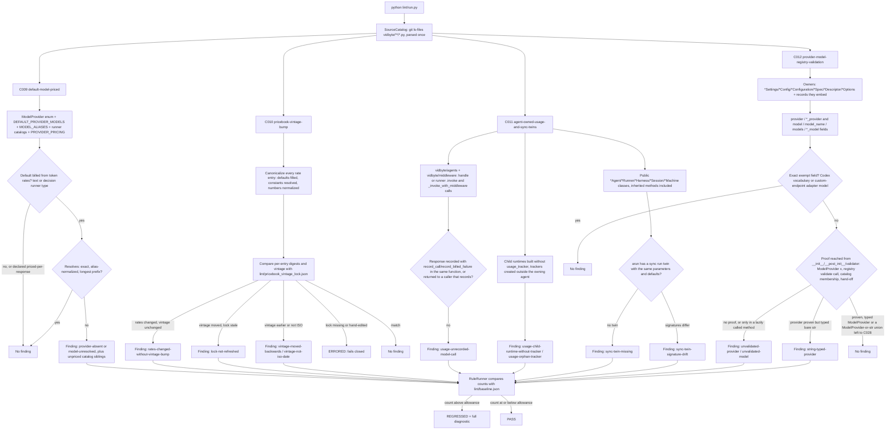

# Design Doc: SDK Lint — Pricing and Usage Contract Rules (C009–C012)

**Status:** Draft
**Created:** 2026-10-09
**Branch:** `feat/lint-sdk-pricing-usage-contracts`

## Summary

This PR adds four static AST rules to the SDK lint suite. None of them depends on Ruff. Each one guards a contract that billing correctness depends on: what a run costs, which rates it was priced with, whether every model call reached the agent's usage tracker, and whether the provider and model a configuration names exist at all.

- **C009 `default-model-priced`** (catalog C010). Every provider whose default model is billed from token rates must have that default resolve in `PROVIDER_PRICING`. The lookup is the same one `ModelPricingRegistry.resolve` uses: exact key, then alias-normalized name, then longest prefix.
- **C010 `pricebook-vintage-bump`** (catalog C032). A change to any effective rate in `PROVIDER_PRICING` or `OPERATION_PRICING` must move the matching `PRICING_AS_OF` / `OPERATION_PRICING_AS_OF` vintage forward. It must also refresh a committed lock, `lint/pricebook_vintage_lock.json`, that records which rates each vintage stands for.
- **C011 `agent-owned-usage-and-sync-twins`** (catalog C030). There are two sub-check families under one ID:
  - every agent-layer model call must record into the agent's `UsageTracker`;
  - every public entry class that defines `async def arun` must also offer a synchronous `run()` with the same parameters.
- **C012 `provider-model-registry-validation`** (catalog C033). A provider or model field on a configuration record must be checked against `ModelProvider` / `ProviderModelRegistry` when the record is built. A provider field that is already validated must be typed `ModelProvider`, not bare `str`.

The rules only read source; they never import `vidbyte`. Existing debt is frozen at its measured count: C009 = 1, C010 = 0, C011 = 2, C012 = 24. Any new violation makes `python lint/run.py` fail with a complete agent-facing diagnostic. This PR changes no product code. The real gaps the rules surface are listed under "Product findings for follow-up" in the PR body.

## Flow chart



## Usage example

```bash
python lint/run.py --rule C009            # focused text report
python lint/run.py --rule C012 --format json
python lint/run.py                        # whole suite, as scripts/run_ci.py runs it

# After re-verifying vendor rates and moving PRICING_AS_OF / OPERATION_PRICING_AS_OF forward:
python -m lint.rules.c010_pricebook_vintage_bump --refresh-lock
```

Sample finding (the one baselined C009 finding, abbreviated):

```text
SDK-LINT C009 default-model-priced [BLOCKING]

WHERE
  vidbyte/lib/registries/models.py:66
  ModelProvider.MISTRAL: "mistral-medium-latest",

WHAT HAPPENED
  vidbyte/lib/registries/models.py:66 registers `mistral-medium-latest` as the default text model of
  ModelProvider.MISTRAL, but it resolves to no rate. PROVIDER_PRICING (vidbyte/lib/registries/pricing.py:86)
  has no ModelProvider.MISTRAL block at all.

HOW TO FIX
  1. Open the vendor's own pricing page for `mistral-medium-latest` ... read the column headers ...
  2. In vidbyte/lib/registries/pricing.py, add a `ModelProvider.MISTRAL: {...}` block ... also price the
     provider's other catalogued text models that still resolve to no rate (`codestral-latest`, ...).
  3. Set PRICING_AS_OF ... then refresh the vintage lock with
     `python -m lint.rules.c010_pricebook_vintage_bump --refresh-lock`; C010 fails until both are done.
  4. Add a test in tests/test_agent_pricing.py asserting ... resolve(ModelProvider.MISTRAL, ...) is not None.
  5. Only if mistral bills each response with a vendor-reported cost ... declare it in _PRICED_PER_RESPONSE.

CORRECT EXAMPLES / WHAT WILL NOT WORK (4 entries, including raising the baseline)

VERIFY
  python lint/run.py --rule C009 && python lint/run.py --rule C010 && python -m pytest tests/test_agent_pricing.py -q
```

## Rule IDs

The implementation plan pre-assigns C009–C012 to this PR, and S1 owns C006–C008. On `origin/main` none of C009–C012 has a rule module, a registry entry, or a baseline key. The SDK catalog says "IDs ... C011, C012 ... are intentionally unused ... Do not register them". That sentence refers to the catalog's own draft IDs, which were merged into C033 and C005x while it was drafted. The plan's "Assigned ID is what ships" governs the shipped namespace, so the assignment stands. The catalog references map as follows:

| Shipped ID | Name | Catalog entry | Standard |
|---|---|---|---|
| C009 | `default-model-priced` | C010 | SS-104 |
| C010 | `pricebook-vintage-bump` | C032 | SS-107 |
| C011 | `agent-owned-usage-and-sync-twins` | C030 | SS-103, SS-135 |
| C012 | `provider-model-registry-validation` | C033 | SS-085, SS-008 |

## How each rule works

### C009 default-model-priced

- **Standard.**
  - The pricing design's table-population rule says every TEXT model in `ProviderModelRegistry.DEFAULT_PROVIDER_MODELS` is priced (`docs/design/agent-usage-pricing.md:149`).
  - The provider-API field guide requires `ModelPricingRegistry.default().resolve(provider, "<versioned id>")` to be not None (PR #437 review).
  - The Vidbyte backend wallet trusts SDK rates ("The Vidbyte SDK owns provider-payload parsing and every model/operation rate", vidbyte field guide `research-usage-tracking.md`).
- **Why defaults only.** 46 of the 77 catalogued text models resolve to no rate today. Most of them are deliberately unpriced: the pricing design prices only what a vendor page verifies, and a wrong but present rate is worse than an honest `None` (it keeps `cost_complete=True`). The table-population rule names the defaults explicitly, because a caller who changes nothing but the provider lands on the default. So C009 enforces the defaults. Each diagnostic also lists the provider's other unpriced catalogued text models, so whoever adds the rates can price them in the same edit. Catalog mode (b), "every qualified text model resolves", is not shipped; it would freeze 46 deliberate omissions as debt.
- **What is billed from token rates.**
  - A default's runner type comes from `MODEL_PROVIDER_RUNNER_TYPE_MAP` for the qualified `provider/model`, else `PROVIDER_DEFAULT_RUNNER_TYPE_MAP`.
  - Only the text and decision runner types count (`RUNNER_TYPE_TEXT`, `RUNNER_TYPE_DECISION`). `UsageTracker` prices those from `PROVIDER_PRICING`; audio, image, video, and embedding defaults are never priced from that table.
- **Lookup.** `PricingLookup` mirrors `ModelPricingRegistry.resolve` (`vidbyte/lib/registries/pricing.py:184-202`) without importing it:
  - exact key, then `ProviderModelRegistry.normalize_model`'s alias result (a `provider/` prefix is stripped only for the alias lookup), then the longest priced key that is a prefix of the canonical name;
  - case-sensitive, like `resolve`.

  An empty provider block is not a price.
- **Declared exceptions.** `_PRICED_PER_RESPONSE` holds one entry, OpenRouter. OpenRouter prices each generation in its marketplace and returns `usage.cost`, and `OpenRouterUsage` (`vidbyte/agents/pricing/openrouter.py`) prefers that reported cost. `PROVIDER_PRICING` keeps `ModelProvider.OPENROUTER` empty on purpose, and the expansion design lists this as a non-goal. The catalog's `UNPRICED_PROVIDERS` became this per-response declaration, because "unknowable pricing" is not a reason a run may report an incomplete cost.
- **Fail closed.** A missing enum, registry literal, pricebook literal, or runner constant raises `RuntimeError` (ERRORED), never zero findings.
- **Kinds.** `provider-absent` means there is no provider block, so the repair is a new block. `model-unresolved` means the block exists but misses the default, so the repair is one more key.

### C010 pricebook-vintage-bump

- **Standard.**
  - `PRICING_AS_OF` and `OPERATION_PRICING_AS_OF` are the pricebook vintages ("Rates verified against official provider ... on *_AS_OF", `pricing.py:54-57`, `operation_pricing.py:52-54`).
  - The Vidbyte backend persists `vidbyte-sdk-models-{PRICING_AS_OF}+operations-{OPERATION_PRICING_AS_OF}` as each run's pricebook version (`backend/lib/enums/research.py` `ResearchPricebookVersion`). It refuses to resume a run whose stored version differs (`backend/lib/usage/ledger.py:161`; field guide `research-usage-tracking.md:32`, "Only the active SDK model and operation pricebook vintages may resume a run").
  - New rates under an old vintage make two pricebooks indistinguishable, so a run started on the old rates resumes and settles on the new ones.
- **Evidence it happens.**
  - PR #438 added the TypeSafe rates (checked 2026-09-21) under `PRICING_AS_OF = "2026-07-30"`.
  - `a71fac66` added the Exa highlights rates without moving `OPERATION_PRICING_AS_OF`.
  - The correct pattern exists too: `7e5683b9` corrected the Parallel rates and moved the operation vintage from 2026-08-03 to 2026-08-08; `c6af16e0` added the GPT-5.6 tier rates and moved the model vintage from 2026-07-22 to 2026-07-30.
- **Why a static lock instead of a git diff.**
  - The catalog describes a merge-base versus HEAD comparison. The lint core has no base-ref support: `SourceCatalog` reads the working tree, and `lint/run.py` takes no base argument. `.github/workflows/ci.yml` also checks out with the default `fetch-depth` of 1, so no merge base exists where `scripts/run_ci.py` runs lint.
  - A static equivalent is deterministic everywhere. `lint/pricebook_vintage_lock.json` records, per pricebook:
    - the vintage;
    - a 16-hex digest of each effective rate entry;
    - a 32-hex fingerprint over all digests.
  - C010 compares the source with the lock. This adds one honest step to a rate change: after the vendor pages are re-read and the vintage moves forward, `python -m lint.rules.c010_pricebook_vintage_bump --refresh-lock` rewrites the lock. The refresh refuses while changed rates are still paired with an unchanged, earlier, or non-ISO vintage, so it cannot launder the violation it guards.
  - A hand-edited lock fails its fingerprint and the rule fails closed.
- **What counts as a rate change.** `RateTableReader` builds a canonical form of every entry:
  - nested keys become paths such as `OPENAI/gpt-5.6-sol` and `search/exa/auto`;
  - positional arguments are mapped to the record dataclass's field names;
  - missing fields are filled from the dataclass defaults (`ClassVar` excluded), so changing a default changes every entry that relies on it;
  - module-level constants and constant subscripts (for example `OPENAI_GPT56_TIER_RATES["gpt-5.6-sol"]`) are resolved through `literal_eval`;
  - numbers are normalized (`272_000` equals `272000.0`);
  - `**` splats are recorded;
  - an unresolvable expression is fingerprinted by its source text.

  Reordering entries, reformatting numbers, and editing comments change no digest. Adding, removing, or changing an entry does.
- **Kinds.**
  - `rates-changed-without-vintage-bump`;
  - `lock-not-refreshed` (the vintage moved forward but the lock is stale);
  - `vintage-moved-backwards`;
  - `vintage-not-iso-date` (regex plus `date.fromisoformat`, so `2026-02-30` is rejected).

  The diagnostic lists up to 8 changed, added, and removed entries with their source lines, then "and N more".
- **Not compared with today's date.** A vintage is the date the rates were verified. The rule only requires it to move later than the locked one, so it never fails because of the calendar.

### C011 agent-owned-usage-and-sync-twins

- **Standard.**
  - PR #285 comment 3635839045: "we have attached a usage tracker inside of the agent class ... propagate from the agent class to the runtime" (FG `runtime-boundaries.md:12`).
  - AGENTS.md: "call `run()` or `arun()`".
  - PR #280, #281, and #282 (comments 3606335886, 3607423669, 3607414084): "want to also create a run() function, not async".
- **Why the usage half detects unrecorded calls.**
  - The catalog's sub-check (a) looks for `UsageRecord(` construction or `input_tokens` arithmetic outside `vidbyte/agents/pricing/**`. It matches 0 sites on `main`, and it misses the bug class that keeps recurring.
  - Four recent fixes were for model calls whose usage never reached the agent's tracker: context-window algorithm side calls (#551), `AggregateAgent` children (#537), Codex fallback turns (#562), and queued-prompt runs (#572).
  - The ambient usage ledger merges nested agents only; it does not record a raw `handle.invoke(...)`.
  - C011 therefore detects the missing recording itself.
- **Usage sub-checks.** The unrecorded-call check scans `vidbyte/agents/` and `vidbyte/middleware/`, where agent-layer model calls live. The other two scan every tracked `vidbyte/` module.
  - `usage-unrecorded-model-call`:
    - The rule looks for a model call: `.invoke(...)` on a handle- or runner-named receiver, or `_invoke_with_middleware(...)`.
    - The bound response must be passed to `record_call` / `record_billed_failure` in the same function, or returned unchanged to a caller.
    - A function that returns the response is a pass-through. Its callers are judged instead, and pass-through names are learned to a fixpoint.
    - A return under `if isinstance(x, AgentResult)` is a middleware abort, not a response, so it does not make the function a pass-through.
    - A recording in a different function is not proof.
  - `usage-child-runtime-without-tracker`: a class whose own or inherited `__init__` accepts `usage_tracker` is constructed without passing it. A `**kwargs` splat is not judged, because the keyword may be inside it.
  - `usage-orphan-tracker`: a `UsageTracker()` constructed anywhere under `vidbyte/`, except in two places. An `*Agent` class's `__init__` may create the tracker it owns and store it. A runtime's `__init__` may fall back to its own tracker only as `usage_tracker or UsageTracker()` for an omitted `usage_tracker` parameter. Any other tracker splits the run's usage from the agent's.
- **Sync-twin sub-checks.**
  - `sync-twin-missing`: a public class whose name, or an in-repo ancestor's name, ends in `Agent`, `Runner`, `Harness`, `Session`, or `Machine` defines or inherits `async def arun` but no `def run`. Inheritance is resolved through an in-repo class index.
  - `sync-twin-signature-drift`: `run` and `arun` differ in parameter names, kinds, or defaults. The finding is anchored at whichever twin the class defines itself.
  - Protocols and other neutral bases are skipped.
- **Why the catalog's four targets are not findings.**
  - The catalog's (b) list is `IndependentCriticRuntimeAlgorithm`, `MultiProviderAgenticGraderRuntimeAlgorithm`, `ReflexionRuntimeAlgorithm`, and `AgentRuntimeContextAlgorithms`. These are runtime internals: each `arun` takes a runtime-owned `handle: RunnerHandle` keyword, and `AgentRuntime` invokes them from inside `BaseAgent.run()` / `arun()`.
  - A sync `run` on them would have no caller. Users reach them through `BaseAgent.run()`, which already has its twin.
  - The PR #280–#282 comments were left on user-facing algorithm classes in PRs that closed without merging in that form.
  - Every landed public entry class that defines `arun` pairs it with a matching `run`: `BaseAgent`, `CodexHarnessAgent`, `EvalRunner`, `TextModelRunner`, `ImageModelRunner`, `VideoModelRunner`, `ParadigmHarness`, `Session`, and `StateMachine`, and the subclasses that inherit them. The one exception is `DecisionModelRunner`, which is baselined.
- **Why one ID.**
  - The plan pre-assigns a single ID, C011, to catalog C030, which planned "two sub-checks with separate reason keys". C013 and later belong to S3, so a second ID is not available without renumbering a sibling PR.
  - The reason keys ship as `extra["kind"]`, one per sub-check. The diagnostic, repair, and examples are specific to each kind.
  - **Masking risk.** The ratchet compares one count, so fixing a usage finding while adding a sync-twin finding keeps the count at 2, which reads RATCHETED rather than REGRESSED.
  - **Mitigation.** The baseline is only 2, and each finding names its kind. Once the two existing findings are fixed, the baseline drops to 0 and the risk disappears. Splitting can follow later if the plan frees an ID.

### C012 provider-model-registry-validation

- **Standard.** Review has asked for this check repeatedly:
  - PR #339 3847625074: "models should be validated against the models that we have offered";
  - #308 3642989701: "provider and model strings here have no validation";
  - #299 3635769007: "matches out model registry";
  - #348 3849882841: "enums for providers/models".

  AGENTS.md also says closed-set fields use an enum.
- **Owners.**
  - Classes named `*Settings`, `*Config`, `*Configuration`, `*Spec`, `*Descriptor`, or `*Options`, anywhere under `vidbyte/`. This is wider than the catalog's path scope, because real configuration owners live in `vidbyte/context/algorithms/` and `vidbyte/agents/settings/fallback.py`.
  - Records those owners embed, through a class-body annotation or an `__init__` parameter annotation, for example `FallbackModel` inside `AgentFallbackSettings`. An embedded record is a dataclass or a plain class with no public methods, and `type[...]` annotations do not embed.
  - Pydantic, Enum, TypedDict, Protocol, and NamedTuple classes are skipped.
- **Fields.** Provider fields are `provider` and `*_provider`. Model fields are `model`, `model_name`, `models`, `*_model`, and `*_model_name`. Both dataclass fields and plain `__init__` parameters count.
- **Proofs** (in a method that runs at construction; see Reachability):
  - `ModelProvider(x)`;
  - a `ProviderModelRegistry` validating call (`validate_provider`, `validate_model`, `validate_provider_model_pair`, `normalize_model`, `resolve_api_key`, ...);
  - a membership test against a registry catalog (`known_models()`, `models_for_provider()`, ...);
  - a hand-off to another configuration class, or to a same-module helper that itself proves its parameter;
  - `getattr(self, name)` sweeps over field tuples, `x = self.f` aliases, import aliases, and pydantic validators are followed.

  A non-empty check is not a proof, and neither is a bare `isinstance` branch.
- **Reachability.** A proof counts only in a method that runs when the record is built.
  - The roots are `__init__`, `__post_init__`, and pydantic validators (`field_validator`, `validator`, `model_validator`, `root_validator`).
  - From the roots, the rule follows same-class calls through `self.`, `cls.`, or the owner's own name, and reads of same-class `@property` / `@cached_property` members, transitively. `__post_init__` therefore still counts when it delegates to `_validate_*` helpers.
  - A method construction never reaches does not count, because a bad record then exists until a caller happens to run it. Examples are a public `validate()`, a `normalized_provider()` that only `resolved_api_key()` calls, a `build()` hand-off, or a bound method stored as a callback.
  - That method's name goes into the diagnostic, with the one-line fix of calling it from `__post_init__`.
  - The repair's home is a `_validate`/`validate` that construction already runs, else the existing `__post_init__`/`__init__`. Otherwise the diagnostic says to add a new one. A `validate()` that nothing calls at construction is never named as the home.
- **Typing.** A field typed exactly `ModelProvider` is trusted to its type. A proven provider annotated `str` or `str | None` is reported as `string-typed-provider`, with the repair "coerce, then type it `ModelProvider`". A proven `ModelProvider | str` field is left to C028 `enum-str-union-fields`, which owns union typing.
- **Precise exemptions.** `_EXEMPT_FIELDS` names exact `(module, class, field)` triples, each with its cited resolution path. Nothing is exempted by module or by class.
  - **Codex CLI vocabulary (7 fields).**
    - `CodexThreadSettings.model_provider` and `.model`, `CodexTurnSettings.model`, and `CodexSubagentSettings.default_model`. Their vocabulary is the user's Codex config `model_providers` table, custom providers included, and `vidbyte/agents/codex/metrics.py` records nothing for a custom provider.
    - `AgentFallbackSettings.models` (`vidbyte/agents/settings/fallback.py`), and `FallbackModel.provider` and `.model` (`vidbyte/lib/dataclasses/agents.py`). The Codex harness reuses the fallback chain: `CodexFallbackCoordinator.build` (`vidbyte/agents/codex/fallback.py:58`) calls `settings.fallback.to_fallback(primary=...)`. The primary is `FallbackModel(provider=codex.thread.model_provider or CODEX_USAGE_PROVIDER, ...)` (`:122-123`), which may be a custom Codex provider, and a bare chain entry inherits that provider in `AgentFallbackSettings._resolve_entry`. On the plain-agent path a bare entry's provider is also unknown until `resolved_models(primary=...)` runs, so the settings cannot check it when they are built.
  - **Custom-endpoint request adapters (6 fields).** `TextModelConfig`, `ImageModelConfig`, `VideoModelConfig`, `AudioModelConfig`, `EmbeddingModelConfig`, and `DecisionModelConfig` `.model` in `vidbyte/lib/dataclasses/model_configs.py`.
    - Each `resolved_endpoint()` prefers a caller endpoint "for tests, proxies, and compatible APIs" (`model_configs.py:89`, `:158`, `:206`, `:271`, `:322`). `ProviderModelRegistry.resolve_endpoint` returns it verbatim (`models.py:164-168`).
    - Direct TypeSafe mode keeps "Direct TypeSafe proxies" configurable (`model_configs.py:412-416`; `docs/design/jev-managed-gateway-credentials.md:324`, "a compatible custom endpoint").
    - No runner validates the model either: `vidbyte/lib/runners/*` call only `config.validate()`, which checks shape and resolves the API key.
    - A registry check here would reject the proxy and self-hosted models the adapters exist to reach. The agent-facing records that feed these adapters (`AgentDescriptor`, `AgentSettings`, YAML config) still validate their model names.
  - **How the adapter exemption and reachability interact.** The exemption covers the `model` field only, and the exempt field is never judged. The sibling `provider` fields are not exempt, because even a custom endpoint is reached through a `ModelProvider` adapter: `resolve_endpoint(self.normalized_provider(), self.endpoint)`, and `normalized_provider()` raises for any non-enum value. A construction-time provider check therefore rejects nothing legitimate.
    - The provider fields are judged under the reachability rule. `DecisionModelConfig.__post_init__` calls `normalized_provider()`, so its provider is proven.
    - The other five configs call `normalized_provider()` only from `validate()` / `resolved_*()`, so their providers are reported as `unvalidated-provider`, and the diagnostic names `normalized_provider` as the unreached check.
    - The fixtures prove both directions: an exempt model is not reported while its provider is, and the same class name in another module is not exempt.
  - Every other field in these modules is still checked.
- **What is deliberately out of scope**, from an inventory of all 123 provider-named `str` parameters and fields:
  - 36 method parameters of non-configuration classes;
  - 20 at the provider and runner adapter boundary (`vidbyte/providers/`, `vidbyte/lib/runners/`);
  - 19 in the registry and pricebook adapters themselves;
  - 15 non-configuration records;
  - 9 usage, speed, and pricing records.

  The catalog's "Bad" example, `UsageRecord.provider: str` (`vidbyte/agents/pricing/records.py:48`), is one of those usage records. It records whatever provider a response came from, including Codex custom providers and the unknown providers counted as unaccounted calls. `OperationUsageRecord.provider` is a search vendor, not a `ModelProvider`. Coercing either would drop usage. The scope is therefore defined by what a configuration owner is, not by a module exemption.

## Files changed

- New rules:
  - `lint/rules/c009_default_model_priced.py`;
  - `lint/rules/c010_pricebook_vintage_bump.py`;
  - `lint/rules/c011_agent_owned_usage_and_sync_twins.py`;
  - `lint/rules/c012_provider_model_registry_validation.py`.
- `lint/pricebook_vintage_lock.json`: C010's lock. It was bootstrapped with `--refresh-lock` on this tree (model 2026-07-30, 41 entries; operation 2026-08-08, 73 entries).
- `lint/core/registry.py`: four appended `RULE_MODULES` entries.
- `lint/baseline.json`: C009 = 1, C010 = 0, C011 = 2, C012 = 24, each seeded with `--update-baseline --rule <ID>`.
- `lint/README.md`: four C-series catalogue rows, a File Index line for the lock, and a count-free Responsibilities line (the same wording as S1).
- `lint/rules/README.md`: four File Index lines.
- `docs/design/lint-sdk-pricing-usage-contracts.md`: this document.

The SDK lint design (`docs/design/sdk-agent-facing-lint-suite.md`, "No new feature-test files") declines committed rule tests. Fixtures and mutants therefore ran from a scratch directory, and their results are recorded in the PR body.

## Risks and open questions

- **C009 mirrors `resolve` by hand.** If `ModelPricingRegistry.resolve` or `normalize_model` changes its matching, `PricingLookup` must change in the same edit. The module header says so. The fixtures pin exact, alias, prefix, and case behavior.
- **C010 adds a refresh step to rate changes.** An agent who moves the vintage correctly still sees `lock-not-refreshed` until it runs the refresh command. The diagnostic gives that command as step 2. This is the cost of having no base ref, and it also documents every vintage move in the diff.
- **The C010 lock freezes today's state.** The model vintage already misidentifies the TypeSafe rates added after 2026-07-30 (PR #438). The lock records the tree as it is, and the fix (re-verify and move `PRICING_AS_OF`) is listed as a product finding, not made here.
- **C011 can under-report.** Model calls through receivers outside the handle/runner name grammar, and calls splatting `**kwargs` into a tracked runtime, are not judged. The eval graders (`vidbyte/evals/graders/llm_judge.py:78`, `rubric.py:88`) call runners directly with no usage recording, outside the agent and middleware scope. They are listed as a product observation. Whether evals should be agent-owned is an open question.
- **C011 masking.** One count covers both families; see "Why one ID".
- **C012 trusts hand-offs.** Passing a field to another configuration class or a validating helper counts as proof when construction reaches the hand-off, and that class is judged on its own.
- **C012 reachability is intra-class.** Calls through `self.`, `cls.`, or the owner's name, and property reads, are followed. An inherited `__post_init__` and dynamic dispatch (`getattr(self, name)()`) are not. A proof that is reached only that way is reported, and the diagnostic names the method holding it, so the repair stays one line. None of the 24 findings on `main` is of that kind.
- **C012 exemptions are data.** Each `_EXEMPT_FIELDS` entry is one field with its cited resolution path. If the Codex harness stops reusing `AgentFallbackSettings`, or the model configs stop accepting custom endpoints, the matching entries should be removed in the same change.
- **C012 versus S014 and C028.** S014 checks enum-registry-runner parity, so C012's verify command runs both. A `ModelProvider | str` field is C028's to type.
- **Report truncation.** The text report prints the first 20 findings of a rule in path order. C012 has 24, so a regression late in path order shows its verdict line (`C012 REGRESSED: 25 finding(s), allowance 24.`), but its diagnostic appears only with `--all`. This is existing lint-core behavior, and this PR does not change it.

## Verification plan

- Run `python lint/run.py --rule C009|C010|C011|C012 --format json` on the tree and classify every finding by hand: 1, 0, 2, and 24 findings, all true positives. Classify every finding the C012 reachability and exemption change added or removed.
- For C010, prove the zero-finding rule on a real file: change one `gpt-5.6-sol` rate, confirm REGRESSED, move the vintage and confirm `lock-not-refreshed`, refresh and confirm CLEAN, then revert both files.
- Run a scratch fixture self-test per rule. Correct code must give 0 findings, each kind must give exactly the expected findings, and every diagnostic must render all six fields with numbered steps, at least two will-not-work entries including the baseline, and no empty-list prose.
- Run scratch mutation tests: 9 mutants for C009, 7 for C010, 11 for C011, and 25 for C012, each of which must make the self-test fail.
- Simulate an agent regression for each rule in a real file, confirm REGRESSED and a readable message, then revert.
- Run `ruff check --config lint/ruff.toml` and `mypy --strict` on the four modules.
- Run the full gate: `python -m pip install -e ".[dev]"` into the lane venv, then `python scripts/run_ci.py`.
