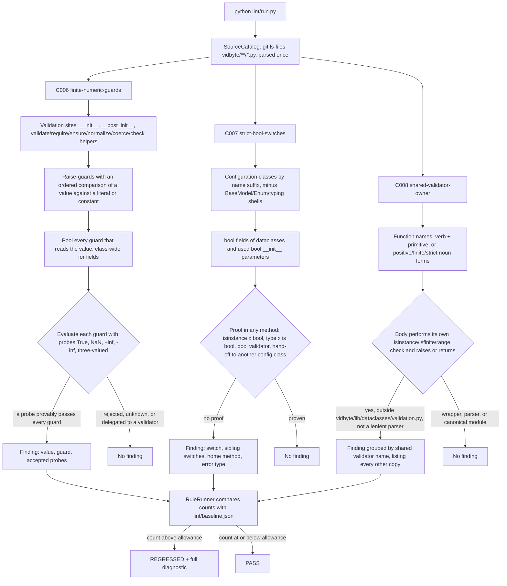

# Design Doc: SDK Lint — Settings Validation Rules (C006–C008)

**Status:** Draft
**Created:** 2026-10-09
**Branch:** `feat/lint-sdk-settings-validation`

## Summary

This PR adds three static, Ruff-independent AST rules to the SDK lint suite. Together they cover the bug class that took seven consecutive merged fixes (#523–#529): settings and records that accept values the SDK contract says must fail.

- **C006 `finite-numeric-guards`** (catalog C007). A numeric range check in a constructor, `__post_init__`, or validator helper must reject `True`, NaN, and both infinities. The rule proves which of those values actually pass every guard on the value.
- **C007 `strict-bool-switches`** (catalog C008). A bool switch on a `*Settings`/`*Config`/`*Configuration`/`*Policy`/`*Options` class must be checked with `isinstance(value, bool)` during construction. Otherwise `"false"` turns the switch on.
- **C008 `shared-validator-owner`** (catalog C009). A primitive validator (positive int, finite number, bool, timeout, limit, temperature) defined outside `vidbyte/lib/dataclasses/validation.py` is a drifting copy. The finding names the shared validator to use and every other copy.

The rules only read source; they never import `vidbyte`. Existing debt is frozen at its measured count: C006 = 104, C007 = 15, C008 = 52. Any new violation makes `python lint/run.py` fail with a complete agent-facing diagnostic. This PR changes no product code. The real bugs the rules surface are listed under "Product findings for follow-up".

## Flow chart



## Usage example

```bash
python lint/run.py --rule C006            # focused text report
python lint/run.py --rule C007 --format json
python lint/run.py                        # whole suite, as scripts/run_ci.py runs it
```

Sample finding (one of the 104 baselined C006 findings, abbreviated):

```text
SDK-LINT C006 finite-numeric-guards [BLOCKING]

WHERE
  vidbyte/middleware/builtins/circuit_breaker.py:51
  if window_seconds <= 0:

WHAT HAPPENED
  vidbyte/middleware/builtins/circuit_breaker.py:51 `CircuitBreakerMiddleware.__init__` range-checks
  `window_seconds` (annotated `float`) with `window_seconds <= 0`, but no guard on that value rejects
  `True`, `float('nan')` and `float('inf')`. `True` is a subclass of int, so it passes as 1.
  `float('nan')` makes every <, <=, > and >= comparison False, so the range check never fires.
  `float('inf')` clears a lower bound and turns the limit into no limit at all.

HOW TO FIX
  1. In `CircuitBreakerMiddleware.__init__` (...circuit_breaker.py:51), put the type check in the same
     condition as the range check, ahead of it: `if isinstance(window_seconds, bool) or not
     isinstance(window_seconds, (int, float)) or not math.isfinite(window_seconds) or <the existing
     range test>: raise ...`. ...
  2.-4. (error message, shared validator, contract-test probes)

CORRECT EXAMPLES / WHAT WILL NOT WORK (5 entries, including raising the baseline)

VERIFY
  python lint/run.py --rule C006 && python -m pytest tests/features -q
```

## Rule IDs

The plan assigns `C006` to `finite-numeric-guards`. The catalog listed C006 as "skipped as a branch-draft ID", but it is unused on `origin/main` (no rule module, registry entry, or baseline key), so the plan's assignment stands. C006–C008 sit in S1's reserved range, and sibling PR S2 starts at C009.

## How each rule works

### C006 finite-numeric-guards

- **Standard.** `tests/features/sdk_loop_settings/FEATURE.md` says "True is not an integer budget; ... NaN and infinities are not finite timeouts". `tests/features/sdk_middleware_limits/FEATURE.md` states the same contract, and AGENTS.md section 4 says every dataclass "checks types, ranges". Evidence: PRs #523–#529, all verified on `origin/main`.
- **Sites.** `__init__`, `__post_init__`, and helpers matching `^_?(validate|validated|require|ensure|normalize|coerce|check)(_|$)`, both methods and module-level functions.
- **Trigger.** An `if` whose body raises, whose test is *pure* (only comparisons, `isinstance`, or `isfinite`/`isnan`/`isinf` on resolved values), and that compares a value with `<`, `<=`, `>`, or `>=` against a literal or named constant.
- **Values resolved.**
  - parameters and `self` fields: dataclass annotations, plus `__init__` parameters stored on `self`;
  - local aliases (`value = self.x`);
  - `float()` and `int()` casts;
  - `getattr(self, name)` sweeps over literal or module-constant field tuples;
  - `for label, value in (("a", self.a), ("b", b))` pair sweeps over fields or parameters, as in `TraceArtifactRenderer._validate_bounds`;
  - `param.field` reads, such as `config.min_successful` in `MultiProviderAggregator._validate_config`, when the parameter is annotated with exactly one SDK class that does not check that field in its own constructor or validators. A field the class checks itself is judged at that class instead.

  An `__init__` parameter and the field it is stored into are the same value, so a strict check in a later `_validate` method covers the parameter.
- **Judge.** Every guard that reads the value is collected: all of the class's validation methods for a field, or the function itself for a parameter. Each guard is then evaluated three-valued with the probes `True`, `nan`, `+inf`, and `-inf`:
  - NaN makes every ordered comparison False.
  - An infinity beats any finite bound.
  - `int()` of NaN or an infinity raises, which counts as rejected.
  - Other inputs are assumed valid in two worlds: optional ones are None, or every other input is finite.
  - A disjunct of a top-level `or` that does not read the value is ignored.

  A probe is reported only when every guard is *provably* False. An unknown result never proves acceptance.
- **Delegation and constants.** A value passed to a validator-named callee (`positive_real(x, ...)`, `JevCount.require(x, ...)`) is judged inside that helper instead. Numeric constants are read from the same module and from absolute `from vidbyte... import NAME` imports, following re-exports up to three hops.
- **Kind.** Whether a value is an int or a real comes from its annotation, then from an `isinstance` guard, then from a `float()`/`int()` cast. The repair is kind-specific, and for an optional value it keeps None valid (`x is not None and (...)`).
- **Engine-built records are out of scope.** A record whose numbers are the engine's own counters and timings cannot receive a caller's `True`, NaN, or infinity. A class counts as engine-built only when every one of these holds:
  1. exactly one SDK module defines it;
  2. its name has no configuration suffix (`Settings`, `Config`, `Configuration`, `Policy`, `Options`);
  3. no class anywhere subclasses it;
  4. SDK code constructs it;
  5. no tracked Python file outside `vidbyte/` names it: no test, script, skill, or example imports, annotates, or builds it;
  6. if it has a hand-written constructor rather than being a dataclass, no package `__init__.py` lists it in `__all__`, because exported components are configured through their constructors.

  A module-level helper is out of scope only when every call to it in its module sits inside an engine-built record. A `param.field` value belongs to the field's class, whichever class reads it. On `main` this removes 20 findings, each built at one or two engine sites: the workflow records in `vidbyte/workflows/contracts.py` (built in `vidbyte/workflows/machine.py` from `perf_counter` differences and visit counters), `TaskRecord`, `LedgerEvent`, and `MultiAgentResult` (built in `vidbyte/agents/multi/ledger.py` and `post_run.py`), `MiddlewareHookInvocation` (built in `vidbyte/middleware/pipeline.py`), and `SessionUsageBuilder` (built once in `vidbyte/sessions/session.py` with `max(..., 0.0)`). `TaskRecord.max_attempts` is copied from `TaskSpec` and `MultiAgentSettings`, and both of those remain findings.

### C007 strict-bool-switches

- **Standard.** The #529 fix (`@intent fallback-enabled-is-not-truthiness`, `vidbyte/agents/settings/fallback.py:35-40`) and AGENTS.md section 4.
- **Owners.** Classes whose name ends in `Settings`, `Config`, `Configuration`, `Policy`, or `Options`. Subclasses of `BaseModel`, the Enum family, `TypedDict`, `Protocol`, and `NamedTuple` are skipped, because pydantic parses `"false"` and the others hold no runtime value.
- **Switches.**
  - Dataclass fields annotated `bool`, `bool | None`, or `Optional[bool]`, including quoted annotations.
  - On plain classes, bool `__init__` parameters that are actually stored or read.
- **Proof.** Any of these, found in any method (directly, through an alias, or in a field sweep):
  - `isinstance(x, bool)`;
  - `type(x) is bool` (or `is not`, `==`, `!=`);
  - a call to a bool validator (`_require_bool`, `require_bool`, `_resolve_bool`, ...);
  - passing the value to another configuration class's constructor.

  `bool(x)` is a violation, not a proof, because `bool("false")` is True.
- **Diagnostic facts.** Each finding carries:
  - the other unchecked switches on the same class, so the fix happens in one loop;
  - which switches are optional (their check must allow None);
  - the method the check belongs in, and whether that method exists yet;
  - the exception type the class already raises.

### C008 shared-validator-owner

- **Standard.**
  - The strict-config-dataclasses field guide, from PR #352 review comment 3850042858 (verified with `gh api`): "seconds should be dataclass defined at vidbyte/lib/dataclasses, and then the validation should be inside of the dataclass". That comment was resolved in #363 with `PauseDuration`.
  - The catalog's finding that validators are duplicated per file.
  - AGENTS.md Placement Rules, which say every new dataclass is defined in `vidbyte/lib/dataclasses/<domain>.py`.
- **Canonical home.** No shared validator module exists today. `vidbyte/middleware/builtins/limit_validation.py` is middleware-scoped, and `vidbyte/agents/multi/validation.py` and `vidbyte/workflows/validation.py` are domain guards. The diagnostic therefore names `vidbyte/lib/dataclasses/validation.py`, the placement AGENTS.md prescribes for a validated dataclass in the "validation" domain. This PR does not create or move product code.
- **Name grammar.**
  - A verb (`require`, `validate`, `validated`, `ensure`, `normalize`, `coerce`, `check`, `resolve`, `is`), optionally followed by `strict_` or `optional_`, then a run of primitive tokens matched on whole underscore-separated words (`positive`, `non_negative`, `finite`, `bool`, `int`, `number`/`float`/`real`, `timeout`, `limit`, `budget`, `temperature`, `probability`).
  - Or a noun form such as `positive_int`, `positive_real`, `finite_real`, or `strict_bool`.
  - Matching whole words means `_validate_interval` is not read as "int".
- **Body.**
  - The function must raise or return, and must itself run `isinstance` against `bool`/`int`/`float`/`Real`/`Number`, or `isfinite`/`isnan`/`isinf`, or an ordered comparison on an input.
  - Delegating wrappers are not reported.
  - Lenient parsers are not reported either. A parser has `if isinstance(x, ...): return None`, as `ProviderUsage.coerce_int` does; it reads untrusted payloads and is not a config validator.
- **Grouping.** Each copy maps to the shared validator that replaces it: `PositiveInt`, `PositiveFinite`, `NonNegativeInt`, `NonNegativeFinite`, `FiniteNumber`, `StrictBool`, `StrictInt`, `BoundedInt`, `Temperature`, or `Probability`. An untyped `positive`/`non_negative` name takes int or finite from its parameter annotations. Every finding lists the other copies in its group, up to 10, then "and N more".

## Files changed

- `lint/rules/c006_finite_numeric_guards.py`, `lint/rules/c007_strict_bool_switches.py`, `lint/rules/c008_shared_validator_owner.py`: the new rules.
- `lint/rules/c006_source_index.py`: C006's read-only source indexes (literals, module constants, and engine-built records), split out to keep the rule module small.
- `lint/core/registry.py`: three appended `RULE_MODULES` entries.
- `lint/baseline.json`: the keys C006 = 104, C007 = 15, C008 = 52, each seeded with `--update-baseline --rule <ID>`.
- `lint/README.md`: three C-series catalogue rows. The Responsibilities line now describes the C-series without a fixed count.
- `lint/rules/README.md`: four File Index lines (the three rules and C006's source index).
- `docs/design/lint-sdk-settings-validation.md`: this document.

The SDK lint design (`docs/design/sdk-agent-facing-lint-suite.md`, "No new feature-test files") declines committed rule tests. Fixtures and mutants therefore ran from a scratch directory, and their results are recorded in the PR body.

## Risks and open questions

- **C006 keeps every record a caller can reach.** An independent audit of the first version found three false positives in twelve sampled findings, all on records only the engine builds. The engine-built exemption above removes them, except `CodexMiddlewareRequest.elapsed_seconds` (`vidbyte/lib/dataclasses/codex.py:804`). The SDK never sets that field, but seven test sites construct the request, as a caller-written Codex middleware would, so it stays in scope. Records that tests or callers build, such as `TaskSpec`, `AgentDispatch`, `TaskLedgerSnapshot`, and `MiddlewareDecision`, also stay. Adding a test that names an engine-built record brings it back into scope, which is intended: the record is then caller-facing.
- **C006 can under-report but never over-report.** A guard the evaluator cannot decide (an unknown helper call, an attribute constant from another module, a cross-field comparison with no proven outcome) never produces a finding. A value checked by a helper outside the delegate grammar may be missed.
- **C007 trusts hand-offs.** Passing a switch to another `*Settings`/`*Config` constructor counts as proof, and that class is checked by C007 on its own.
- **C007 leaves bools outside configuration classes alone.** Outside the five suffixes, 32 plain constructors take an unchecked bool parameter (middleware, graders, tools), and 137 record dataclasses declare unchecked bool fields. They are out of scope here. The open question is whether component constructors should get the same rule.
- **C008 grammar risk.** A runtime enforcement method named like `check_budget(self)` would match if it range-checks `self` state. None exists on `main`. The fixtures prove `_enforce_budget` and `_validate_interval` do not match.
- **C008 versus C002.** C002 groups `isinstance(<name>, bool)` identities, and C008 groups validator definitions; both can name the same `_require_bool` copies. The C007 repair recommends a sweep with the generic local name `value`, which C002 deliberately ignores, so fixing a C007 finding never creates a C002 finding.
- **C001 overlap.** `_require_boolean_enabled` (`fallback.py:35`) is already C001 debt and is also a C008 copy. Consolidating it into `StrictBool` resolves both.
- **Report truncation.** The text report prints the first 20 findings of a rule in path order. When a regression lands later in that order, the verdict line reports it (for example `C006 REGRESSED: 105 finding(s), allowance 104.`), but its diagnostic appears only with `--all`. This is existing lint-core behavior, and this PR does not change it.

## Verification plan

- Run `python lint/run.py --rule C006|C007|C008 --format json` on the tree and classify every finding by hand: 104, 15, and 52 findings, all true positives.
- Run a scratch fixture self-test per rule. Correct code must give 0 findings, each problem kind must give exactly the expected findings, and every diagnostic must render all six fields with numbered steps, real example paths, at least two will-not-work entries including the baseline, and no empty-list prose.
- Run scratch mutation tests: 39 mutants for C006, 19 for C007, and 17 for C008, each of which must make the self-test fail.
- Simulate an agent regression for each rule in a real file, confirm REGRESSED and a readable message, then revert.
- Run the full gate: `python -m pip install -e ".[dev]"` into the lane venv, then `python scripts/run_ci.py`.
