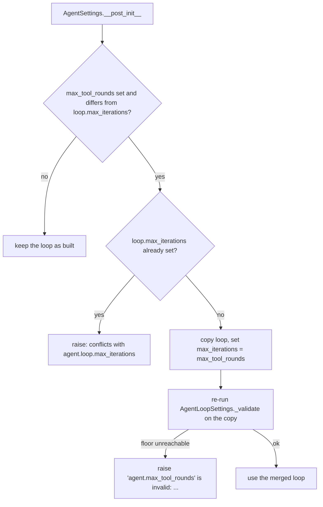

# max_tool_rounds Validates Output-Contract Floors

## Summary

An agent document can cap the loop two ways: `loop.max_iterations` or the top-level `max_tool_rounds`. `AgentSettings._loop_with_tool_rounds` folds `max_tool_rounds` into a shallow copy of the already-built `AgentLoopSettings` by assigning `max_iterations` on the copy. `AgentLoopSettings` checks its output-contract floors against its ceilings only in its constructor, so that assignment skipped the check. The same unreachable floor was rejected under one spelling and silently accepted under the other:

- `loop: {max_iterations: 3, output_contracts: [MinIterations(5)]}` raised `'agent.loop' is invalid: ...`.
- `max_tool_rounds: 3` with `loop: {output_contracts: [MinIterations(5)]}` loaded, producing a run that can never satisfy its floor.

The fix re-runs the loop's own constructor validation on the merged copy and reports a failure against `agent.max_tool_rounds`.

## Flow chart



## Usage example

```yaml
type: base
name: support
system_prompt: Help.
provider: deepseek
model_name: deepseek-v4-flash
max_tool_rounds: 3
loop:
  output_contracts:
    - {type: MinIterations, minimum: 5}
```

```python
from vidbyte.config import YamlLoader

YamlLoader().load_agent("agent.yaml")
# ConfigurationError: 'agent.max_tool_rounds' is invalid: MinIterations(minimum=5) conflicts with
# AgentLoopSettings.max_iterations=3: the floor is unreachable (require minimum <= max_iterations).
# details["field"] == "agent.max_tool_rounds"
```

## How it works

After `merged.max_iterations = rounds`, `_loop_with_tool_rounds` calls `merged._validate()`, the exact method `AgentLoopSettings.__init__` ends with, and wraps any `ConfigurationError` with `cls._error(...)`. Reusing it keeps one source of truth for the floor rules (including the inclusive `MinIterations <= max_iterations` rule from #620) instead of duplicating floor logic in the config layer.

The error names `agent.max_tool_rounds` rather than `agent.loop`: the loop alone was valid and was already accepted when built; it is the top-level cap that makes the floor unreachable, so that is the field the author has to change (or move into `loop.max_iterations`).

Re-validation has no side effects. `_validate()` and every helper it calls only read attributes and raise; they do not normalize fields, re-freeze the contract tuple, or rebuild `output_contract`. The `max_tool_calls` / `ToolSettings.max_calls` match rule re-checks fields the copy did not change, so it passes exactly as it did at construction. `rounds` is already a validated positive integer (`_positive_int` runs first), so the positive-int check on `max_iterations` cannot newly fail.

## Other post-construction ceiling assignments

Checked for other code that sets a ceiling on an existing `AgentLoopSettings`:

- `vidbyte/agents/fork.py` `_loop_settings` builds a new `AgentLoopSettings(...)` with the overridden `max_iterations`, so the constructor validates it.
- `vidbyte/agents/base.py` turns the flat `max_iterations=` / `max_tool_rounds=` kwargs into a new `AgentLoopSettings(**flat_params)`, and refuses flat kwargs alongside a loop object; `_restore_loop_settings` also constructs.
- No other `.max_iterations =`, `.max_tokens =`, `.max_tool_calls =`, or `.timeout_seconds =` assignment on a loop object exists in `vidbyte/`.

`_loop_with_tool_rounds` was the only bypass.

## Files

- `vidbyte/lib/dataclasses/config.py`: re-validate the merged loop; new `@intent yaml-max-tool-rounds-validates-floors`.
- `tests/test_agent_settings_validation.py`: regression test beside the existing `max_tool_rounds` tests.

## Risks

- A document that previously loaded with an unreachable floor under `max_tool_rounds` now fails to load. That is the intended behavior and matches `loop.max_iterations`.
- `config.py` calls the loop's private `_validate()`. The alternative, rebuilding the loop through its constructor, would need every field listed out (as `fork.py` does) and would drift when a field is added.

## Verification

- Regression test: `MinIterations(5)` with `max_tool_rounds: 3` is rejected with field `agent.max_tool_rounds`, and the nested spelling still fails with field `agent.loop`. Reachable floors still load: `max_tool_rounds: 2` with `MinToolCalls(1)` and `tool_settings.max_calls: 2`, and `MinIterations(5)` with `max_tool_rounds: 5`.
- `python lint/run.py` and `python scripts/run_ci.py`.
