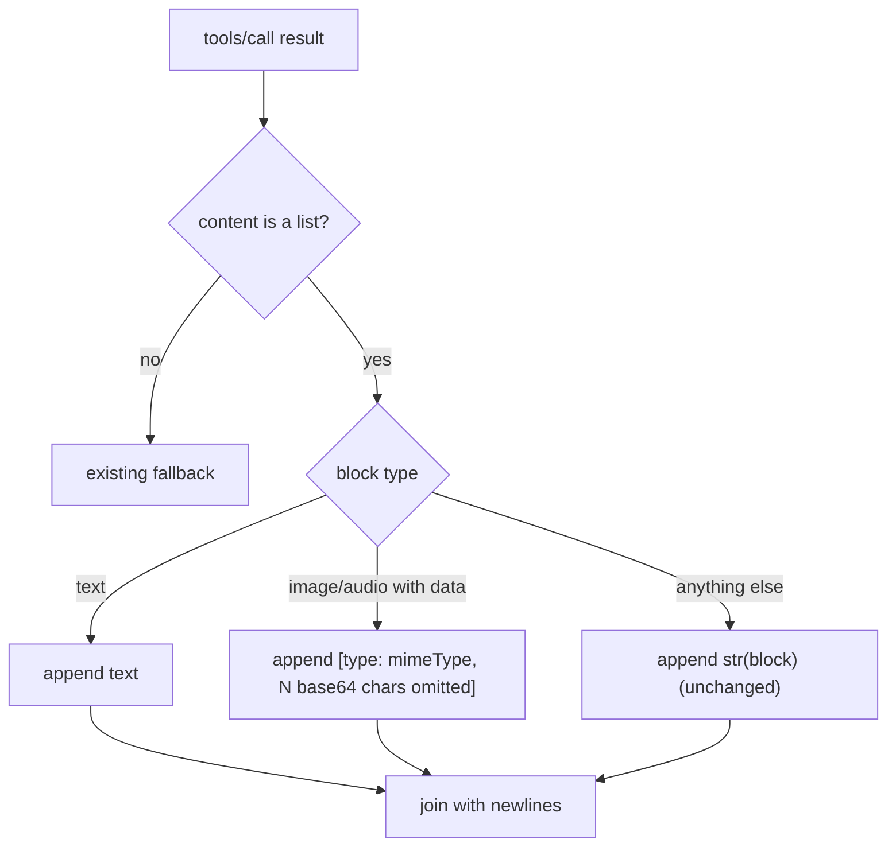

# MCP Binary Content Placeholder

## Summary

`McpClient._content_to_text` rendered every non-text MCP content block with `str(item)`, so an
`image` or `audio` block dumped its whole base64 `data` payload into the model-visible tool result.
A screenshot tool could push megabytes of base64 into the prompt. Image and audio blocks with a
`data` payload now render as a short placeholder naming the block type and media type.

## Flow chart



## Usage example

```python
client = McpClient(transport)
text = client._content_to_text({"content": [
    {"type": "text", "text": "part one"},
    {"type": "image", "data": "iVBORw0KGgo=", "mimeType": "image/png"},
]})
assert text == "part one\n[image: image/png, 12 base64 chars omitted]"
```

## How it works

One new branch in `_content_to_text`, marked `@intent mcp-binary-content-stays-out-of-prompts`.
Text blocks and every other block type (resource, resource_link, unknown) keep their exact
current rendering.

## Files

- `vidbyte/tools/mcp/client.py` — the new branch.
- `tests/test_mcp_bridge.py` — one regression test.

## Risks

A model can no longer see raw image bytes as text, which it could not use anyway. Passing images
through as native multimodal tool content is a separate feature.

## Verification

`python lint/run.py` and `python scripts/run_ci.py`; the new test asserts text parts survive, the
placeholder names type and mimeType, and the base64 string is absent.
