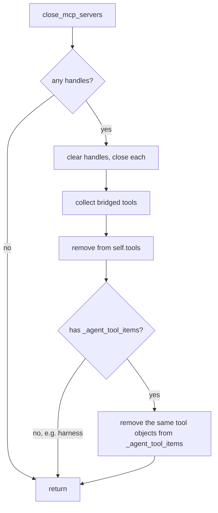

# MCP Close Drops Agent Tool Items

## Summary

`McpAttachableMixin.close_mcp_servers()` removes closed servers' bridged tools from `self.tools`, but `BaseAgent` keeps a second list, `_agent_tool_items`, which `add_tool` appends every bridged tool to. Close never pruned it, so after closing, `fork()` children inherited dead MCP tools (whose model could call a closed subprocess), `export_state().tool_names` listed them (causing spurious resume mismatches), and session binding / tool-spec listing still saw them. The fix drops the bridged tools from `_agent_tool_items` too, when the object has that attribute.

## Flow chart



## Usage example

```python
agent = Agent(name="worker", system_prompt="Work.")
await agent.attach_mcp_server(command=["python", "server.py"])
await agent.close_mcp_servers()

child = agent.fork()                       # no closed MCP tools inherited
assert "add" not in agent.export_state().tool_names
```

## How it works

After the existing `self.tools` pruning, `close_mcp_servers` reads `getattr(self, "_agent_tool_items", None)` and, if present, rebuilds it as a tuple without the bridged tool objects. Removal uses the same set-membership on tool objects as `Tools.without`, so only the exact closed tools go. The mixin is shared with non-`BaseAgent` classes, hence the `getattr` guard. Attach, fork, and export are unchanged.

## Files

- `vidbyte/agents/mixins.py`: prune `_agent_tool_items` in `close_mcp_servers`.
- `tests/test_mcp_attachment.py`: one regression test.

## Risks

Minimal. A user-added tool that is the same object as a bridged tool would also be dropped, which matches `self.tools` behavior.

## Verification

New test: after close, `_agent_tool_items` has no bridged tools, a `fork()` child has none, and `export_state().tool_names` excludes them. It fails without the fix. Then `python lint/run.py` and `python scripts/run_ci.py`.
