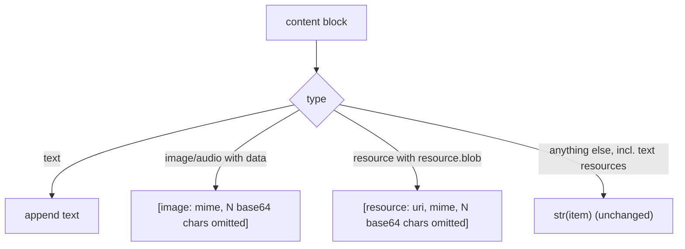

# MCP embedded-resource blob placeholder

## Summary

`McpClient._content_to_text` already replaces image and audio base64 payloads with a short
placeholder (#673). Binary embedded resources (`{"type": "resource", "resource": {..., "blob": ...}}`)
still fell through to `str(item)`, so their whole base64 blob reached the model-visible tool result.
This change gives them the same placeholder, keeping the uri and mimeType.

## Flow chart



## Usage example

```python
client = McpClient(transport)
client._content_to_text({"content": [
    {"type": "text", "text": "exported"},
    {"type": "resource", "resource": {"uri": "file:///r.pdf", "mimeType": "application/pdf", "blob": "JVBERi0x..."}},
]})
# -> "exported\n[resource: file:///r.pdf, application/pdf, 32 base64 chars omitted]"
```

## How it works

One new `elif` branch in `_content_to_text`, under the existing
`@intent mcp-binary-content-stays-out-of-prompts`, matches a `resource` block whose nested
`resource` mapping has a `blob` key and appends the placeholder. Text resources and every other
block type are untouched.

## Files

- `vidbyte/tools/mcp/client.py`: the new branch.
- `tests/test_mcp_bridge.py`: one regression test next to the image/audio placeholder test.

## Risks

None beyond #673's: the model no longer sees the blob bytes, which it could not read anyway.

## Verification

`python lint/run.py`, `python scripts/run_ci.py`, and required GitHub CI.
