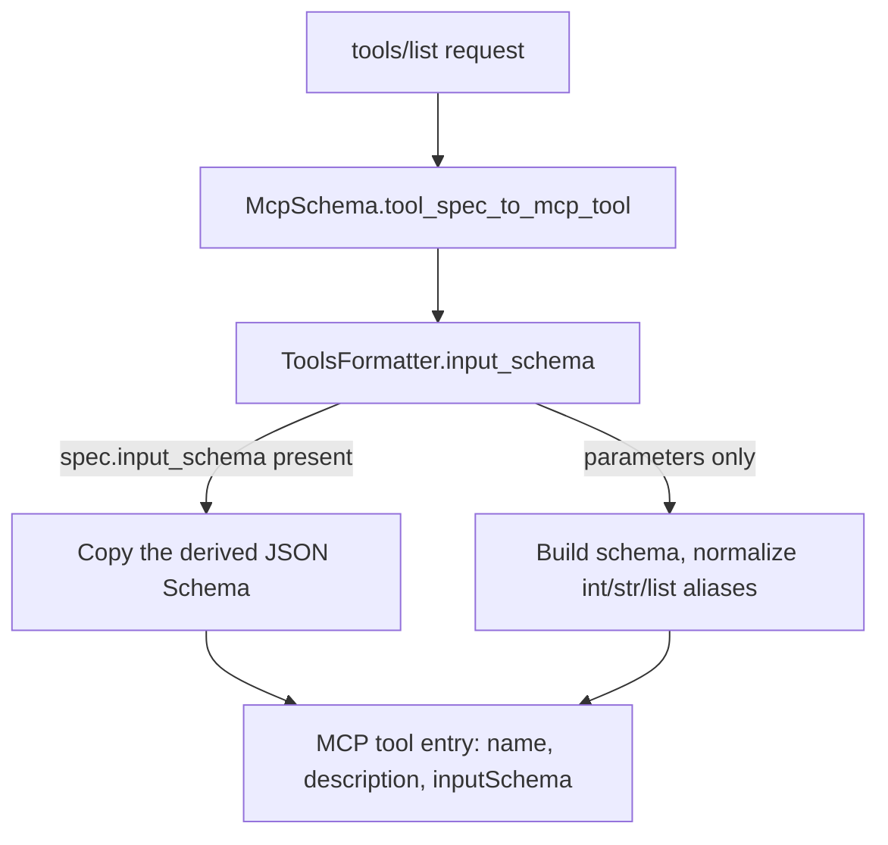

# MCP Server Input Schema

## Summary

`McpSchema.tool_spec_to_mcp_tool` built each tool's MCP `inputSchema` by hand
from `spec.parameters`, keeping only `type` and `description` and copying the
type string verbatim. Tools exposed through `McpStudioServer(tools=[...])`
therefore advertised lossy schemas: `list[str]` lost `items`, `Literal[...]`
lost `enum`, and builtin parameters typed `"int"` produced an invalid JSON
Schema type. The fix makes the MCP adapter reuse the same provider-neutral
schema the provider formatters already send to models.

## Flow chart



## Usage example

```python
from typing import Literal
from vidbyte.mcp_server.schema import McpSchema
from vidbyte.tools import tool

@tool
def tag_ticket(ticket_id: int, tags: list[str], priority: Literal["low", "high"]) -> str:
    """Tag a support ticket."""
    return "ok"

schema = McpSchema.tool_spec_to_mcp_tool(tag_ticket.spec())["inputSchema"]
assert schema["properties"]["tags"]["items"] == {"type": "string"}
assert schema["properties"]["priority"]["enum"] == ["low", "high"]
```

## How it works

`ToolsFormatter` gains a public `input_schema(spec)` helper holding the logic
`_schema_for_spec` already used: prefer `spec.input_schema`, otherwise build an
object schema from parameters with type aliases normalized. `_schema_for_spec`
calls it and still layers the activity annotation on top for providers. The MCP
adapter calls `input_schema` directly, so activity annotations (an agent-loop
concern MCP `tools/call` never enforces) stay out of the MCP schema.

## Files

- `vidbyte/lib/tools/formatter.py`: extract public `input_schema`.
- `vidbyte/mcp_server/schema.py`: use it in `tool_spec_to_mcp_tool`.
- `tests/test_mcp_studio_server.py`: regression test.

## Risks

Parameter-only tools now also carry `"required": []` and
`"additionalProperties": false`, both valid JSON Schema; MCP `tools/call`
dispatch does not validate against the schema, so behavior is unchanged.

## Verification

Regression test asserts `items`, `enum`, and `"integer"` survive and that
`DocumentRetrievalTool` advertises no `"int"` type; `python lint/run.py` and
`python scripts/run_ci.py` pass.
