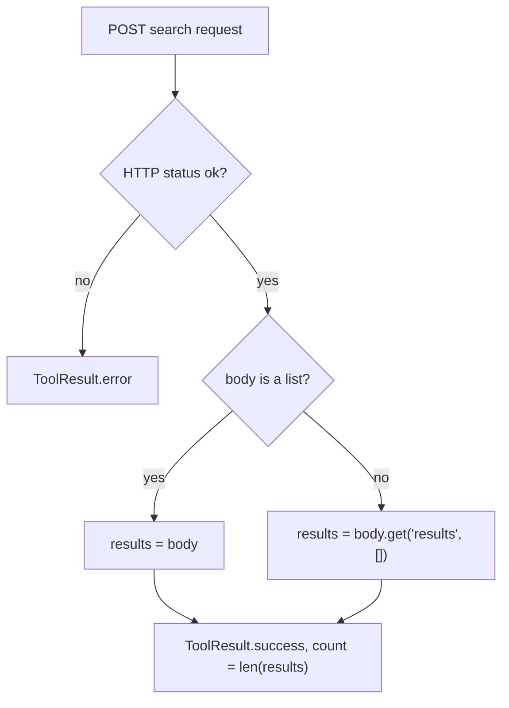

# Memory Search Accepts Bare-List Responses

## Summary

`Mem0SearchMemoryTool` and `ZepSearchMemoryTool` meant to accept a search response that is either `{"results": [...]}` or a bare JSON list, but they called `data.get(...)` before checking for a list. A bare-list body raised `AttributeError`, the tool returned an error, and the agent never saw the memories. The fix checks for a list first, matching the Cognee and Letta search tools.

## Flow chart



## Usage example

```python
from vidbyte.tools.builtins.memory import Mem0SearchMemoryTool
from vidbyte.tools.types import ToolCall

tool = Mem0SearchMemoryTool(api_key="m0-...")
result = await tool.execute(ToolCall("mem0_search_memory", {"query": "pets", "user_id": "u1"}))
# Works whether Mem0 answers [{...}, {...}] or {"results": [{...}, {...}]}.
print(result.status, result.metadata["count"])
```

## How it works

In both `execute` methods, `results = data.get("results", data if isinstance(data, list) else [])` becomes `results = data if isinstance(data, list) else data.get("results", [])`, with a `# @intent memory-search-accepts-bare-list` comment. A dict without a `"results"` key still yields `[]`, and `count` stays `len(results)`.

## Files changed

- `vidbyte/tools/builtins/memory/mem0.py`
- `vidbyte/tools/builtins/memory/zep.py`
- `tests/test_memory_tools.py`

## Risks

None known. Other memory tools (`supermemory.py`, Zep get) have no list intent and are unchanged.

## Verification

New tests in `tests/test_memory_tools.py` cover bare-list and dict bodies for both tools (the bare-list tests fail on the old code), plus `python lint/run.py` and `python scripts/run_ci.py`.
