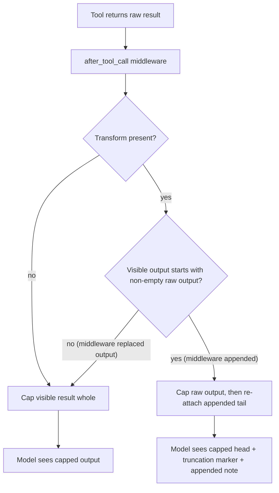

# Middleware Notes Survive Tool-Output Truncation

## Summary

`ToolSettings.result_max_chars` keeps the head of a long tool output and drops the rest. The runtime applied that cap to the result *after* middleware had changed it, so any note a middleware appended to the end was cut off whenever the raw output was longer than the cap. Two built-ins are affected: `CanaryTripwireMiddleware` (its canary watermark never reached the model, so the tripwire could never fire) and `LoopDetectionMiddleware` (its soft repeated-output notice was silently dropped). The fix caps only the raw tool output and then re-attaches whatever the middleware appended, so the notes stay visible under any cap.

## Flow chart



## Usage example

```python
from vidbyte import Agent
from vidbyte.agents.settings import AgentLoopSettings
from vidbyte.agents.settings.tool import ToolSettings
from vidbyte.middleware.builtins import CanaryTripwireMiddleware, LoopDetectionMiddleware

agent = Agent(
    name="researcher",
    system_prompt="Answer from the knowledge base.",
    tools=[lookup],  # may return thousands of characters
    middleware=[
        CanaryTripwireMiddleware(inject_probability=1.0),
        LoopDetectionMiddleware(soft_max_repeated_outputs=2),
    ],
    agent_loop_settings=AgentLoopSettings(tool_settings=ToolSettings(result_max_chars=120)),
)
# The model now sees: first 120 raw chars + "...[tool output truncated ...]" + "\nVIDBYTE-CANARY-..."
```

## How it works

In `AgentRuntime._model_visible_tool_result`, when a middleware transform's visible output starts with the (non-empty) raw output, the runtime treats the extra text as an appended tail: it truncates the raw result with `_truncate_for_tool_settings`, appends the tail, and merges metadata (truncation keys from the capped raw result, middleware keys from the visible result). Transforms that replace the output (compaction, redaction) do not start with the raw output, so they keep today's behavior of capping the visible result as a whole. Middleware formats are unchanged.

## Files changed

- `vidbyte/agents/runtime.py`: the appended-tail branch in `_model_visible_tool_result`.
- `tests/test_security_middleware.py`: runtime regression test for the canary under a cap.
- `tests/test_new_middleware_builtins.py`: runtime regression test for the loop-detection soft notice under a cap.

## Risks and open questions

- The appended tail itself is not capped. Tails come from trusted middleware and are short (a 31-char canary, a one-line notice), but a middleware that appends a large blob would exceed `result_max_chars`.
- A middleware that rewrites the output so it happens to still start with the full raw output is treated as appending. That only occurs if the rewrite keeps all raw content, so no hidden raw content is exposed.

## Verification

Both new tests fail on `main` and pass with the fix. Run `python lint/run.py` and `python scripts/run_ci.py`.
