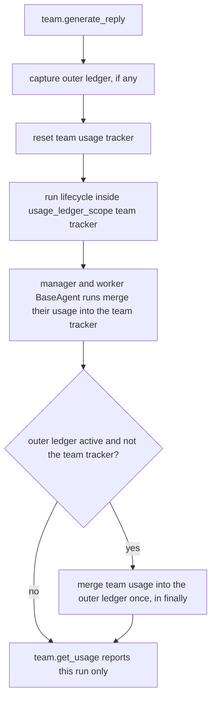

# MultiAgent usage reaches the team ledger

## Summary

`MultiAgent` overrides `BaseAgent.generate_reply` entirely, so it skipped BaseAgent's usage-ledger scoping. Manager and worker forks recorded into their own trackers, and nothing merged into the team. After a team run that made billed model calls, `team.get_usage().model_call_count` was `0` and `team.get_cost_usd()` was `None`. The fix scopes the team run to the team's own tracker, the same way `AggregateAgent` does, so a team reports what its manager and workers spent.

## Flow chart



## Usage example

```python
team = MultiAgent(name="team", system_prompt="coordinate", orchestrator=manager, agents=(worker,))
await team.arun("complete the task")
usage = team.get_usage()
print(usage.model_call_count, team.get_cost_usd())  # every manager and worker call of this run
```

## How it works

`MultiAgent.generate_reply` now mirrors `AggregateAgent.generate_reply`: it captures `active_usage_ledger()`, resets `self._usage_tracker`, runs `self._lifecycle.execute(...)` inside `usage_ledger_scope(self._usage_tracker)`, and in `finally` merges into the outer ledger when one is active and is not the team's own tracker. Children already merge into whatever ledger is active, so they land in the team tracker, and the team merges once into the parent. Nothing is counted twice.

## Files changed

- `vidbyte/agents/multi/agent.py`: ledger scoping around the lifecycle call, with an `# @intent` comment.
- `tests/multi_agent/test_behavior.py`: a regression test for usage per run, its reset on the next run, and a single count in an outer ledger.

## Risks

Usage spent before a failed run still merges into the outer ledger, because the merge runs in `finally`. This is the same behavior as BaseAgent and AggregateAgent.

## Verification

The new test fails on `main` (count `0`) and passes with the fix. `python lint/run.py` and `python scripts/run_ci.py` pass.
