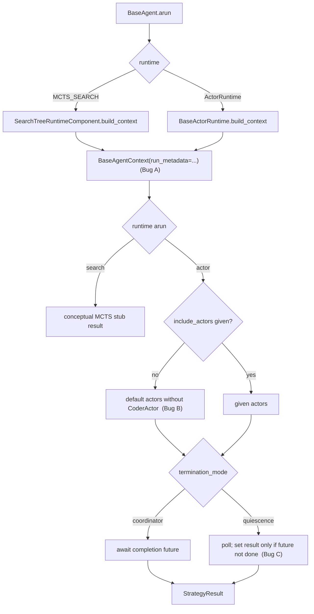

# Non-linear runtime drift fixes

## Summary

The MCTS search runtime and every actor runtime crash on their first run. Three
small bugs cause this, and each one is left over from an earlier refactor. First,
both runtimes still build their context with the old `strategy_metadata` field,
which was renamed to `run_metadata`. Second, the default actor list imports
`CoderActor`, a class that no longer exists. Third, the quiescence monitor can set
the completion future a second time after an actor reply has already set it. This
change fixes all three with minimal edits, so the README's "Swappable Agent
Runtimes" example runs again. MCTS stays a conceptual stub that never calls the
model; this change only stops it from crashing.

## Flow chart



## Usage example

```python
from vidbyte import BaseAgent
from vidbyte.agents.runtimes.configs import ActorRuntime
from vidbyte.lib.enums import AgentRuntimeType

agent = BaseAgent(
    name="swarm",
    system_prompt="Coordinate the team.",
    provider="deepseek",
    model_name="deepseek-chat",
    runtime=ActorRuntime(topology=AgentRuntimeType.ACTOR_MODEL_P2P),
)
result = agent.run("Plan a release checklist.")  # returns the model's answer

quiet = BaseAgent(
    name="quiet",
    system_prompt="Coordinate the team.",
    provider="deepseek",
    model_name="deepseek-chat",
    runtime=ActorRuntime(termination_mode="quiescence", max_loop=4),
)
quiet.run("Plan a release checklist.")  # completes without InvalidStateError
```

## How it works

- **Bug A.** `build_context` in `vidbyte/agents/runtimes/search.py` and
  `vidbyte/agents/runtimes/actor/broker.py` passes
  `run_metadata=dict(managed_context.run_metadata)`, the same as the linear runtime.
- **Bug B.** `BaseActorRuntime.arun` drops `CoderActor` from the default import and
  list. The rest of the default actor set does not change.
- **Bug C.** The quiescence loop sets its result only when
  `not self._completion_future.done()`, the same guard that `send` already uses.

## Files changed

- `vidbyte/agents/runtimes/search.py`: Bug A.
- `vidbyte/agents/runtimes/actor/broker.py`: Bugs A, B and C.
- `tests/test_agent_runtime.py`: one regression test per bug, which drives
  `BaseAgent` through an offline fake runner.

## Risks and open questions

- The default actor set shrinks from six to five classes. That matches what was
  importable before `CoderActor` was removed, so users lose nothing.
- The quiescence guard can return an actor's reply in place of the "Quiescence
  reached" message when that reply arrives first. This is the same first-wins rule
  that `send` applies.

## Verification

- Regression tests: MCTS returns without error. P2P and broadcast coordinator runs
  with the default actors return the model's answer. A quiescence run where the
  reply completes the future during the poll ends without error.
- `python lint/run.py`, `python -m pytest -q -x`, `python scripts/run_ci.py`, and
  the required CI checks on the PR.
