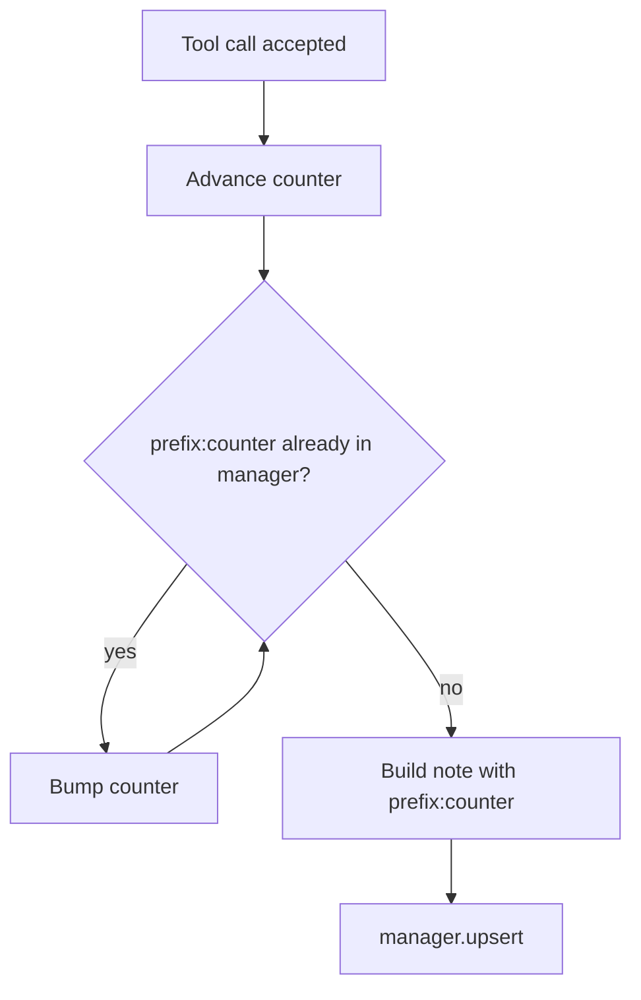

# Note tool ids skip taken ids

## Summary

Note tools (`reflexion`, `trajectory_checkpoint`, the five CoT event tools, and the
35 single-step reasoning tools such as `deduce`) build ids from a per-instance counter,
for example `reflexion:1`, and then call `ContextManager.upsert`, which replaces any
entry with the same id. When two agents share one context manager, the second agent's
first note reused `reflexion:1` and silently replaced the first agent's note. Each tool
now skips ids that are already registered, the same way `reasoning/_base.py` and
`handoff/create.py` already do.

## Flow chart



## Usage example

```python
shared = ContextManager()
investigator = Agent(name="inv", tools=[ReflexionTool(shared)], context_manager=shared)
reviewer = Agent(name="rev", tools=[ReflexionTool(shared)], context_manager=shared)
# After each agent calls reflexion once:
[pid for pid, _ in shared.registry_items()]  # ['reflexion:1', 'reflexion:2']
```

## How it works

A private helper `next_free_counter(manager, prefix, counter)` in
`vidbyte/tools/builtins/_note_ids.py` returns the first counter at or after `counter`
whose `prefix:counter` id is not registered. Each tool assigns the result back to its
own counter, so ids and counter-derived fields such as `checkpoint_index` stay in sync.
`ContextManager.upsert` is unchanged; edit and move tools still rely on replace semantics.
The content-keyed CoT ledger ids (`statement_primitive_id`) are intentionally untouched.

## Files

- `vidbyte/tools/builtins/_note_ids.py` (new helper)
- `vidbyte/tools/builtins/reflexion.py`, `trajectory_checkpoint.py`, `cot_events.py`
- 35 tools in `vidbyte/tools/builtins/reasoning/` (one import, one line each)
- `tests/test_context_algorithm_tools.py`

## Risks

A tool now writes `reflexion:2` where it previously overwrote (or failed on) a taken
`reflexion:1`. Two existing tests that relied on that collision to hit the frozen-note
error path are updated to assert the frozen note is kept, and the error path is covered
by patching `upsert` to raise.

## Verification

New shared-manager tests for reflexion, trajectory_checkpoint, backtrack, and deduce;
`python lint/run.py`; `python scripts/run_ci.py`.
