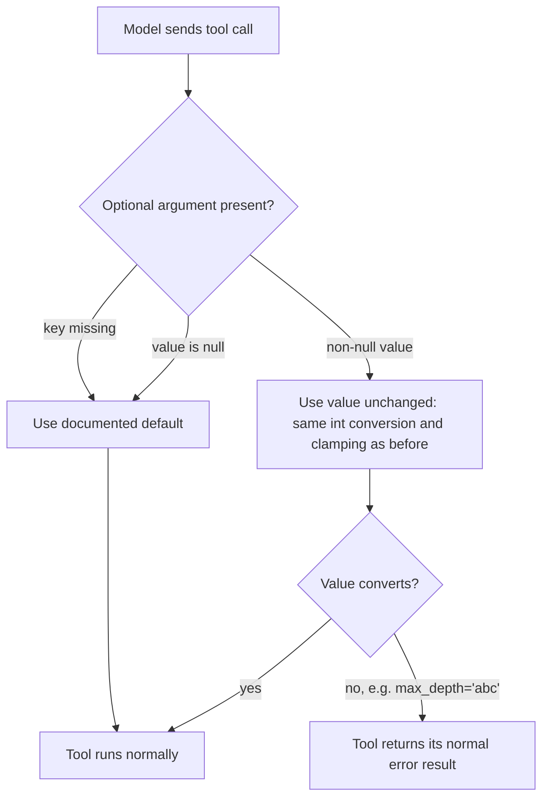

# Null Optional Tool Arguments Mean the Default

## Summary

Models often send JSON `null` for an optional tool argument they mean to leave out. The root-scoped
filesystem tools and the code-search tools read optional arguments with `call.arguments.get(name, default)`,
which only applies the default when the key is missing, so an explicit `null` reached `int(None)` or
`Path(None)` and crashed. In the code-search tools it was worse: `str(None)` turned `subdir: null` into a
folder named `"None"` and the tool reported "No files matched." instead of searching from the root.
Since #700, a null boolean flag already means the documented default; this change gives every listed
optional non-boolean argument the same rule.

## Flow chart



## Usage example

```python
from vidbyte.tools.filesystem import FileSystemToolConfig, TreeTool, ReadLinesTool
from vidbyte.tools.builtins.code_search import GlobTool
from vidbyte.tools.types import ToolCall

config = FileSystemToolConfig(root="/repo")
# All three now behave exactly as if the null keys were omitted.
await ReadLinesTool(config).execute(ToolCall("read_lines", {"path": "app.py", "start": None}))
await TreeTool(config).execute(ToolCall("tree", {"path": None, "max_depth": None, "max_entries": None}))
await GlobTool("/repo").execute(ToolCall("glob", {"pattern": "**/*.py", "subdir": None, "max_results": None}))
```

## How it works

`BaseTool` gains one tiny static reader, `_optional_argument(call, name, *, default)`, placed beside
`_resolve_bool_argument`. It returns `default` when the value is missing or `None`, and the raw value
otherwise. Call sites keep their existing conversion and clamping, so non-null behavior is unchanged.
`TreeTool` also moves its argument parsing inside its existing `try`, so a bad non-null value such as
`max_depth="abc"` returns the tool's normal error result instead of raising out of `execute()`.

## Files changed

- `vidbyte/tools/base.py`: add `_optional_argument` with an `@intent null-optional-arg-means-default` note.
- `vidbyte/tools/filesystem/read_lines.py` (`start`), `find.py` (`root`), `list_dir.py` (`path`),
  `tree.py` (`path`, `max_depth`, `max_entries`, parsing moved into the error handling).
- `vidbyte/tools/builtins/code_search/glob.py`, `grep.py`, `semantic.py`: `subdir`, `max_results`,
  `max_chars`, grep `context_lines`, semantic `max_chars_per_result`.
- `tests/test_filesystem_tools.py`, `tests/test_code_search_tools.py`: regression tests.

## Risks and open questions

- Required arguments are out of scope; a null there still fails validation as before.
- `providers/mongodb.py` and `rows.py` `limit` have a similar shape but are deliberately left for a separate change.

## Verification

- New tests: an explicit null for each listed optional gives the same output and metadata as omitting it;
  a null code-search `subdir` finds `pkg/auth.py`; `tree` with a non-integer limit returns an error result.
- `python lint/run.py` and `python scripts/run_ci.py` locally, then the required remote CI checks.
