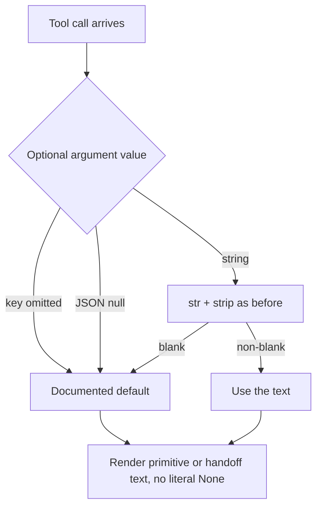

# Null optional arguments must not render as "None"

## Summary

PR #701 made an explicit JSON null on a declared-optional tool argument mean the
documented default, exactly like an omitted key (`null-optional-arg-means-default`).
Four builtin tools that turn arguments into model-visible text still read those
optionals as `str(args.get("x", ""))`, so a null becomes the literal text `None`.
The next model iteration, or the next agent receiving a handoff, then reads
`Audience: None`, `Salvage: None`, or a note titled `None` as real content, and
`context_upsert` fails outright with `Unknown primitive_type 'none'`. This change
treats `None` like the omitted key for exactly those optionals.

## Flow chart



## Usage example

```python
from vidbyte.context.manager import ContextManager
from vidbyte.tools.builtins.cot_events import BacktrackTool
from vidbyte.tools.types import ToolCall

tool = BacktrackTool(ContextManager())
result = await tool.execute(ToolCall(tool_name="backtrack", arguments={
    "abandoning": "regex parser", "reason": "r", "evidence": "e",
    "attempted_result": "a", "replacement_plan": "p", "loop_guard": "g",
    "salvage": None,  # a model's explicit null now means "nothing", the default
}))
assert "None" not in result.output
```

## How it works

For each listed optional, check for `None` before `str()`/`strip()` and fall back
to the same value an omitted key produces. Non-null values keep their current
behaviour.

- `cot_events.py`: `UncertaintyTool` `trigger`, `blocker`, `reassessment_condition`
  use `CotEventParser.optional_text(...) or ""`; `BacktrackTool` `salvage` uses
  `CotEventParser.optional_text(...) or DEFAULT_SALVAGE`. This reuses the parser's
  existing None-aware helper already used for sibling optional fields.
- `handoff/create.py` `_build_handoff`: `audience` and `instructions` are skipped
  when null, so no `Audience: None` / `Instructions: None` line is written.
- `reflexion.py` `_build_item`: a null `title` falls back to `Reflexion Note`.
- `context_primitives/upsert.py`: `primitive_type` and `title` read through
  `BaseTool._optional_argument` with their documented defaults (`"text"`, `""`).

## Files changed

- `vidbyte/tools/builtins/cot_events.py`
- `vidbyte/tools/builtins/handoff/create.py`
- `vidbyte/tools/builtins/reflexion.py`
- `vidbyte/tools/builtins/context_primitives/upsert.py`
- Regression tests in `tests/test_context_algorithm_tools.py`,
  `tests/test_create_handoff_tool.py`, `tests/test_context_primitives_builtins.py`

## Risks and open questions

- Out of scope: required arguments (a null there may still error) and every other
  tool. Other tools with the same pattern can follow in separate small PRs.
- No schema or public API changes.

## Verification

- New regression tests: each listed null optional behaves like the omitted key and
  no `None` text is rendered.
- `python lint/run.py` and `python scripts/run_ci.py`, then remote CI.
- External probe `a311_null_optionals_rendered_text.py` prints `BAD total 0`.
