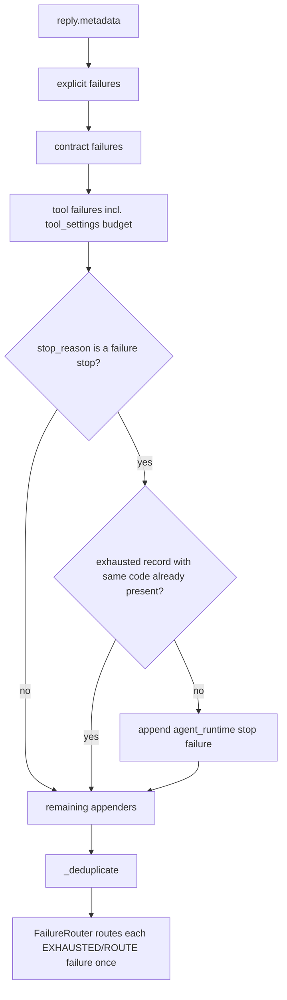

# One Stop, One Routable Failure

## Summary

`FailureMetadataNormalizer.from_reply` turned a single run stop into two routable Session failures when the stop was also exposed by a more specific appender: `contract_unsatisfied` (runtime stop plus the `output_contract` record) and tool-settings budget stops such as `max_identical_calls` (runtime stop plus the `tool_settings` record). `_deduplicate` keys on `(code, source)`, so both survived and a handler bound with `session.failures.on(code, ...)` ran twice. The fix records the runtime stop last and skips it when an exhausted record with the same code already exists, so one stop routes once and keeps the richer details.

## Flow chart



## Usage example

```python
session = Session(agent)
session.failures.on(FailureCode.CONTRACT_UNSATISFIED, HumanReviewRecovery(open_ticket))
session.run("work")  # stops with stop_reason="contract_unsatisfied"
assert len(session.failures.history(code=FailureCode.CONTRACT_UNSATISFIED)) == 1
# open_ticket ran exactly once
```

## How it works

- `from_reply` calls `_append_stop_failure` after `_append_contract_failures` and `_append_tool_failures`.
- `_append_stop_failure` returns early when `failures` already holds an EXHAUSTED record with the mapped stop code. Observed (non-routable) records and different codes are untouched.

## Files

- `vidbyte/sessions/failure/router.py`
- `tests/test_session_failures.py`

## Risks

- Failure order changes for stop records (now after contract/tool records). No caller depends on that order.

## Verification

- New tests: contract stop and tool budget stop each normalize to one failure; a bound handler runs once.
- `python lint/run.py` and `python scripts/run_ci.py`.
