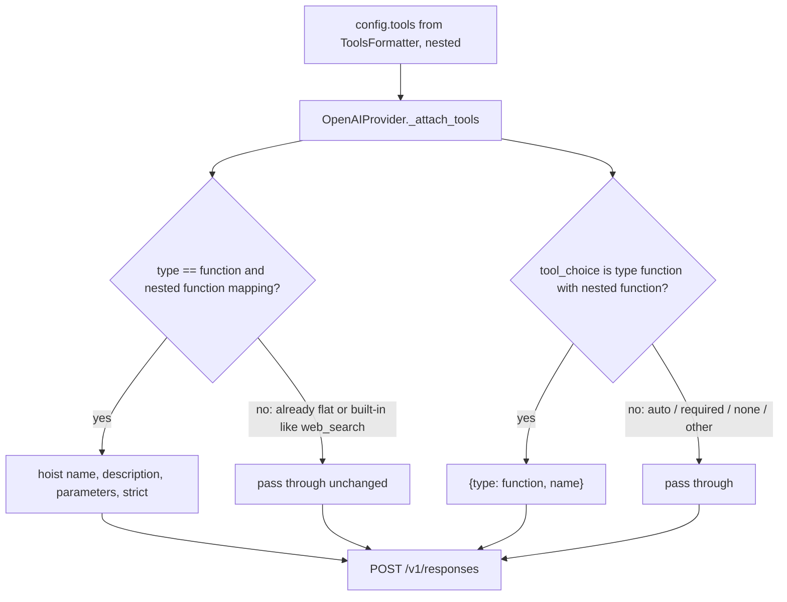

# OpenAI Responses Flat Function Tools

## Summary

`OpenAIProvider` posts text runs to `/v1/responses`, but `_attach_tools` copied `config.tools` verbatim.
Those tools come from `ToolsFormatter.to_openai_tool`, which emits the Chat Completions nested shape
`{"type": "function", "function": {name, description, parameters}}`. The Responses API wants flat function
tools `{"type": "function", name, description, parameters}` and rejects the nested shape with 400
`Missing required parameter: 'tools[0].name'`. The runtime always attaches the internal `isDone` tool, so
practically every OpenAI agent run failed live. The fix flattens tool definitions (and a function-form
`tool_choice`) inside `OpenAIProvider._attach_tools` only; Chat Completions providers keep the nested shape.

## Flow chart



## Usage example

```python
from vidbyte import Agent, tool

@tool
def lookup(order_id: str) -> str:
    """Look up an order."""
    return "shipped"

agent = Agent(name="support", system_prompt="Support.", tools=[lookup], provider="openai", model_name="gpt-5.4-mini")
agent.run("where is order 7?")
# Request body tools: [{"type": "function", "name": "lookup", "description": ..., "parameters": {...}}, {... "isDone" ...}]
```

## How it works

`_attach_tools` walks `config.tools`. A tool whose `type` is `function` and which carries a nested
`function` mapping becomes `{"type": "function", ...}` with `name`, `description`, `parameters`, and
`strict` hoisted when present. Every other tool is copied unchanged. A `tool_choice` of the Chat Completions
form `{"type": "function", "function": {"name": X}}` becomes `{"type": "function", "name": X}`.

## Files changed

- `vidbyte/providers/openai.py`: `_attach_tools`.
- `tests/test_text_model_runner.py`: one regression test.

## Risks

None expected: no other provider and no formatter changes. Already-flat tools and built-in tools pass through.

## Verification

- New test: nested function tool plus `{"type": "web_search"}` yields a flat function tool and an untouched
  built-in; a function-form `tool_choice` is flattened.
- Repro `a99_responses_tool_shape.py` prints `ok` for both lines.
- `python lint/run.py` and `python scripts/run_ci.py`.
