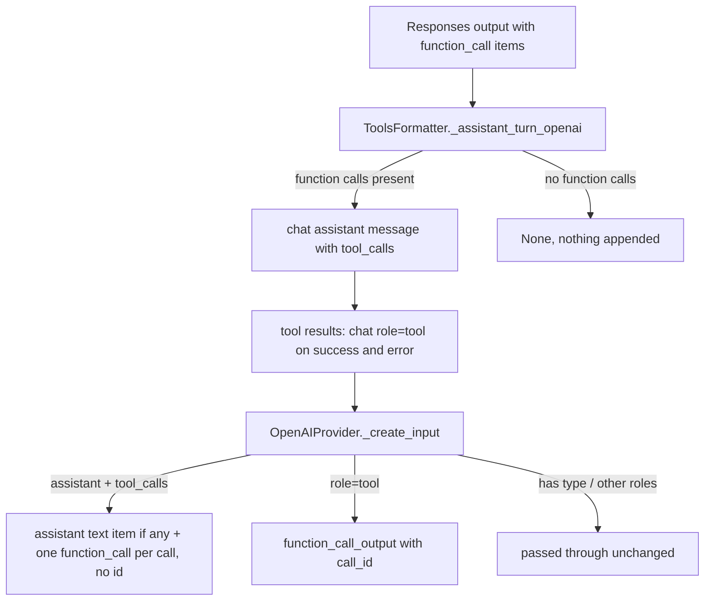

# OpenAI Responses Tool History

## Summary

`provider="openai"` text runs call `POST /v1/responses`. After any tool call, the agent history was sent as
chat-completions messages (`{"role": "tool", ...}`) with no preceding `function_call` items, which the
Responses API rejects ("Invalid value: 'tool'" / "No tool call found for function call output"). Every
OpenAI agent that used a tool failed on its next model call. This change keeps the runtime transcript
chat-shaped (so fallback can still carry it across OpenAI-compatible providers) and translates it into
Responses input items at the OpenAI provider boundary.

## Flow chart



## Usage example

```python
from vidbyte import Agent, tool

@tool
def flights(city: str) -> str:
    """Find flights."""
    return f"3 flights to {city}"

agent = Agent(name="planner", system_prompt="Plan trips.", provider="openai", model_name="gpt-4.1-mini", tools=[flights])
agent.run("Plan Rome")  # 2nd /responses call now sends function_call + function_call_output items
```

## How it works

- `ToolsFormatter._assistant_turn_openai`: a Responses payload with `function_call` items now yields
  `{"role": "assistant", "content": <output_text or None>, "tool_calls": [{"id": call_id, "type": "function", "function": {...}}]}`.
- Tool results for Responses calls are chat-shaped on both paths; the error-only `function_call_output`
  special case is removed so success and error agree.
- `OpenAIProvider._create_input` maps assistant `tool_calls` to `function_call` items (no `fc_` item `id`,
  which reasoning models reject without their reasoning items) and `role: "tool"` messages to
  `function_call_output`. Items with a `type` and all other messages pass through.

## Files

- `vidbyte/lib/tools/formatter.py`, `vidbyte/providers/openai.py`
- Tests: `tests/test_agent_tool_loop.py`, `tests/test_provider_tool_schema_translation.py`, `tests/test_text_model_runner.py`

## Risks

- Assistant text accompanying tool calls is re-sent as a plain assistant message item; acceptable for the
  Responses API. Chat-completions providers are unchanged.

## Verification

Regression tests drive a Responses tool turn (one success, one failing tool) through the agent loop and
assert the next `/responses` `input` has each `function_call` (call_id/name/arguments, no id) before its
`function_call_output` and no `role: "tool"` item; they fail on `main`. Then `python scripts/run_ci.py --stage source`.
