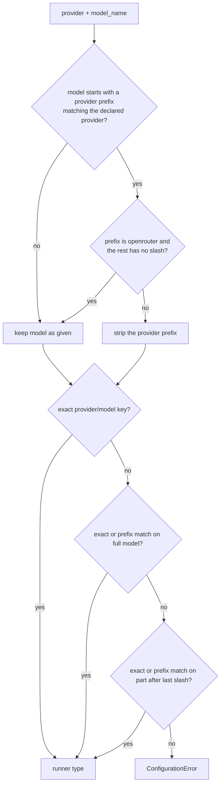

# OpenRouter vendor/model ids

## Summary

OpenRouter model ids are `vendor/model` slugs (`anthropic/claude-sonnet-5`, `meta-llama/llama-4-maverick`) plus its own router id `openrouter/auto`. Two bugs in `Runner` broke them. Runner resolution raised `ConfigurationError` for any vendor slug, because prefix lookups ran against the whole string. `openrouter/auto` was also split down to `auto`, so the wrong model name went on the wire. This fix lets slugs resolve by their bare name and keeps OpenRouter's own ids intact, as `agent-model-fallback.md` and `models-providers-catalog-refresh.md` already intend.

## Flow chart



## Usage example

```python
from vidbyte import Agent

agent = Agent(name="router", system_prompt="Help.", provider="openrouter", model_name="anthropic/claude-sonnet-5", api_key="k")
await agent.arun("hello")  # request body: {"model": "anthropic/claude-sonnet-5", ...}

auto = Agent(name="auto", system_prompt="Help.", provider="openrouter", model_name="openrouter/auto", api_key="k")
await auto.arun("hello")   # request body: {"model": "openrouter/auto", ...}
```

## How it works

- `Runner.resolve_runner_type` first tries the exact-model and prefix lookups on the full model string, then on the part after the last `/`, which mirrors `ModalityDetector.detect_modality`. Models that match neither way still raise the existing `ConfigurationError`.
- `Runner._normalize_provider_and_model` still sets the provider from a matching prefix. When that prefix is `openrouter`, it strips it only if the remainder is itself a `vendor/model` slug. `openrouter/auto` is left as is, and `openrouter/anthropic/claude-sonnet-5` still becomes `anthropic/claude-sonnet-5`.
- `openrouter/auto` then resolves through the existing `MODEL_RUNNER_TYPE_MAP["openrouter/auto"]` entry.

## Files changed

- `vidbyte/lib/runners/utility.py`: the two changes above.
- `tests/test_openrouter_provider.py`: regression test.

## Risks and open questions

- The slash-split retry applies to every provider, not only OpenRouter, so a prefixed name like `foo/claude-x` now resolves to the text runner. This matches the documented "treated as a bare model name" rule.
- Pricing is unaffected. The OpenRouter pricing table is intentionally empty, and cost comes from OpenRouter's reported usage.
- Out of scope: `AgentFallbackSettings._split_provider_prefix` still splits a fallback entry `openrouter/auto` into model `auto`.

## Verification

- A regression test asserts that `anthropic/claude-sonnet-5`, `meta-llama/llama-4-maverick` and `openrouter/auto` on `provider="openrouter"` resolve to the text runner and keep their full id as the model name.
- A scratch script outside the repo ran `Agent(...).arun("hello")` with a mocked transport and confirmed that the request body's `model` is each id unchanged.
- `python lint/run.py` and `python scripts/run_ci.py`.
